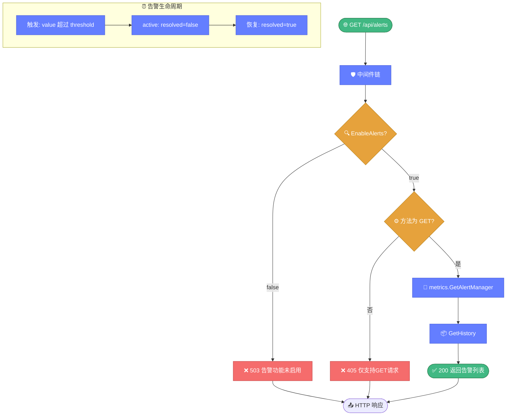

# 🚨 告警端点 — GET /api/alerts

> 📖 告警历史查询端点，需服务器开启 `EnableAlerts`，返回 `metrics.GetAlertManager().GetHistory()` 的告警事件列表。

---

## 📋 概览

| 项目 | 内容 |
|------|------|
| 路径 | `/api/alerts` |
| 方法 | `GET` |
| 处理器 | `handleAlerts` |
| 前置条件 | `s.EnableAlerts == true` |
| 底层函数 | `metrics.GetAlertManager().GetHistory()` |

---

## 📝 请求

### 请求参数

无。

### curl 示例

```bash
curl http://127.0.0.1:8080/api/alerts
```

::: warning 前置条件
必须在创建服务器时设置 `s.EnableAlerts = true`，否则返回 `503`。
:::

---

## ✅ 响应示例

```json
{
  "success": true,
  "data": [
    {
      "id": "alert-001",
      "type": "high_error_rate",
      "level": "warning",
      "message": "WHOIS 查询错误率超过阈值: 15%",
      "value": 0.15,
      "threshold": 0.10,
      "triggered_at": "2026-07-03T10:30:00Z",
      "resolved": false
    },
    {
      "id": "alert-002",
      "type": "high_latency",
      "level": "critical",
      "message": "平均延迟过高: 2500ms",
      "value": 2500,
      "threshold": 2000,
      "triggered_at": "2026-07-03T11:00:00Z",
      "resolved": true,
      "resolved_at": "2026-07-03T11:15:00Z"
    }
  ]
}
```

### AlertEvent 结构说明

| 字段 | 类型 | 说明 |
|------|------|------|
| `id` | `string` | 告警 ID |
| `type` | `string` | 告警类型（如 `high_error_rate`、`high_latency`） |
| `level` | `string` | 严重级别（`info` / `warning` / `critical`） |
| `message` | `string` | 告警描述 |
| `value` | `float64` | 触发时的实际值 |
| `threshold` | `float64` | 触发阈值 |
| `triggered_at` | `time.Time` | 触发时间 |
| `resolved` | `bool` | 是否已恢复 |
| `resolved_at` | `time.Time` | 恢复时间（仅 `resolved=true` 时） |

---

## ❌ 错误码

| HTTP 状态码 | 触发条件 | 错误信息 |
|------------|----------|----------|
| `503` | `EnableAlerts = false` | `告警功能未启用` |
| `405` | 非 GET 方法 | `仅支持GET请求` |

::: tip 检查顺序
先检查 `EnableAlerts`（未启用返回 503），再检查方法（非 GET 返回 405）。
:::

下图展示 alerts 端点的检查顺序与告警事件的生命周期，告警由阈值触发、可被恢复。



---

## 🔗 相关

- 🌐 [overview.md](./overview.md) — API 概览
- 🖥️ [server.md](./server.md) — `EnableAlerts` 配置
- 📊 [endpoint-metrics.md](./endpoint-metrics.md) — 监控指标端点
