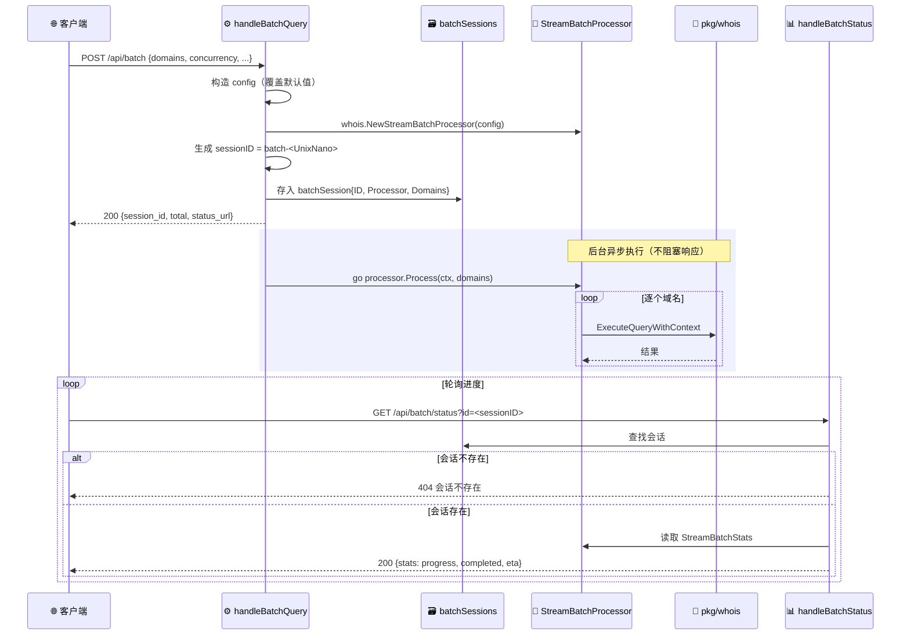

# 📦 批量端点

> 📖 批量域名查询端点，提供提交与轮询两个接口。提交后生成会话 ID 异步执行，客户端通过状态端点轮询进度与统计。

---

## 📋 概览

| 路径 | 方法 | 处理器 | 说明 |
|------|------|--------|------|
| `/api/batch` | POST | `handleBatchQuery` | 提交批量查询，异步执行 |
| `/api/batch/status` | GET | `handleBatchStatus` | 轮询批量进度 |

---

## ① POST /api/batch — 提交批量查询

### 请求体字段

| 字段 | 类型 | 必填 | 默认值 | 说明 |
|------|------|------|--------|------|
| `domains` | `[]string` | 是 | — | 域名列表，不能为空 |
| `concurrency` | `int` | 否 | 默认配置 | 并发数，`>0` 覆盖默认 |
| `timeout` | `int` | 否 | 默认配置 | 单次查询超时（秒），`>0` 覆盖 |
| `max_retries` | `int` | 否 | 默认配置 | 最大重试次数，`>0` 覆盖 |
| `query_delay_ms` | `int` | 否 | 默认配置 | 查询间隔（毫秒），`>0` 覆盖 |
| `use_proxy` | `bool` | 否 | `false` | 是否走代理 |
| `checkpoint_dir` | `string` | 否 | `""` | 检查点目录（断点续传） |

::: tip 配置覆盖
基于 `whois.DefaultStreamBatchConfig()`，仅当字段 `>0`（数值型）时覆盖默认值，`use_proxy` 直接赋值。
:::

### 处理流程

1. 基于 `DefaultStreamBatchConfig()` 构造配置
2. 创建 `whois.NewStreamBatchProcessor(config)`
3. 生成会话 ID：`sessionID := fmt.Sprintf("batch-%d", time.Now().UnixNano())`
4. 构造 `batchSession{ID, Processor, Domains, CreatedAt}` 存入 `s.batchSessions`
5. 启动 goroutine 异步执行：`go processor.Process(ctx, req.Domains)`
6. 立即返回会话信息

### curl 示例

```bash
curl -X POST http://127.0.0.1:8080/api/batch \
  -H "Content-Type: application/json" \
  -d '{
    "domains": ["example.com", "example.org", "example.net"],
    "concurrency": 5,
    "timeout": 15,
    "max_retries": 3,
    "query_delay_ms": 500
  }'
```

### 响应示例

```json
{
  "success": true,
  "data": {
    "session_id": "batch-1751548800000000000",
    "total": 3,
    "message": "批量查询已启动",
    "status_url": "/api/batch/status?id=batch-1751548800000000000"
  }
}
```

### 响应字段

| 字段 | 类型 | 说明 |
|------|------|------|
| `session_id` | `string` | 会话 ID，格式 `batch-<UnixNano>` |
| `total` | `int` | 域名总数 |
| `message` | `string` | 固定为 `批量查询已启动` |
| `status_url` | `string` | 轮询状态的相对路径 |

---

## ② GET /api/batch/status — 轮询批量进度

### 请求参数

| 参数 | 位置 | 必填 | 说明 |
|------|------|------|------|
| `id` | query string | 是 | 批量会话 ID |

### curl 示例

```bash
curl "http://127.0.0.1:8080/api/batch/status?id=batch-1751548800000000000"
```

### 响应示例

```json
{
  "success": true,
  "data": {
    "session_id": "batch-1751548800000000000",
    "stats": {
      "total": 3,
      "completed": 2,
      "successful": 2,
      "failed": 0,
      "progress": 66.67,
      "avg_latency": 720,
      "eta_seconds": 1
    }
  }
}
```

### 响应字段

| 字段 | 类型 | 说明 |
|------|------|------|
| `session_id` | `string` | 会话 ID |
| `stats` | `StreamBatchStats` | 处理器统计信息 |

---

## 🔄 提交 + 轮询完整示例

```bash
# 1. 提交批量查询
RESP=$(curl -s -X POST http://127.0.0.1:8080/api/batch \
  -H "Content-Type: application/json" \
  -d '{"domains": ["example.com", "example.org"], "concurrency": 2}')

# 2. 提取 session_id
SID=$(echo "$RESP" | jq -r '.data.session_id')

# 3. 轮询状态
while true; do
  STATUS=$(curl -s "http://127.0.0.1:8080/api/batch/status?id=$SID")
  PROGRESS=$(echo "$STATUS" | jq -r '.data.stats.progress')
  echo "进度: $PROGRESS%"
  if [ "$(echo "$STATUS" | jq -r '.data.stats.completed')" = "2" ]; then
    echo "完成"
    break
  fi
  sleep 2
done
```

下图展示批量查询「提交即返回 → 后台异步执行 → 客户端轮询进度」的完整交互时序。



---

## ❌ 错误码

### POST /api/batch

| HTTP 状态码 | 触发条件 | 错误信息 |
|------------|----------|----------|
| `405` | 非 POST 方法 | `仅支持POST请求` |
| `400` | JSON 解码失败 | `无效的请求格式` |
| `400` | `domains` 为空 | `域名列表不能为空` |

### GET /api/batch/status

| HTTP 状态码 | 触发条件 | 错误信息 |
|------------|----------|----------|
| `405` | 非 GET 方法 | `仅支持GET请求` |
| `400` | 缺少 `id` 参数 | `缺少会话ID参数` |
| `404` | 会话不存在 | `会话不存在` |

---

## 🔗 相关

- 🌐 [overview.md](./overview.md) — API 概览
- 📑 [endpoints.md](./endpoints.md) — 端点总览
- 🔎 [endpoint-whois.md](./endpoint-whois.md) — 单域名 WHOIS 查询
