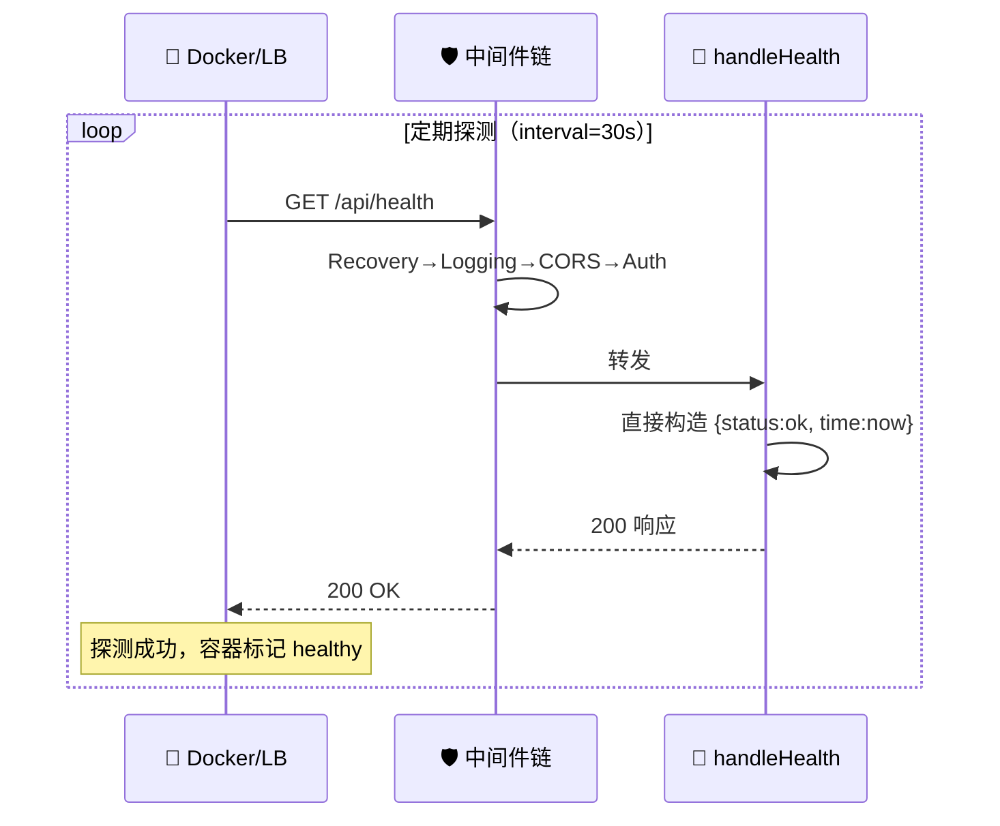

# 💚 健康检查 — GET /api/health

> 📖 服务健康检查端点，返回 `status: ok` 与当前时间，供容器编排、负载均衡与 Docker HEALTHCHECK 探测使用。

---

## 📋 概览

| 项目 | 内容 |
|------|------|
| 路径 | `/api/health` |
| 方法 | `GET` |
| 处理器 | `handleHealth` |
| 前置条件 | 无 |

---

## 📝 请求

### 请求参数

无。

### curl 示例

```bash
curl http://127.0.0.1:8080/api/health
```

---

## ✅ 响应示例

```json
{
  "success": true,
  "data": {
    "status": "ok",
    "time": "2026-07-03T12:00:00Z"
  }
}
```

### 响应字段

| 字段 | 类型 | 说明 |
|------|------|------|
| `status` | `string` | 固定为 `"ok"` |
| `time` | `time.Time` | 服务器当前时间 |

---

## ❌ 错误码

| HTTP 状态码 | 触发条件 | 错误信息 |
|------------|----------|----------|
| `405` | 非 GET 方法 | `仅支持GET请求` |

---

## 🐳 Docker HEALTHCHECK

Dockerfile 中可使用此端点配置健康检查：

```dockerfile
HEALTHCHECK --interval=30s --timeout=5s --start-period=10s --retries=3 \
  CMD curl -f http://127.0.0.1:8080/api/health || exit 1
```

::: tip 无需鉴权
健康检查端点不依赖任何功能开关（`EnableMetrics` / `EnableAlerts` 均无需开启），始终可用，适合作为存活探针。
:::

下图展示 health 端点作为容器编排存活探针的交互时序，无前置条件、始终返回 200。



---

## 🔗 相关

- 🌐 [overview.md](./overview.md) — API 概览
- 📑 [endpoints.md](./endpoints.md) — 端点总览
- 📊 [endpoint-metrics.md](./endpoint-metrics.md) — 监控指标端点
