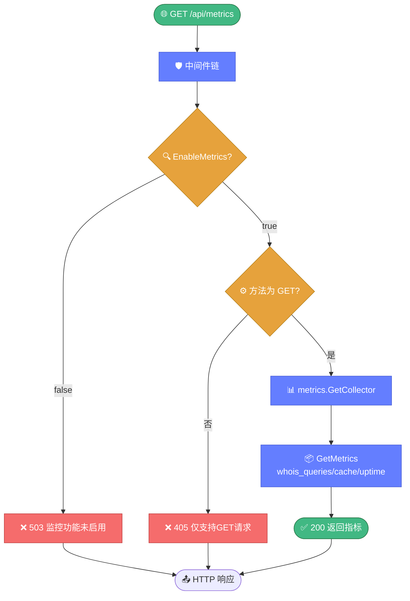

# 📊 监控端点 — GET /api/metrics

> 📖 监控指标查询端点，需服务器开启 `EnableMetrics`，返回 `metrics.GetCollector().GetMetrics()` 采集的全局指标数据。

---

## 📋 概览

| 项目 | 内容 |
|------|------|
| 路径 | `/api/metrics` |
| 方法 | `GET` |
| 处理器 | `handleMetrics` |
| 前置条件 | `s.EnableMetrics == true` |
| 底层函数 | `metrics.GetCollector().GetMetrics()` |

---

## 📝 请求

### 请求参数

无。

### curl 示例

```bash
curl http://127.0.0.1:8080/api/metrics
```

::: warning 前置条件
必须在创建服务器时设置 `s.EnableMetrics = true`，否则返回 `503`。
:::

---

## ✅ 响应示例

```json
{
  "success": true,
  "data": {
    "whois_queries": {
      "total": 1520,
      "successful": 1490,
      "failed": 30,
      "success_rate": 0.9803,
      "avg_latency_ms": 820,
      "by_server": {
        "whois.verisign-grs.com": {
          "total": 800,
          "successful": 790,
          "avg_latency_ms": 750
        }
      }
    },
    "cache": {
      "hits": 320,
      "misses": 1200,
      "hit_rate": 0.2105,
      "size": 1200
    },
    "uptime_seconds": 86400
  }
}
```

### 响应字段说明

| 字段 | 说明 |
|------|------|
| `whois_queries` | WHOIS 查询统计（总数、成功/失败、成功率、平均延迟、按服务器分组） |
| `cache` | 缓存统计（命中/未命中、命中率、大小） |
| `uptime_seconds` | 服务运行时长（秒） |

::: details 指标记录来源
WHOIS 端点 `handleWhoisQuery` 在 `EnableMetrics` 时调用 `metrics.GetCollector().RecordWHOISQuery(server, success, duration)` 记录每次查询。
:::

---

## ❌ 错误码

| HTTP 状态码 | 触发条件 | 错误信息 |
|------------|----------|----------|
| `503` | `EnableMetrics = false` | `监控功能未启用` |
| `405` | 非 GET 方法 | `仅支持GET请求` |

::: tip 检查顺序
先检查 `EnableMetrics`（未启用返回 503），再检查方法（非 GET 返回 405）。即使方法错误，未启用指标时仍返回 503。
:::

下图展示 metrics 端点的检查顺序与数据来源，强调「先检查开关再检查方法」的优先级。



---

## 🔗 相关

- 🌐 [overview.md](./overview.md) — API 概览
- 🖥️ [server.md](./server.md) — `EnableMetrics` 配置
- 🚨 [endpoint-alerts.md](./endpoint-alerts.md) — 告警端点
