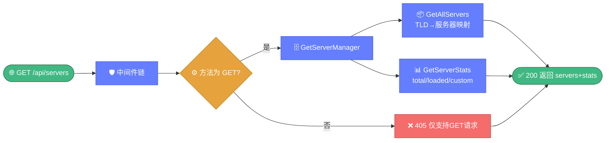

# 🖥️ 服务器端点 — GET /api/servers

> 📖 WHOIS 服务器列表与统计端点，返回 `GetServerManager().GetAllServers()` 的全量服务器配置与 `GetServerStats()` 的统计信息。

---

## 📋 概览

| 项目 | 内容 |
|------|------|
| 路径 | `/api/servers` |
| 方法 | `GET` |
| 处理器 | `handleServers` |
| 底层函数 | `whois.GetServerManager().GetAllServers()` + `.GetServerStats()` |

---

## 📝 请求

### 请求参数

无请求参数，无需请求体。

### curl 示例

```bash
curl http://127.0.0.1:8080/api/servers
```

---

## ✅ 响应示例

```json
{
  "success": true,
  "data": {
    "servers": {
      "com": "whois.verisign-grs.com",
      "net": "whois.verisign-grs.com",
      "org": "whois.publicinterestregistry.org",
      "cn": "whois.cnnic.cn",
      "io": "whois.nic.io"
    },
    "stats": {
      "total": 320,
      "tld_count": 320,
      "loaded": 320,
      "custom_count": 0
    }
  }
}
```

### 响应字段

| 字段 | 类型 | 说明 |
|------|------|------|
| `servers` | `map[string]string` | TLD → WHOIS 服务器地址映射 |
| `stats` | `ServerStats` | 服务器统计信息 |

下图展示此只读端点从 ServerManager 获取全量服务器配置与统计信息的处理流程。



---

## ❌ 错误码

| HTTP 状态码 | 触发条件 | 错误信息 |
|------------|----------|----------|
| `405` | 非 GET 方法 | `仅支持GET请求` |

---

## 🔗 相关

- 🌐 [overview.md](./overview.md) — API 概览
- 📑 [endpoints.md](./endpoints.md) — 端点总览
- 🔎 [endpoint-whois.md](./endpoint-whois.md) — WHOIS 查询端点
