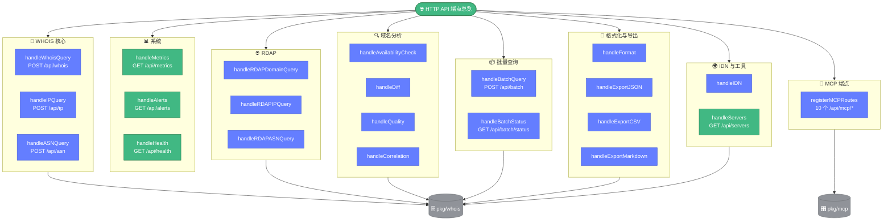

# 📑 端点总览

> 📖 HTTP API 全部端点的导航页，按功能分类列出方法、路径、处理器函数与说明，便于快速定位。

下图按分类汇总全部端点及其处理器函数，绿色为只读系统/工具端点，蓝色为业务查询端点，灰色为底层共享库。

---

## 📋 WHOIS 核心

| 方法 | 路径 | 处理器 | 说明 | 详解 |
|------|------|--------|------|------|
| POST | `/api/whois` | `handleWhoisQuery` | 域名 WHOIS 查询 | [endpoint-whois.md](./endpoint-whois.md) |
| POST | `/api/ip` | `handleIPQuery` | IP WHOIS 查询 | [endpoint-ip.md](./endpoint-ip.md) |
| POST | `/api/asn` | `handleASNQuery` | ASN 查询 | [endpoint-asn.md](./endpoint-asn.md) |

---

## 🌐 RDAP

| 方法 | 路径 | 处理器 | 说明 | 详解 |
|------|------|--------|------|------|
| POST | `/api/rdap/domain` | `handleRDAPDomainQuery` | RDAP 域名查询 | [endpoint-rdap.md](./endpoint-rdap.md) |
| POST | `/api/rdap/ip` | `handleRDAPIPQuery` | RDAP IP 查询 | [endpoint-rdap.md](./endpoint-rdap.md) |
| POST | `/api/rdap/asn` | `handleRDAPASNQuery` | RDAP ASN 查询 | [endpoint-rdap.md](./endpoint-rdap.md) |

---

## 🔍 域名分析

| 方法 | 路径 | 处理器 | 说明 | 详解 |
|------|------|--------|------|------|
| POST | `/api/availability` | `handleAvailabilityCheck` | 域名可用性检查 | [endpoint-availability.md](./endpoint-availability.md) |
| POST | `/api/diff` | `handleDiff` | WHOIS 对比 | [endpoint-diff.md](./endpoint-diff.md) |
| POST | `/api/quality` | `handleQuality` | 质量评估 | [endpoint-quality.md](./endpoint-quality.md) |
| POST | `/api/correlation` | `handleCorrelation` | 关联分析 | [endpoint-correlation.md](./endpoint-correlation.md) |

---

## 📦 批量查询

| 方法 | 路径 | 处理器 | 说明 | 详解 |
|------|------|--------|------|------|
| POST | `/api/batch` | `handleBatchQuery` | 提交批量查询，异步执行 | [endpoint-batch.md](./endpoint-batch.md) |
| GET | `/api/batch/status` | `handleBatchStatus` | 查询批量进度 | [endpoint-batch.md](./endpoint-batch.md) |

---

## 📝 格式化与导出

| 方法 | 路径 | 处理器 | 说明 | 详解 |
|------|------|--------|------|------|
| POST | `/api/format` | `handleFormat` | WHOIS 格式检测/格式化 | [endpoint-format.md](./endpoint-format.md) |
| POST | `/api/export/json` | `handleExportJSON` | 导出 JSON（直接返回字节） | [endpoint-export.md](./endpoint-export.md) |
| POST | `/api/export/csv` | `handleExportCSV` | 导出 CSV（附件下载） | [endpoint-export.md](./endpoint-export.md) |
| POST | `/api/export/markdown` | `handleExportMarkdown` | 导出 Markdown | [endpoint-export.md](./endpoint-export.md) |

---

## 🌍 IDN 与工具

| 方法 | 路径 | 处理器 | 说明 | 详解 |
|------|------|--------|------|------|
| POST | `/api/idn` | `handleIDN` | 国际化域名转换 | [endpoint-idn.md](./endpoint-idn.md) |
| GET | `/api/servers` | `handleServers` | WHOIS 服务器列表与统计 | [endpoint-servers.md](./endpoint-servers.md) |

---

## 📊 系统

| 方法 | 路径 | 处理器 | 说明 | 详解 |
|------|------|--------|------|------|
| GET | `/api/metrics` | `handleMetrics` | 监控指标（需 `EnableMetrics`） | [endpoint-metrics.md](./endpoint-metrics.md) |
| GET | `/api/alerts` | `handleAlerts` | 告警历史（需 `EnableAlerts`） | [endpoint-alerts.md](./endpoint-alerts.md) |
| GET | `/api/health` | `handleHealth` | 健康检查 | [endpoint-health.md](./endpoint-health.md) |

---

## 🤖 MCP 端点

由 `registerMCPRoutes(router)` 注册，通过 `mcp.NewServer` 提供处理器：

| 方法 | 路径 | 处理器 | 说明 |
|------|------|--------|------|
| POST | `/api/mcp/request_planning` | `HandleRequestPlanning()` | 请求规划 |
| POST | `/api/mcp/get_next_task` | `HandleGetNextTask()` | 获取下一任务 |
| POST | `/api/mcp/mark_task_done` | `HandleMarkTaskDone()` | 标记任务完成 |
| POST | `/api/mcp/approve_task_completion` | `HandleApproveTaskCompletion()` | 审批任务完成 |
| POST | `/api/mcp/approve_request_completion` | `HandleApproveRequestCompletion()` | 审批请求完成 |
| POST | `/api/mcp/open_task_details` | `HandleOpenTaskDetails()` | 打开任务详情 |
| POST | `/api/mcp/list_requests` | `HandleListRequests()` | 列出请求 |
| POST | `/api/mcp/add_tasks_to_request` | `HandleAddTasksToRequest()` | 添加任务到请求 |
| POST | `/api/mcp/update_task` | `HandleUpdateTask()` | 更新任务 |
| POST | `/api/mcp/delete_task` | `HandleDeleteTask()` | 删除任务 |

---

## 🔗 相关

- 🌐 [overview.md](./overview.md) — API 概览与统一响应格式
- 🖥️ [server.md](./server.md) — 服务器结构与路由注册
