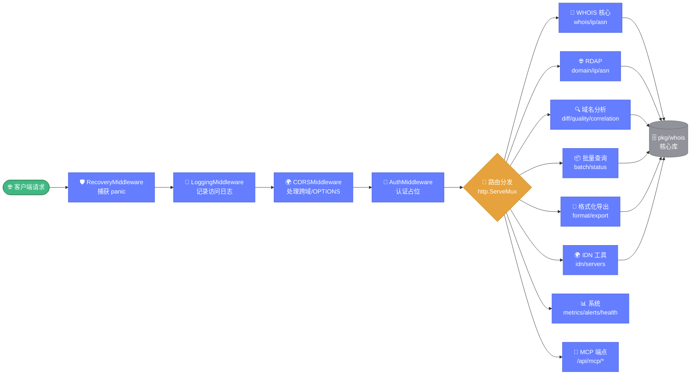
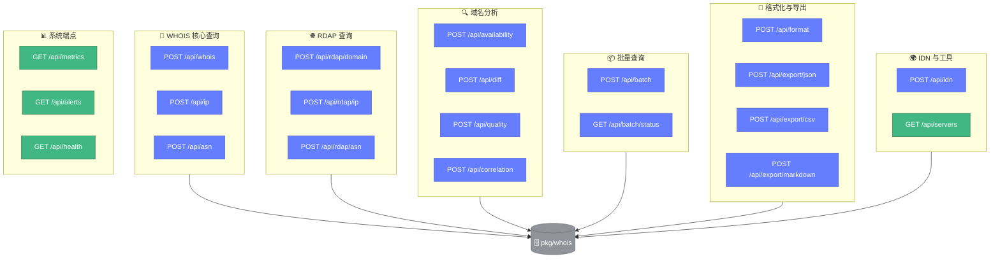

# 🌐 HTTP API 概览

> 📖 whois-skills 提供的 HTTP 接口服务，基于 `pkg/api/server.go` 实现，默认监听 `127.0.0.1:8080`，所有端点均以 POST 方式调用（GET 端点另行标注），统一返回 `APIResponse` 结构。

---

## 📋 服务信息

| 项目 | 内容 |
|------|------|
| 入口文件 | `pkg/api/server.go` |
| 默认地址 | `127.0.0.1:8080` |
| 请求格式 | `Content-Type: application/json` |
| 响应格式 | `application/json`（导出端点除外） |
| 中间件链 | Recovery → Logging → CORS → Auth |

::: tip 启动服务
```go
s := api.NewServer("127.0.0.1", 8080)
s.EnableMetrics = true
s.Start()
```
:::

---

## 📦 统一响应格式

所有端点（导出端点除外）都返回统一的 `APIResponse` 结构：

```go
type APIResponse struct {
    Success bool        `json:"success"`
    Message string      `json:"message,omitempty"`
    Data    interface{} `json:"data,omitempty"`
    Error   string      `json:"error,omitempty"`
}
```

| 字段 | 类型 | 说明 |
|------|------|------|
| `success` | `bool` | 请求是否成功 |
| `message` | `string` | 可选提示信息 |
| `data` | `interface{}` | 成功时返回的数据 |
| `error` | `string` | 失败时的错误描述 |

::: details 发送函数
- `SendSuccessResponse(w, data, message ...string)` — 写入 200，`success=true`
- `SendErrorResponse(w, statusCode, message)` — 写入对应状态码，`success=false`，`error=message`
:::

详见 [response.md](./response.md)。

---

## 🔗 中间件链

请求由外到内依次经过：

```
请求 → RecoveryMiddleware → LoggingMiddleware → CORSMiddleware → AuthMiddleware → 业务处理器
```

下面的流程图展示了 HTTP API 的整体路由结构与中间件链执行顺序，请求自左向右穿过四层中间件后抵达业务处理器。



| 顺序 | 中间件 | 职责 |
|------|--------|------|
| 1（最外） | RecoveryMiddleware | 捕获 panic，返回 500 |
| 2 | LoggingMiddleware | 记录请求日志 |
| 3 | CORSMiddleware | 处理跨域与 OPTIONS 预检 |
| 4（最内） | AuthMiddleware | 认证（占位实现） |

详见 [middleware.md](./middleware.md)。

---

## 📚 端点速查表

### WHOIS 核心

| 方法 | 路径 | 说明 | 详解 |
|------|------|------|------|
| POST | `/api/whois` | 域名 WHOIS 查询 | [endpoint-whois.md](./endpoint-whois.md) |
| POST | `/api/ip` | IP WHOIS 查询 | [endpoint-ip.md](./endpoint-ip.md) |
| POST | `/api/asn` | ASN 查询 | [endpoint-asn.md](./endpoint-asn.md) |

### RDAP

| 方法 | 路径 | 说明 | 详解 |
|------|------|------|------|
| POST | `/api/rdap/domain` | RDAP 域名查询 | [endpoint-rdap.md](./endpoint-rdap.md) |
| POST | `/api/rdap/ip` | RDAP IP 查询 | [endpoint-rdap.md](./endpoint-rdap.md) |
| POST | `/api/rdap/asn` | RDAP ASN 查询 | [endpoint-rdap.md](./endpoint-rdap.md) |

### 域名分析

| 方法 | 路径 | 说明 | 详解 |
|------|------|------|------|
| POST | `/api/availability` | 域名可用性检查 | [endpoint-availability.md](./endpoint-availability.md) |
| POST | `/api/diff` | WHOIS 对比 | [endpoint-diff.md](./endpoint-diff.md) |
| POST | `/api/quality` | 质量评估 | [endpoint-quality.md](./endpoint-quality.md) |
| POST | `/api/correlation` | 关联分析 | [endpoint-correlation.md](./endpoint-correlation.md) |

### 批量查询

| 方法 | 路径 | 说明 | 详解 |
|------|------|------|------|
| POST | `/api/batch` | 提交批量查询 | [endpoint-batch.md](./endpoint-batch.md) |
| GET | `/api/batch/status` | 查询批量进度 | [endpoint-batch.md](./endpoint-batch.md) |

### 格式化与导出

| 方法 | 路径 | 说明 | 详解 |
|------|------|------|------|
| POST | `/api/format` | WHOIS 格式检测/格式化 | [endpoint-format.md](./endpoint-format.md) |
| POST | `/api/export/json` | 导出 JSON | [endpoint-export.md](./endpoint-export.md) |
| POST | `/api/export/csv` | 导出 CSV | [endpoint-export.md](./endpoint-export.md) |
| POST | `/api/export/markdown` | 导出 Markdown | [endpoint-export.md](./endpoint-export.md) |

### IDN 与工具

| 方法 | 路径 | 说明 | 详解 |
|------|------|------|------|
| POST | `/api/idn` | 国际化域名转换 | [endpoint-idn.md](./endpoint-idn.md) |
| GET | `/api/servers` | WHOIS 服务器列表 | [endpoint-servers.md](./endpoint-servers.md) |

### 系统

| 方法 | 路径 | 说明 | 详解 |
|------|------|------|------|
| GET | `/api/metrics` | 监控指标 | [endpoint-metrics.md](./endpoint-metrics.md) |
| GET | `/api/alerts` | 告警历史 | [endpoint-alerts.md](./endpoint-alerts.md) |
| GET | `/api/health` | 健康检查 | [endpoint-health.md](./endpoint-health.md) |

### MCP 端点

| 方法 | 路径 | 说明 |
|------|------|------|
| POST | `/api/mcp/request_planning` | 请求规划 |
| POST | `/api/mcp/get_next_task` | 获取下一任务 |
| POST | `/api/mcp/mark_task_done` | 标记任务完成 |
| POST | `/api/mcp/approve_task_completion` | 审批任务完成 |
| POST | `/api/mcp/approve_request_completion` | 审批请求完成 |
| POST | `/api/mcp/open_task_details` | 打开任务详情 |
| POST | `/api/mcp/list_requests` | 列出请求 |
| POST | `/api/mcp/add_tasks_to_request` | 添加任务 |
| POST | `/api/mcp/update_task` | 更新任务 |
| POST | `/api/mcp/delete_task` | 删除任务 |

完整端点总览见 [endpoints.md](./endpoints.md)。

下图按功能分类汇总全部端点，颜色按职责区分：绿色为只读系统端点，蓝色为业务查询端点，灰色为底层依赖。



---

## 🚀 curl 调用示例

```bash
# WHOIS 查询
curl -X POST http://127.0.0.1:8080/api/whois \
  -H "Content-Type: application/json" \
  -d '{"domain": "example.com"}'

# 健康检查（GET）
curl http://127.0.0.1:8080/api/health

# 带完整选项的查询
curl -X POST http://127.0.0.1:8080/api/whois \
  -H "Content-Type: application/json" \
  -d '{
    "domain": "example.com",
    "timeout": 15,
    "max_retries": 5,
    "validate_result": true,
    "required_fields": ["registrar", "created_date"]
  }'
```

---

## 🔗 相关

- 🖥️ [server.md](./server.md) — 服务器结构
- 🛡️ [middleware.md](./middleware.md) — 中间件
- 📦 [response.md](./response.md) — 响应结构
- 📑 [endpoints.md](./endpoints.md) — 端点总览
