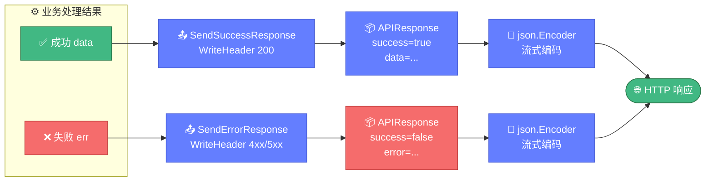

# 📦 response.go — 响应结构

> 📖 定义 HTTP API 的统一响应结构 `APIResponse` 与两个响应发送函数 `SendSuccessResponse` / `SendErrorResponse`，所有端点（导出端点除外）均使用此结构返回结果。

---

## 📋 概览

| 项目 | 内容 |
|------|------|
| 文件 | `pkg/api/response.go` |
| 核心职责 | 统一响应格式、状态码与 JSON 编码 |
| 编码方式 | `json.NewEncoder(w).Encode` 流式编码 |

---

## 📊 APIResponse 结构

```go
type APIResponse struct {
    Success bool        `json:"success"`
    Message string      `json:"message,omitempty"`
    Data    interface{} `json:"data,omitempty"`
    Error   string      `json:"error,omitempty"`
}
```

| 字段 | 类型 | JSON 标签 | 说明 |
|------|------|-----------|------|
| `Success` | `bool` | `success` | 请求是否成功 |
| `Message` | `string` | `message,omitempty` | 可选提示信息，空值省略 |
| `Data` | `interface{}` | `data,omitempty` | 成功返回的数据，空值省略 |
| `Error` | `string` | `error,omitempty` | 失败时的错误描述，空值省略 |

::: tip omitempty 行为
`Message`、`Data`、`Error` 均带 `omitempty`，零值字段不会出现在 JSON 中。成功响应不含 `error`，失败响应不含 `data`。
:::

下图说明 `APIResponse` 如何根据成功/失败两条路径被封装，并由 `SendSuccessResponse` / `SendErrorResponse` 写入 HTTP 响应。



---

## 🔧 发送函数

### SendErrorResponse

```go
func SendErrorResponse(w http.ResponseWriter, statusCode int, message string)
```

| 参数 | 说明 |
|------|------|
| `w` | 响应写入器 |
| `statusCode` | HTTP 状态码（如 400、404、500、503） |
| `message` | 错误描述，写入 `Error` 字段 |

行为：
1. 设置 `Content-Type: application/json`
2. `w.WriteHeader(statusCode)` 写入状态码
3. 构造 `APIResponse{Success: false, Error: message}`
4. `json.NewEncoder(w).Encode(response)` 流式编码

---

### SendSuccessResponse

```go
func SendSuccessResponse(w http.ResponseWriter, data interface{}, message ...string)
```

| 参数 | 说明 |
|------|------|
| `w` | 响应写入器 |
| `data` | 返回数据，写入 `Data` 字段 |
| `message` | 可变参数，可选提示信息（仅取第一个） |

行为：
1. 设置 `Content-Type: application/json`
2. `w.WriteHeader(http.StatusOK)` 固定写入 200
3. 构造 `APIResponse{Success: true, Data: data}`
4. 若 `len(message) > 0` 则填入 `Message`
5. `json.NewEncoder(w).Encode(response)` 流式编码

::: details 可变参数 message
```go
SendSuccessResponse(w, result)                          // 不带 message
SendSuccessResponse(w, result, "查询成功")               // 带 message
SendSuccessResponse(w, result, "查询成功", "多余参数")    // 仅取第一个
```
:::

---

## 🚀 使用示例

### 成功响应

```go
SendSuccessResponse(w, result)
// 输出: {"success":true,"data":{...}}

SendSuccessResponse(w, result, "查询成功")
// 输出: {"success":true,"message":"查询成功","data":{...}}
```

### 错误响应

```go
SendErrorResponse(w, http.StatusBadRequest, "域名不能为空")
// HTTP 400
// 输出: {"success":false,"error":"域名不能为空"}

SendErrorResponse(w, http.StatusInternalServerError, "查询失败: timeout")
// HTTP 500
// 输出: {"success":false,"error":"查询失败: timeout"}
```

---

## ⚠️ 注意事项

| 注意点 | 说明 |
|--------|------|
| 导出端点例外 | `/api/export/{json,csv,markdown}` 直接返回文件内容，**不**使用 `APIResponse` 包装 |
| Content-Type 固定 | 两个函数均固定写 `application/json`，导出端点自行设置 |
| 成功状态码固定 | `SendSuccessResponse` 永远返回 200，无法自定义 |

---

## 🔗 相关

- 🖥️ [server.md](./server.md) — 各端点调用响应函数
- 🛡️ [middleware.md](./middleware.md) — `RecoveryMiddleware` 调用 `SendErrorResponse`
- 🌐 [overview.md](./overview.md) — 统一响应格式概览
