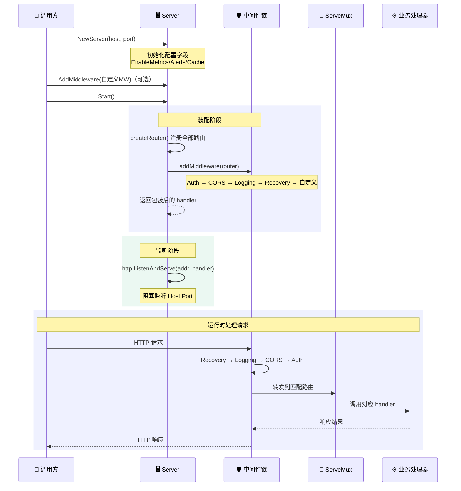
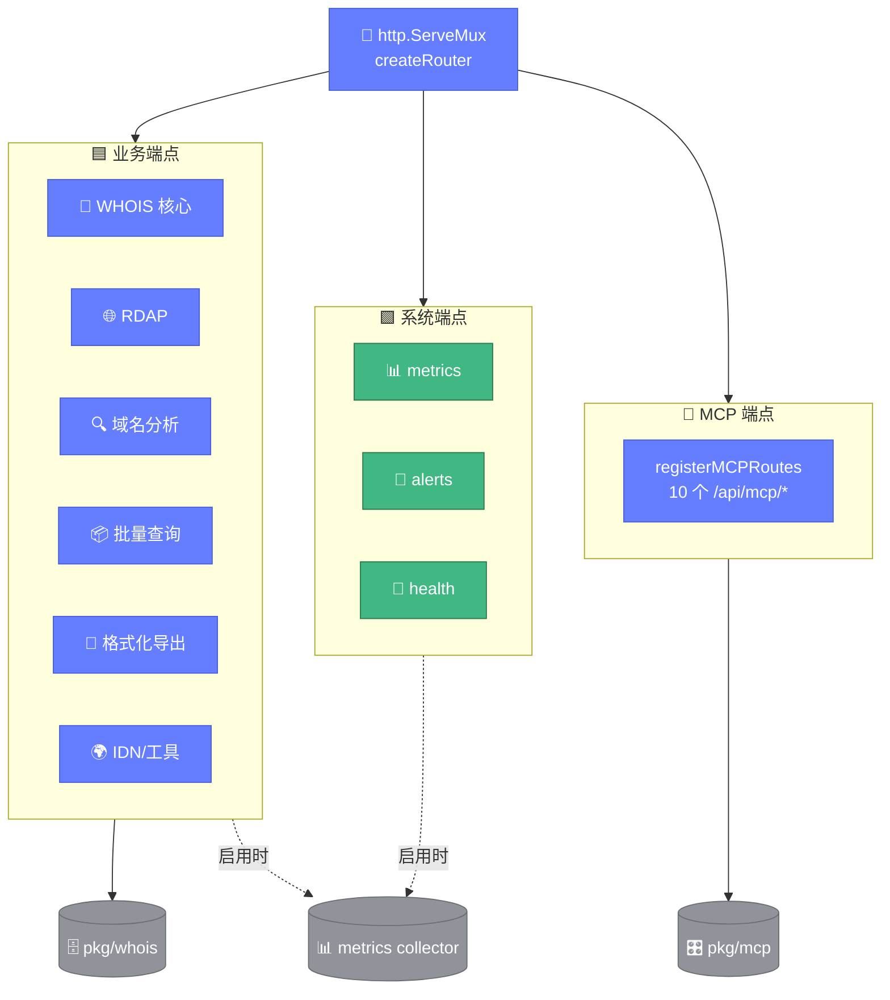

# 🖥️ server.go — API 服务器

> 📖 HTTP API 服务器的核心结构，负责路由注册、中间件装配与监听启动，承载所有业务端点与 MCP 端点。

---

## 📋 概览

| 项目 | 内容 |
|------|------|
| 文件 | `pkg/api/server.go` |
| 核心职责 | 服务器配置、路由注册、中间件链装配、批量会话管理 |
| 默认端口 | `8080` |
| 路由器 | `http.NewServeMux()` |

---

## ⚙️ Server 结构

```go
type Server struct {
    Host string
    Port int

    EnableProxy   bool
    EnableCache   bool
    EnableMetrics bool
    EnableAlerts  bool

    middlewares   []func(http.Handler) http.Handler
    batchSessions sync.Map
}
```

### 字段说明

| 字段 | 类型 | 说明 |
|------|------|------|
| `Host` | `string` | 监听主机，如 `127.0.0.1` |
| `Port` | `int` | 监听端口，如 `8080` |
| `EnableProxy` | `bool` | 是否启用代理 |
| `EnableCache` | `bool` | 是否启用缓存 |
| `EnableMetrics` | `bool` | 是否启用监控指标（影响 `/api/metrics`） |
| `EnableAlerts` | `bool` | 是否启用告警（影响 `/api/alerts`） |
| `middlewares` | `[]func(http.Handler) http.Handler` | 自定义中间件列表 |
| `batchSessions` | `sync.Map` | 批量查询会话存储（key 为 sessionID） |

---

## 📦 batchSession 类型

批量查询会话，未导出：

```go
type batchSession struct {
    ID        string
    Processor *whois.StreamBatchProcessor
    Stats     whois.StreamBatchStats
    Domains   []string
    CreatedAt time.Time
}
```

| 字段 | 说明 |
|------|------|
| `ID` | 会话 ID，格式 `batch-<UnixNano>` |
| `Processor` | 流式批量处理器 |
| `Stats` | 统计信息 |
| `Domains` | 待查询域名列表 |
| `CreatedAt` | 创建时间 |

---

## 🔧 方法

| 方法 | 说明 |
|------|------|
| `NewServer(host string, port int) *Server` | 创建服务器实例 |
| `Start() error` | 启动服务器，监听 `Host:Port` |
| `CreateHandler() http.Handler` | 创建处理器（路由 + 中间件），可供外部 `http.Server` 使用 |
| `AddMiddleware(middleware func(http.Handler) http.Handler)` | 添加自定义中间件 |

### Start 流程

1. 拼接监听地址 `Host:Port`
2. `CreateHandler()` 创建路由处理器
3. `http.ListenAndServe(addr, router)` 启动

下面的时序图展示了服务器从创建到监听的生命周期，包括中间件装配、路由注册与请求处理全过程。



---

## 🔗 中间件链装配

`addMiddleware` 的包装顺序（由内到外）：

```
路由 → AuthMiddleware → CORSMiddleware → LoggingMiddleware → RecoveryMiddleware → 自定义中间件
```

```go
func (s *Server) addMiddleware(next http.Handler) http.Handler {
    handler := AuthMiddleware(next)        // 最内
    handler = CORSMiddleware(handler)
    handler = LoggingMiddleware(handler)
    handler = RecoveryMiddleware(handler) // 最外
    for _, mw := range s.middlewares {     // 自定义中间件包在最外层
        handler = mw(handler)
    }
    return handler
}
```

::: tip 执行顺序
请求实际经过顺序为：自定义 → Recovery → Logging → CORS → Auth → 业务处理器。
:::

---

## 📑 路由注册

`createRouter()` 通过 `http.ServeMux` 注册全部端点，分为以下分类：

- WHOIS 核心查询：`/api/whois`、`/api/ip`、`/api/asn`
- RDAP 查询：`/api/rdap/{domain,ip,asn}`
- 域名分析：`/api/availability`、`/api/diff`、`/api/quality`、`/api/correlation`
- 批量查询：`/api/batch`、`/api/batch/status`
- 格式化与导出：`/api/format`、`/api/export/{json,csv,markdown}`
- IDN 与工具：`/api/idn`、`/api/servers`
- 系统端点：`/api/metrics`、`/api/alerts`、`/api/health`
- MCP 端点：`registerMCPRoutes(router)` 注册 10 个 `/api/mcp/*` 端点

下图呈现 `createRouter()` 注册的全部路由分类与底层依赖关系，路由器统一调度各业务端点并委托 `pkg/whois` 与 `pkg/mcp`。



---

## ⚠️ 统一错误处理约定

各端点遵循一致的错误返回约定：

| 场景 | HTTP 状态码 | 错误信息 |
|------|------------|----------|
| 非 GET/POST 方法 | `405 Method Not Allowed` | `仅支持POST请求` / `仅支持GET请求` |
| JSON 解码失败 | `400 Bad Request` | `无效的请求格式` |
| 必填字段为空（domain/ip 等） | `400 Bad Request` | `域名不能为空` 等 |
| 查询/处理失败 | `500 Internal Server Error` | `查询失败: ...` |
| 批量会话不存在 | `404 Not Found` | `会话不存在` |
| 功能未启用（metrics/alerts） | `503 Service Unavailable` | `监控功能未启用` 等 |

---

## 🚀 使用示例

```go
package main

import "github.com/cyberspacesec/whois-skills/pkg/api"

func main() {
    s := api.NewServer("127.0.0.1", 8080)
    s.EnableMetrics = true
    s.EnableAlerts = true
    s.EnableCache = true

    // 添加自定义中间件（可选）
    // s.AddMiddleware(myMiddleware)

    if err := s.Start(); err != nil {
        panic(err)
    }
}
```

::: details 也可用于自定义 http.Server
```go
s := api.NewServer("0.0.0.0", 8080)
httpSrv := &http.Server{
    Handler:      s.CreateHandler(),
    ReadTimeout:  10 * time.Second,
    WriteTimeout: 30 * time.Second,
}
httpSrv.ListenAndServe()
```
:::

---

## 🔗 相关

- 🌐 [overview.md](./overview.md) — API 概览
- 🛡️ [middleware.md](./middleware.md) — 中间件
- 📦 [response.md](./response.md) — 响应结构
- 📑 [endpoints.md](./endpoints.md) — 端点总览
