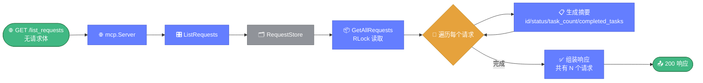

# 📡 GET /list_requests — 列出请求

> 📖 返回当前存储中所有请求的摘要信息，含状态、任务数与已完成任务数。

---

## 📋 概述

| 项目 | 内容 |
|------|------|
| 方法 | `GET` |
| 路径 | `/api/mcp/list_requests` 或 `/mcp/list_requests` |
| Controller 方法 | `ListRequests()` |
| 状态变更 | 无（只读） |
| 请求体 | 无 |

---

## 📥 请求

无需请求体，直接 GET。

### curl 示例

```bash
curl http://localhost:8080/api/mcp/list_requests
```

---

## 📤 响应示例

```json
{
  "requests": [
    {
      "id": "a1b2c3d4-....",
      "original_request": "调研 example.com 归属",
      "status": "in_progress",
      "task_count": 2,
      "completed_tasks": 1,
      "created_at": "2026-07-03T10:00:00Z"
    }
  ],
  "message": "共有 1 个请求"
}
```

- `completed_tasks` 统计的是状态为 `approved` 的任务数。
- `status` 为 `RequestStatus`（`pending`/`in_progress`/`done`）。

下图展示列出请求端点的只读流程，遍历存储中全部请求并生成摘要（含任务计数）。



---

## 🔄 状态转换

只读，不改变状态。

---

## 🔗 相关

- 📡 [请求规划](./endpoint-request-planning.md)
- 📡 [任务详情](./endpoint-task-details.md)
- 🎛️ [控制器 controller.go](./controller.md)
