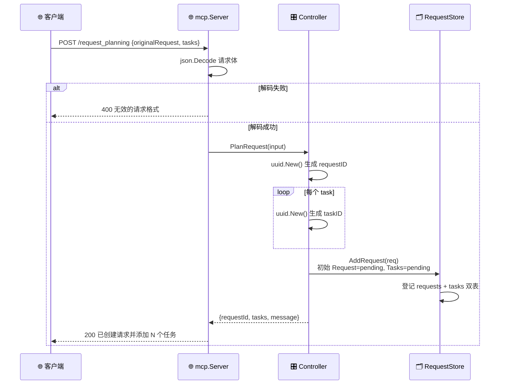

# 📡 POST /request_planning — 请求规划

> 📖 创建一个新的 MCP 请求并附带初始任务列表，生成请求 ID 与各任务 ID，进入 `pending` 状态。

---

## 📋 概述

| 项目 | 内容 |
|------|------|
| 方法 | `POST` |
| 路径 | `/api/mcp/request_planning` 或 `/mcp/request_planning` |
| Controller 方法 | `PlanRequest(RequestPlanningInput)` |
| 状态变更 | 新建请求（`pending`）+ 新建任务（`pending`） |

---

## 📥 请求

### 请求体字段

| 字段 | 类型 | 必填 | 说明 |
|------|------|------|------|
| `originalRequest` | string | 是 | 原始请求描述 |
| `tasks` | array | 是 | 任务列表，不可为空 |
| `tasks[].title` | string | 是 | 任务标题 |
| `tasks[].description` | string | 是 | 任务描述 |
| `splitDetails` | string | 否 | 任务拆分说明 |

### curl 示例

```bash
curl -X POST http://localhost:8080/api/mcp/request_planning \
  -H "Content-Type: application/json" \
  -d '{
    "originalRequest": "调研 example.com 归属",
    "splitDetails": "拆为 WHOIS 与 RDAP 两步",
    "tasks": [
      {"title": "查 WHOIS", "description": "查询域名注册信息"},
      {"title": "查 RDAP",  "description": "查询 RDAP 数据"}
    ]
  }'
```

---

## 📤 响应示例

```json
{
  "requestId": "a1b2c3d4-....",
  "tasks": [
    {"id": "task-id-1", "title": "查 WHOIS", "description": "查询域名注册信息"},
    {"id": "task-id-2", "title": "查 RDAP",  "description": "查询 RDAP 数据"}
  ],
  "message": "已创建请求并添加 2 个任务"
}
```

- `requestId`、各 `id` 均由 `uuid.New()` 生成。
- 请求初始状态 `pending`，任务初始状态 `pending`。

---

## 🔄 状态转换

```
(无) ──request_planning──▶ Request: pending
                            Task:   pending (×N)
```

下图展示请求规划端点的交互时序：生成 UUID、初始化 pending 状态并入库。



---

## 🔗 相关

- 📡 [获取下一个任务](./endpoint-get-next-task.md)
- 🎛️ [控制器 controller.go](./controller.md)
- 🧭 [MCP 概览](./overview.md)
