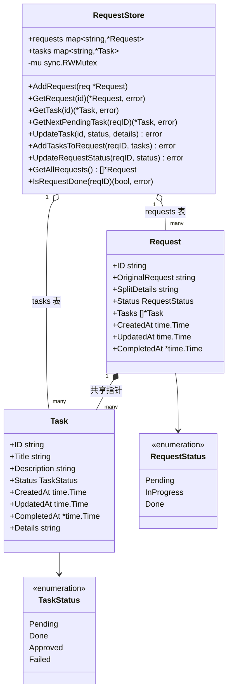

# 🗂️ models.go — 数据模型

> 📖 定义 MCP 协议的状态常量、`Task` / `Request` 结构体，以及并发安全的 `RequestStore` 存储层（双映射表 + 读写锁）。

---

## 📋 概览

| 项目 | 内容 |
|------|------|
| 文件 | `pkg/mcp/models.go` |
| 核心类型 | `RequestStatus`、`TaskStatus`、`Task`、`Request`、`RequestStore` |
| 并发安全 | `sync.RWMutex`（读 `RLock`，写 `Lock`） |

---

## 🚦 状态常量

### 请求状态 `RequestStatus`

| 常量 | 值 | 含义 |
|------|------|------|
| `RequestStatusPending` | `"pending"` | 刚规划，尚无任务推进 |
| `RequestStatusProgress` | `"in_progress"` | 任务执行中 |
| `RequestStatusDone` | `"done"` | 完成（所有任务已批准 / 请求已批准） |

### 任务状态 `TaskStatus`

| 常量 | 值 | 含义 |
|------|------|------|
| `TaskStatusPending` | `"pending"` | 已创建待执行 |
| `TaskStatusDone` | `"done"` | 已完成待批准 |
| `TaskStatusApproved` | `"approved"` | 已批准 |
| `TaskStatusFailed` | `"failed"` | 执行失败 |

```go
type RequestStatus string
type TaskStatus   string
```

---

## 📦 Task 结构

```go
type Task struct {
    ID          string     `json:"id"`
    Title       string     `json:"title"`
    Description string     `json:"description"`
    Status      TaskStatus `json:"status"`
    CreatedAt   time.Time  `json:"created_at"`
    UpdatedAt   time.Time  `json:"updated_at"`
    CompletedAt *time.Time `json:"completed_at,omitempty"`
    Details     string     `json:"details,omitempty"`
}
```

- `CompletedAt` 为指针，仅任务进入 `done`/`approved` 时由 `UpdateTask` 填写。
- `Details` 存放 `MarkTaskDone` 提交的完成说明。

---

## 📦 Request 结构

```go
type Request struct {
    ID              string        `json:"id"`
    OriginalRequest string        `json:"original_request"`
    SplitDetails    string        `json:"split_details,omitempty"`
    Status          RequestStatus `json:"status"`
    Tasks           []*Task       `json:"tasks"`
    CreatedAt       time.Time     `json:"created_at"`
    UpdatedAt       time.Time     `json:"updated_at"`
    CompletedAt     *time.Time    `json:"completed_at,omitempty"`
}
```

`Tasks` 与全局任务映射表共享同一指针，修改任务会同时反映在请求视图与全局查询中。

下图用类图呈现 `Request`、`Task` 与 `RequestStore` 的结构关系，包括双映射表设计与状态常量归属。



---

## 🗃️ RequestStore

```go
type RequestStore struct {
    requests map[string]*Request
    tasks    map[string]*Task
    mu       sync.RWMutex
}

func NewRequestStore() *RequestStore
```

双映射表设计：`requests` 按 requestID 索引请求，`tasks` 按 taskID 索引任务，实现 **O(1)** 任务查找，无需遍历请求。

### 方法一览

| 方法 | 锁 | 说明 |
|------|------|------|
| `AddRequest(request *Request)` | `Lock` | 入库请求及其所有任务 |
| `GetRequest(id) (*Request, error)` | `RLock` | 取请求，不存在报错 |
| `GetTask(id) (*Task, error)` | `RLock` | 取任务，不存在报错 |
| `GetNextPendingTask(requestID) (*Task, error)` | `RLock` | 返回首个 pending 任务；**无待处理返回 `(nil, nil)`** |
| `UpdateTask(taskID, status, details) error` | `Lock` | 改状态；done/approved 设 `CompletedAt`；联动请求状态 |
| `AddTasksToRequest(requestID, tasks) error` | `Lock` | 追加任务并登记进 tasks 表 |
| `UpdateRequestStatus(requestID, status) error` | `Lock` | 直接改请求状态，done 时填 `CompletedAt` |
| `GetAllRequests() []*Request` | `RLock` | 返回所有请求副本切片 |
| `IsRequestDone(requestID) (bool, error)` | `RLock` | 判断请求是否 done |

### UpdateTask 的联动逻辑

```go
// 1. 改 task.Status / UpdatedAt；done|approved 时填 CompletedAt
// 2. 找到所属 request，更新其 UpdatedAt
// 3. 检查 request 内所有任务是否全部 approved：
//      是 → request.Status = done，填 CompletedAt
//      否 → request.Status = in_progress
```

::: tip 关键约定
`GetNextPendingTask` 在「请求存在但无待处理任务」时返回 `(nil, nil)`——`nil` 任务而非 `nil` error，调用方需同时判断两者。
:::

下图展示 `RequestStore` 的双映射表设计与读写锁并发控制，`requests` 与 `tasks` 通过共享 `*Task` 指针关联。

```mermaid
flowchart TD
  subgraph Store[🗂️ RequestStore]
    direction TB
    Mu[🔒 sync.RWMutex<br/>读 RLock / 写 Lock]

    subgraph Maps[双映射表]
      RM[📦 requests map<br/>requestID → *Request]
      TM[📦 tasks map<br/>taskID → *Task]
    end
  end

  RM --> Req[📄 Request<br/>Tasks: []*Task]
  TM --> T1[📌 Task A]
  TM --> T2[📌 Task B]
  Req -.共享指针.-> T1
  Req -.共享指针.-> T2

  Op1[🔍 GetTask<br/>O1 查找] -->|RLock| TM
  Op2[🔍 GetNextPendingTask<br/>遍历请求任务] -->|RLock| RM
  Op3[✏️ UpdateTask<br/>改状态+联动] -->|Lock| TM
  Op3 -->|Lock| RM
  Op4[➕ AddTasksToRequest<br/>登记两表] -->|Lock| RM
  Op4 -->|Lock| TM

  classDef entry fill:#41b883,color:#fff,stroke:#2b7a4b
  classDef svc fill:#647eff,color:#fff,stroke:#4a5fd6
  classDef infra fill:#909399,color:#fff,stroke:#6b6e72

  class Op1,Op2 entry
  class Op3,Op4,Req,T1,T2 svc
  class Mu,RM,TM,Maps,Store infra
```

---

## 🚀 使用示例

```go
store := mcp.NewRequestStore()

// 入库
store.AddRequest(&mcp.Request{
    ID: "req-1", Status: mcp.RequestStatusPending,
    Tasks: []*mcp.Task{{ID: "t-1", Status: mcp.TaskStatusPending}},
})

// 取下一个待处理任务
task, err := store.GetNextPendingTask("req-1") // task != nil
task, err = store.GetNextPendingTask("req-1")  // 标记 done 后再次取 → (nil, nil)

// 标记完成 → 联动请求状态
store.UpdateTask("t-1", mcp.TaskStatusDone, "完成说明")

// 全局 O(1) 查任务
t, _ := store.GetTask("t-1")
```

---

## 🔗 相关

- 🎛️ [控制器 controller.go](./controller.md)
- 🧭 [MCP 概览](./overview.md)
