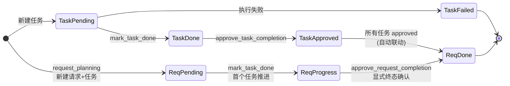

# 🧭 MCP 概览

> 📖 Mission Control Protocol 将 WHOIS 能力封装为可控的任务流程：请求规划 → 获取任务 → 执行 → 标记完成 → 审批，通过显式状态机驱动多步骤查询任务。

---

## 📋 协议概览

| 项目 | 内容 |
|------|------|
| 包路径 | `pkg/mcp` |
| 全称 | Mission Control Protocol（任务控制协议） |
| 核心定位 | 任务规划 / 执行 / 审批的状态机协议 |
| 关键组件 | `Controller`、`RequestStore`、`Server` |
| 模型文件 | `models.go`（状态常量与结构体） |

MCP 把一次复杂的 WHOIS 调研拆解为若干**任务**，挂在一个**请求**下，逐个执行并经过批准，使整个流程可追踪、可审批、可回溯。

---

## 🚀 两套 HTTP 路径

| 路径前缀 | 集成方式 | 注册方法 |
|----------|----------|----------|
| `/mcp/*` | gorilla/mux 独立路由 | `Server.RegisterRoutes(router *mux.Router)` |
| `/api/mcp/*` | 集成进主 API 服务器（`http.ServeMux`） | `pkg/api` 调用 `HandleXxx()` 系列包装器 |

两条路径背后的处理函数完全相同——`/api/mcp/*` 由 `pkg/api/server.go` 的 `registerMCPRoutes` 调用 `mcp.NewServer(...)` 后委托各 `HandleXxx()`（返回 `http.HandlerFunc`），`/mcp/*` 则由 `Server.RegisterRoutes` 在 gorilla/mux 上注册带方法约束的路由。

::: tip 选用建议
- 已使用主 API 服务器的部署 → 直接走 `/api/mcp/*`，无需额外起服务。
- 需要独立 MCP 服务或自定义中间件 → 走 `/mcp/*`，用 gorilla/mux 自行挂载。
:::

---

## 🔁 状态机

### 任务状态 `TaskStatus`

```
pending ──mark_task_done──▶ done ──approve_task_completion──▶ approved
   │                          │
   └──────(执行失败)────────▶ failed
```

| 常量 | 值 | 含义 |
|------|------|------|
| `TaskStatusPending` | `"pending"` | 已创建，待执行 |
| `TaskStatusDone` | `"done"` | 已执行完成，待批准 |
| `TaskStatusApproved` | `"approved"` | 已通过审批 |
| `TaskStatusFailed` | `"failed"` | 执行失败 |

### 请求状态 `RequestStatus`

```
pending ──(首个任务变更)──▶ in_progress ──(所有任务 approved)──▶ done
```

| 常量 | 值 | 含义 |
|------|------|------|
| `RequestStatusPending` | `"pending"` | 刚规划完成，尚无任务推进 |
| `RequestStatusProgress` | `"in_progress"` | 任务执行中 |
| `RequestStatusDone` | `"done"` | 所有任务已批准 / 请求已批准完成 |

::: details 自动联动
`RequestStore.UpdateTask` 在任务状态变更时，会检查请求内**所有任务是否均为 `approved`**——是则请求自动置为 `done` 并填写 `CompletedAt`，否则置为 `in_progress`。`ApproveRequestCompletion` 则要求所有任务 `approved` 后显式批准。
:::

下图呈现 MCP 协议中请求与任务的完整生命周期状态机，任务由 `pending` 推进至 `done` 再经审批到 `approved`，请求随之在 `pending → in_progress → done` 间联动。



---

## 📡 端点速查表

| 端点（`/api/mcp/*` 与 `/mcp/*`） | 方法 | 说明 |
|------|------|------|
| `request_planning` | POST | 规划请求，生成请求与初始任务 |
| `get_next_task` | POST | 取下一个待处理任务 |
| `mark_task_done` | POST | 标记任务已完成（pending→done） |
| `approve_task_completion` | POST | 批准任务（done→approved） |
| `approve_request_completion` | POST | 批准整个请求（请求→done） |
| `open_task_details` | POST | 查看任务详情 |
| `list_requests` | GET | 列出所有请求 |
| `add_tasks_to_request` | POST | 向请求追加任务 |
| `update_task` | POST | 更新任务标题 / 描述 |
| `delete_task` | POST | 删除任务 |

---

## 🧩 Controller 双重职责

`Controller`（`pkg/mcp/controller.go`）同时承担两类能力：

1. **任务管理**：规划、获取、完成、批准、列表、增删改查——驱动状态机。
2. **WHOIS 查询封装**：域名 WHOIS、IP WHOIS、ASN、RDAP、可用性、对比、质量评估、域名规范化——把 `pkg/whois` 的能力集中暴露为统一方法。

因此 MCP 既是任务编排层，也是 WHOIS 能力的统一入口。

下图展示 MCP 协议的整体架构：两条 HTTP 路径（`/mcp/*` 与 `/api/mcp/*`）复用同一套 `Controller`，Controller 既驱动任务状态机，又封装 `pkg/whois` 的查询能力。

```mermaid
flowchart TD
  subgraph Routes[📡 HTTP 路径]
    R1[/mcp/*<br/>gorilla/mux 独立路由]
    R2[/api/mcp/*<br/>主 API ServeMux 集成]
  end

  Routes --> Server[🌐 mcp.Server<br/>解码/调用/响应]

  Server --> Ctrl{🎛️ Controller}

  subgraph Task[🅰️ 任务管理]
    T1[PlanRequest]
    T2[GetNextTask]
    T3[MarkTaskDone]
    T4[ApproveTask/Request]
    T5[List/Add/Update/Delete]
  end

  subgraph Query[🅱️ WHOIS 查询封装]
    Q1[ExecuteWhoisQuery]
    Q2[ExecuteIP/ASN/RDAP]
    Q3[CheckAvailability]
    Q4[Compare/Assess/Normalize]
  end

  Ctrl --> Task
  Ctrl --> Query

  Task --> Store[(🗂️ RequestStore<br/>双映射表+RWMutex)]
  Query --> Whois[(🗄️ pkg/whois<br/>核心库)]

  classDef entry fill:#41b883,color:#fff,stroke:#2b7a4b
  classDef svc fill:#647eff,color:#fff,stroke:#4a5fd6
  classDef check fill:#e6a23c,color:#fff,stroke:#b7821c
  classDef infra fill:#909399,color:#fff,stroke:#6b6e72

  class R1,R2 entry
  class Server,T1,T2,T3,T4,T5,Q1,Q2,Q3,Q4 svc
  class Ctrl check
  class Store,Whois infra
```

---

## 🔗 相关

- 🎛️ [控制器 controller.go](./controller.md)
- 🗂️ [数据模型 models.go](./models.md)
- 🌐 [服务端 server.go](./server.md)
- 📡 [端点详解](./endpoint-request-planning.md)
