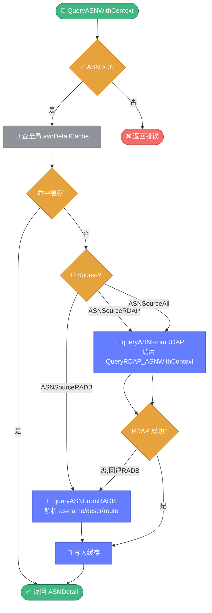

# 🚀 asn_enhanced.go — 增强版 ASN 查询

> 📖 整合 RDAP 与 RADB 双数据源的增强 ASN 查询引擎，提供缓存、批量查询、BGP 关系（上下游/对等）分析能力。

---

## 📋 概览

| 项目 | 内容 |
|------|------|
| 文件 | `pkg/whois/asn_enhanced.go` |
| 核心职责 | ASN 注册信息与前缀查询、缓存、批量、BGP 关系 |
| 数据源 | RDAP（`rdap.go`）+ RADB（`asn.go`） |
| 缓存 | 全局 `asnDetailCache` 单例 |

---

## 🚀 快速使用

```go
import "github.com/cyberspacesec/whois-skills/pkg/whois"

// 1. 简化查询（默认双源 + 含前缀）
detail, err := whois.QueryASN(13335)
if err != nil {
    log.Fatal(err)
}
fmt.Println(detail.Name, detail.Country, detail.Organization)
fmt.Println("IPv4 前缀：", detail.IPv4Prefixes)

// 2. 批量查询
result := whois.BatchQueryASN(ctx, []int{13335, 15169, 32934}, 10)
for asn, d := range result.Results {
    fmt.Printf("%d: %s\n", asn, d.Name)
}
```

---

## 📊 核心类型

### ASNDetail

```go
type ASNDetail struct {
    ASN             int        // ASN 数字
    ASNString       string     // "AS13335"
    Name            string     // AS 名称
    Organization    string     // 持有组织
    Country         string     // 国家
    RIR             string     // 分配的 RIR（ARIN/RIPE/APNIC/LACNIC/AFRINIC）
    AllocationDate  string     // 分配日期
    Status          string     // 状态
    Description     string     // 描述
    IPv4Prefixes    []string   // IPv4 前缀
    IPv6Prefixes    []string   // IPv6 前缀
    UpstreamASNs    []int      // 上游 AS（提供商）
    DownstreamASNs  []int      // 下游 AS（客户）
    PeerASNs        []int      // 对等 AS
    Source          string     // 数据源
    QueryTime       time.Time  // 查询时刻
}
```

### ASNQueryOptions

```go
type ASNQueryOptions struct {
    ASN             int              // ASN 数字
    Timeout         int              // 超时（秒）
    Source          ASNQuerySource   // 数据源
    IncludePrefixes bool             // 是否包含前缀
    IncludeBGP      bool             // 是否包含 BGP 关系
}
```

### 数据源常量

| 常量 | 值 | 说明 |
|------|----|------|
| `ASNSourceRADB` | `"radb"` | 仅 RADB |
| `ASNSourceRDAP` | `"rdap"` | 仅 RDAP |
| `ASNSourceAll` | `"all"` | 双源：先 RDAP，失败回退 RADB |

### 批量与关系结构

```go
type ASNBatchResult struct {
    Results        map[int]*ASNDetail // 成功结果
    Errors         map[int]error      // 失败错误
    TotalQueried   int
    SuccessCount   int
    FailureCount   int
}

type ASNRelation struct {
    ASN        int
    Upstream   []ASNPeer // 上游
    Downstream []ASNPeer // 下游
    Peers      []ASNPeer // 对等
}

type ASNPeer struct {
    ASN    int
    Name   string
    Source string
}
```

---

## 🔧 导出函数与方法

| 函数/方法 | 说明 |
|-----------|------|
| `QueryASN(asn int) (*ASNDetail, error)` | 简化入口，默认 `ASNSourceAll` + 含前缀 |
| `QueryASNWithContext(ctx, opts *ASNQueryOptions) (*ASNDetail, error)` | 带上下文的完整查询（**主流程**） |
| `BatchQueryASN(ctx, asnList []int, concurrency int) *ASNBatchResult` | 批量查询，默认并发 5 |
| `GetASNDetailCache() map[int]*ASNDetail` | 读取全局缓存 |
| `ClearASNDetailCache()` | 清空全局缓存 |
| `ParseASNString(s string) (int, error)` | 解析 ASN 字符串 |
| `ASNToPrefixCount(info *ASNDetail) (ipv4Count, ipv6Count int)` | 统计前缀数量 |

### ParseASNString 支持的格式

| 输入 | 输出 |
|------|------|
| `AS12345` | `12345, nil` |
| `as12345` | `12345, nil` |
| `12345` | `12345, nil` |
| `abc` | `0, error` |

---

## 🔍 关键实现要点

`QueryASNWithContext` 支持三种数据源，`ASNSourceAll` 模式下 RDAP 失败自动回退 RADB：



::: details QueryASNWithContext 主流程
1. 校验 ASN > 0
2. 查全局 `asnDetailCache`，命中则返回
3. 按 `Source` 分派：
   - `ASNSourceRADB` → `queryASNFromRADB`
   - `ASNSourceRDAP` → `queryASNFromRDAP`（调用 `QueryRDAP_ASNWithContext`）
   - `ASNSourceAll` → 先 RDAP，失败回退 RADB
4. 写入缓存后返回
:::

::: details queryASNFromRADB 字段解析
解析 RADB 响应的以下字段：

| RADB 字段 | 映射 |
|-----------|------|
| `as-name` | `Name` |
| `descr` | `Description` / `Organization` |
| `country` | `Country` |
| `source` | 提取 RIR（`extractRIRFromHandle`） |
| `route` | `IPv4Prefixes` |
| `route6` | `IPv6Prefixes` |
:::

::: details extractRIRFromHandle 映射规则
按 handle 后缀映射 RIR：

| 后缀 | RIR |
|------|-----|
| `-ARIN` | ARIN |
| `-RIPE` | RIPE NCC |
| `-AP` | APNIC |
| `-LACNIC` | LACNIC |
| `-AFRINIC` | AFRINIC |
:::

::: details 批量查询 worker pool
`BatchQueryASN` 使用 worker pool + 信号量通道实现并发控制：

- 创建 `concurrency` 个 worker goroutine
- 任务通过 channel 分发
- 每个 worker 调用 `QueryASNWithContext`
- 结果与错误分别写入 `Results` / `Errors` map
:::

---

## 📝 使用示例

### 示例 1：单 ASN 完整查询

```go
detail, err := whois.QueryASN(15169) // Google
if err != nil {
    log.Fatal(err)
}
fmt.Printf("AS%d %s (%s)\n", detail.ASN, detail.Name, detail.Country)
fmt.Printf("IPv4 前缀数：%d\n", len(detail.IPv4Prefixes))
```

### 示例 2：指定数据源

```go
detail, err := whois.QueryASNWithContext(ctx, &whois.ASNQueryOptions{
    ASN:             13335,
    Source:          whois.ASNSourceRDAP,
    IncludePrefixes: false,
    Timeout:         15,
})
```

### 示例 3：批量查询

```go
result := whois.BatchQueryASN(ctx, []int{13335, 15169, 32934, 8075}, 10)
fmt.Printf("成功 %d / 失败 %d\n", result.SuccessCount, result.FailureCount)
for asn, err := range result.Errors {
    fmt.Printf("AS%d 失败：%v\n", asn, err)
}
```

### 示例 4：解析 ASN 字符串

```go
n, err := whois.ParseASNString("AS13335")
if err != nil {
    log.Fatal(err)
}
detail, _ := whois.QueryASN(n)
```

---

## ⚠️ 注意事项

- `ASNSourceAll` 模式下 RDAP 失败会自动回退 RADB，保证可用性。
- BGP 关系数据依赖 RADB，可能不完整；对关键业务请交叉验证。
- 批量查询的 `concurrency` 建议不超过 20，避免被数据源限速。

---

## 🔗 相关

- 🌐 [asn.md](./asn.md) — 基础 RADB 前缀查询
- 📡 [rdap.md](./rdap.md) — RDAP ASN 查询
- 🎯 [ASN 查询教程](../../guide/tutorial-asn.md)
