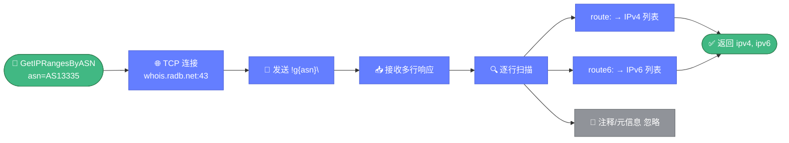

# 🌐 asn.go — ASN 前缀查询

> 📖 通过 RADB（`whois.radb.net:43`）查询指定 ASN 对应的 IPv4/IPv6 前缀列表，是网络资产测绘与 BGP 关系分析的基础能力。

---

## 📋 概览

| 项目 | 内容 |
|------|------|
| 文件 | `pkg/whois/asn.go` |
| 核心职责 | 直连 RADB 查询 ASN 的 IPv4/IPv6 路由前缀 |
| 查询服务器 | `whois.radb.net:43` |
| 查询语法 | `!g{asn}\n`（RADB 私有命令） |

---

## 🚀 快速使用

```go
import "github.com/cyberspacesec/whois-skills/pkg/whois"

// 查询 AS13335（Cloudflare）的前缀
ipv4, ipv6, err := whois.GetIPRangesByASN("AS13335")
if err != nil {
    log.Fatal(err)
}

fmt.Println("IPv4 前缀：", ipv4) // ["104.16.0.0/12", ...]
fmt.Println("IPv6 前缀：", ipv6) // ["2606:4700::/32", ...]
```

---

## 🔧 导出函数

| 函数 | 说明 |
|------|------|
| `GetIPRangesByASN(asn string) ([]string, []string, error)` | 查询 ASN，返回 `(ipv4前缀, ipv6前缀, err)` |

### 参数与返回

| 参数/返回 | 类型 | 说明 |
|-----------|------|------|
| `asn` | `string` | ASN 字符串，建议带 `AS` 前缀（如 `AS13335`） |
| 返回 1 | `[]string` | IPv4 前缀列表（对应 `route:` 字段） |
| 返回 2 | `[]string` | IPv6 前缀列表（对应 `route6:` 字段） |
| 返回 3 | `error` | 连接或读取错误 |

---

## 🔍 关键实现要点

`GetIPRangesByASN` 直连 RADB，逐行扫描响应并按字段归类前缀：



::: details 查询协议细节
直连 `whois.radb.net:43`，发送 RADB 私有查询命令 `!g{asn}\n`。RADB 返回多行文本，逐行扫描：

- 以 `route:` 开头的行 → 提取值加入 IPv4 列表
- 以 `route6:` 开头的行 → 提取值加入 IPv6 列表

其他注释/元信息行被忽略。
:::

::: details ASN 字符串格式
函数接受 `AS13335`、`as13335`、`13335` 等多种写法。RADB 的 `!g` 命令对前缀 `AS` 大小写不敏感，但建议统一使用大写 `AS` 前缀以保证可读性。
:::

::: details 网络连接
直接建立到 `whois.radb.net:43` 的 TCP 连接，不走代理池或速率限制器。若需更完整的 ASN 信息（注册人、国家、RIR、BGP 关系等），请使用增强版 [asn-enhanced.md](./asn-enhanced.md)。
:::

---

## 📝 使用示例

### 示例 1：基础查询

```go
ipv4, ipv6, err := whois.GetIPRangesByASN("AS13335")
if err != nil {
    log.Fatal(err)
}
fmt.Printf("IPv4 前缀数：%d，IPv6 前缀数：%d\n", len(ipv4), len(ipv6))
```

### 示例 2：批量统计

```go
asns := []string{"AS13335", "AS15169", "AS32934"}
for _, asn := range asns {
    v4, v6, err := whois.GetIPRangesByASN(asn)
    if err != nil {
        fmt.Printf("%s 查询失败：%v\n", asn, err)
        continue
    }
    fmt.Printf("%s: IPv4=%d, IPv6=%d\n", asn, len(v4), len(v6))
}
```

### 示例 3：结合 IP 段判断

```go
ipv4, _, _ := whois.GetIPRangesByASN("AS13335")
// 检查某 IP 是否属于该 ASN 的前缀
for _, cidr := range ipv4 {
    if _, network, err := net.ParseCIDR(cidr); err == nil {
        if network.Contains(net.ParseIP("1.1.1.1")) {
            fmt.Println("1.1.1.1 属于 AS13335")
        }
    }
}
```

---

## ⚠️ 注意事项

- RADB 数据反映 BGP 路由表的实际宣告情况，可能滞后于 IANA 的官方分配记录。
- 高频查询建议自行加重试与间隔控制，避免被 RADB 限速。
- 若需 ASN 的注册信息（持有者、国家、分配日期），请用 [rdap.md](./rdap.md) 或 [asn-enhanced.md](./asn-enhanced.md)。

---

## 🔗 相关

- 🚀 [asn-enhanced.md](./asn-enhanced.md) — 增强 ASN 查询（RDAP + RADB 双源、批量、BGP 关系）
- 📡 [rdap.md](./rdap.md) — RDAP ASN 查询
- 🎯 [ASN 查询教程](../../guide/tutorial-asn.md)
