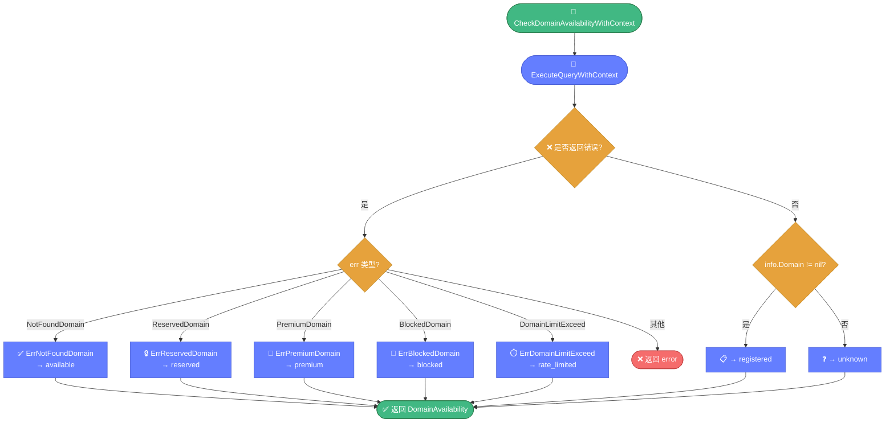

# ✅ availability.go — 域名可注册性判断

> 📖 通过 WHOIS 查询结果判断域名是否可注册，将解析器错误分类为可注册、已注册、保留、溢价、封锁、限速等状态。

---

## 📋 概览

| 项目 | 内容 |
|------|------|
| 文件 | `pkg/whois/availability.go` |
| 核心职责 | 域名可注册性判断 |
| 依赖 | `query.go`（`ExecuteQueryWithContext`）、`errors.go`（错误分类） |

---

## 🚀 快速使用

```go
import "github.com/cyberspacesec/whois-skills/pkg/whois"

avail, err := whois.CheckDomainAvailability("example.com")
if err != nil {
    log.Fatal(err)
}

if avail.Available {
    fmt.Println("域名可注册：", avail.Domain)
} else {
    fmt.Println("域名不可注册，状态：", avail.Status, "-", avail.Message)
}
```

---

## 📊 核心类型

### DomainAvailability

```go
type DomainAvailability struct {
    Domain    string // 查询的域名
    Available bool   // 是否可注册
    Status    string // 状态（见下表）
    Message   string // 人类可读说明
}
```

### Status 取值

| 状态 | 含义 | 触发条件 |
|------|------|----------|
| `available` | 可注册 | 解析返回 `ErrNotFoundDomain` |
| `registered` | 已注册 | `info.Domain != nil` |
| `reserved` | 保留 | `ErrReservedDomain` |
| `premium` | 溢价 | `ErrPremiumDomain` |
| `blocked` | 封锁 | `ErrBlockedDomain` |
| `unknown` | 未知 | 其他情况 |
| `rate_limited` | 被限速 | `ErrDomainLimitExceed` |

---

## 🔧 导出函数

| 函数 | 说明 |
|------|------|
| `CheckDomainAvailability(domain string) (*DomainAvailability, error)` | 简化入口 |
| `CheckDomainAvailabilityWithContext(ctx, domain string) (*DomainAvailability, error)` | 带上下文（**主流程**） |

---

## 🔍 关键实现要点

`CheckDomainAvailabilityWithContext` 通过错误分类将 WHOIS 响应映射为 6 种可注册性状态：



::: details 判断主流程
1. 调用 `ExecuteQueryWithContext` 获取 WHOIS 信息
2. 若返回错误：
   - `ErrNotFoundDomain` → `available`（域名未注册）
   - `ErrReservedDomain` → `reserved`
   - `ErrPremiumDomain` → `premium`
   - `ErrBlockedDomain` → `blocked`
   - `ErrDomainLimitExceed` → `rate_limited`
   - 其他错误 → 返回 error
3. 若无错误且 `info.Domain != nil` → `registered`
4. 其他 → `unknown`
:::

::: details isParserError 错误识别
通过 `err.Error()` 字符串匹配识别解析器抛出的特定错误，将其映射为对应的 `ErrorType`。这是基于错误消息文本的分类，依赖 `errors.go` 的 `CheckError` 字符串匹配逻辑。
:::

::: details available 与 registered 的边界
- "未注册" 在 WHOIS 协议中表现为服务器返回特殊响应或空响应，解析器据此抛出 `ErrNotFoundDomain`。
- "已注册" 表现为正常解析出 `Domain` 字段。
- 部分新 gTLD 的溢价/保留状态需注册商 WHOIS 才能确认，根 WHOIS 可能只返回 `unknown`。
:::

---

## 📝 使用示例

### 示例 1：单域名判断

```go
avail, _ := whois.CheckDomainAvailability("mynewidea1234.com")
if avail.Available {
    fmt.Println("快去注册！", avail.Domain)
}
```

### 示例 2：带超时

```go
ctx, cancel := context.WithTimeout(context.Background(), 15*time.Second)
defer cancel()

avail, err := whois.CheckDomainAvailabilityWithContext(ctx, "example.com")
if err != nil {
    log.Fatal(err)
}
fmt.Printf("%s -> %s\n", avail.Domain, avail.Status)
```

### 示例 3：批量检查

```go
domains := []string{"aaa.com", "bbb.com", "ccc.io"}
for _, d := range domains {
    avail, err := whois.CheckDomainAvailability(d)
    if err != nil {
        fmt.Printf("%s: 错误 %v\n", d, err)
        continue
    }
    status := "不可注册"
    if avail.Available {
        status = "✅ 可注册"
    }
    fmt.Printf("%s: %s (%s)\n", d, status, avail.Status)
}
```

---

## ⚠️ 注意事项

- 高频检查会被注册局限速，建议配合 [ratelimit.md](./ratelimit.md) 与 [scheduler.md](./scheduler.md)。
- `.ai`、`.cn` 等 ccTLD 的可注册性判断规则与 gTLD 不同，状态可能为 `unknown`。
- 本工具仅基于 WHOIS 数据判断，不替代注册商的实时可用性校验。

---

## 🔗 相关

- 🔎 [query.md](./query.md) — 底层查询引擎
- ❌ [errors.md](./errors.md) — 错误分类体系
- 🎯 [域名可用性教程](../../guide/tutorial-availability.md)
