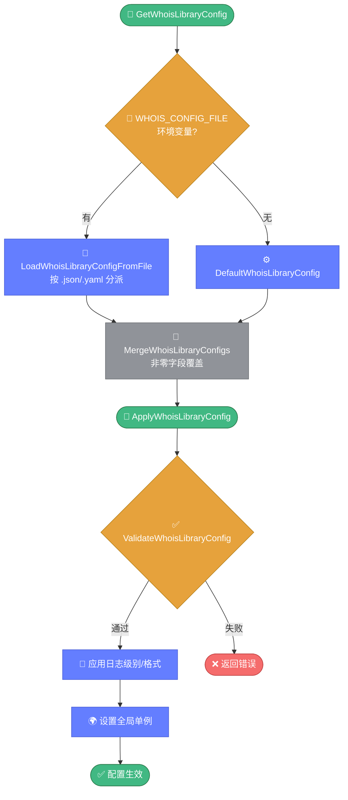
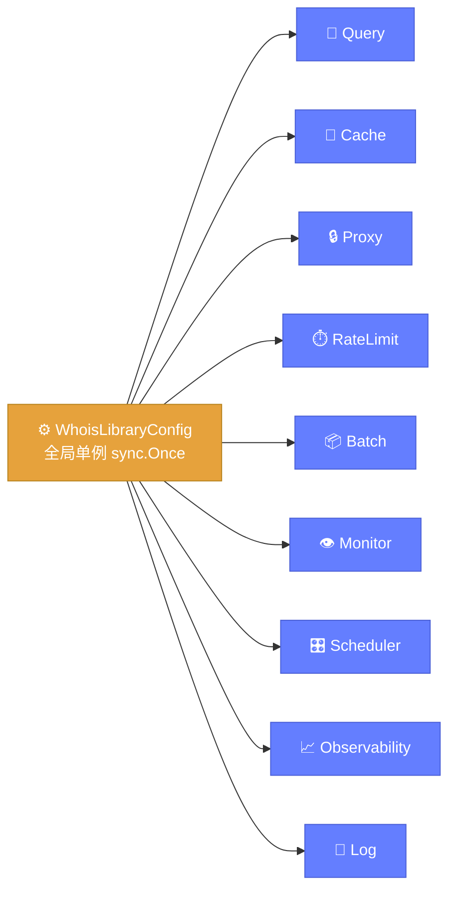

# ⚙️ config.go — 全局统一配置

> 📖 WHOIS 库的全局统一配置结构，整合九大子系统（查询、缓存、代理、限速、批量、监控、调度、可观测性、日志），支持 JSON/YAML 加载与字段级合并。

---

## 📋 概览

| 项目 | 内容 |
|------|------|
| 文件 | `pkg/whois/config.go` |
| 核心职责 | 统一配置结构、文件加载、校验、应用、合并 |
| 支持格式 | JSON、YAML |
| 全局单例 | `GetWhoisLibraryConfig()` |

---

## 🚀 快速使用

```go
import "github.com/cyberspacesec/whois-skills/pkg/whois"

// 1. 获取全局配置（优先读 WHOIS_CONFIG_FILE 环境变量）
cfg := whois.GetWhoisLibraryConfig()

// 2. 从文件加载
cfg := whois.LoadWhoisLibraryConfigFromFile("config.json")

// 3. 修改并应用
cfg.Query.Timeout = 15
if err := whois.ApplyWhoisLibraryConfig(cfg); err != nil {
    log.Fatal(err)
}
```

---

## 📊 WhoisLibraryConfig 主结构

```go
type WhoisLibraryConfig struct {
    mu            sync.RWMutex
    Query         WhoisQueryConfig
    Cache         WhoisCacheConfig
    Proxy         WhoisProxyConfig
    RateLimit     WhoisRateLimitConfig
    Batch         WhoisBatchConfig
    Monitor       WhoisMonitorConfig
    Scheduler     WhoisSchedulerConfig
    Observability WhoisObservabilityConfig
    Log           WhoisLogConfig
}
```

### 九大子配置字段

#### Query 查询配置

| 字段 | 说明 |
|------|------|
| `Timeout` | 查询超时（秒） |
| `MaxRetries` | 最大重试 |
| `RetryInterval` | 重试间隔 |
| `UseProxy` | 是否走代理 |
| `FollowReferral` | 是否跟随引导 |
| `MaxReferrals` | 最大引导次数 |
| `ValidateResult` | 是否校验结果 |
| `QueryDelay` | 查询延迟（毫秒） |

#### Cache 缓存配置

| 字段 | 说明 |
|------|------|
| `Enabled` | 是否启用 |
| `Type` | `local` / `redis` |
| `MaxEntries` | 最大条目 |
| `DefaultTTLMinutes` | 默认 TTL（分钟） |
| `RedisAddr` / `RedisPassword` / `RedisDB` | Redis 连接 |

#### Proxy 代理配置

| 字段 | 说明 |
|------|------|
| `Enabled` | 是否启用 |
| `SOCKS5Addr` / `HTTPAddr` | 代理地址 |
| `Username` / `Password` | 认证 |
| `ProxyFile` | 代理列表文件 |

#### RateLimit 限速配置

| 字段 | 说明 |
|------|------|
| `Enabled` | 是否启用 |
| `GlobalRate` | 全局速率 |
| `PerServerRate` | 每服务器速率 map |
| `BurstSize` | 突发大小 |

#### Batch 批量配置

| 字段 | 说明 |
|------|------|
| `Concurrency` | 并发数 |
| `CheckpointFile` / `CheckpointInterval` | 断点 |
| `Timeout` / `MaxRetries` | 超时与重试 |

#### Monitor 监控配置

| 字段 | 说明 |
|------|------|
| `Enabled` | 是否启用 |
| `CheckIntervalMinutes` | 检查间隔（分钟） |
| `ExpiryWarningDays` / `ExpiryCriticalDays` | 到期告警阈值 |
| `WatchStatusChange` / `WatchRegistrantChange` / `WatchNSChange` | 变更监控开关 |

#### Scheduler 调度配置

| 字段 | 说明 |
|------|------|
| `DefaultIntervalMs` / `MinIntervalMs` / `MaxIntervalMs` | 间隔范围 |
| `MaxConcurrency` | 最大并发 |
| `AdaptFactor` | 自适应因子 |
| `BackoffInitialMs` / `BackoffMaxMs` / `BackoffMultiplier` | 退避参数 |
| `UnhealthyThreshold` | 不健康阈值 |

#### Observability 可观测性配置

| 字段 | 说明 |
|------|------|
| `Enabled` | 是否启用 |
| `Providers` | 提供者列表 |
| `PrometheusPath` / `PrometheusPort` | Prometheus 端点 |
| `OTLPEndpoint` | OTLP 导出端点 |

#### Log 日志配置

| 字段 | 说明 |
|------|------|
| `Level` | 日志级别 |
| `Format` | 输出格式 |
| `OutputFile` | 输出文件 |

---

## 📄 AppConfig（config.yaml 对应）

`AppConfig` 是面向部署的配置结构，对应 `config.yaml`，包含以下子结构：

- `AppConfigServer` — 服务监听
- `Log` — 日志
- `Cache` — 缓存
- `Proxy` — 代理
- `Metrics` — 指标
- `Alerts` — 告警

---

## 🔧 导出函数

| 函数 | 说明 |
|------|------|
| `DefaultWhoisLibraryConfig() WhoisLibraryConfig` | 默认配置 |
| `GetWhoisLibraryConfig() *WhoisLibraryConfig` | 全局单例，优先读 `WHOIS_CONFIG_FILE` |
| `SetWhoisLibraryConfig(cfg)` | 设置全局配置 |
| `LoadWhoisLibraryConfigFromFile(path) *WhoisLibraryConfig` | 按扩展名加载 JSON/YAML |
| `LoadYAMLConfig(path) (*AppConfig, error)` | 加载 YAML AppConfig |
| `DefaultAppConfig() *AppConfig` | 默认 AppConfig |
| `SaveWhoisLibraryConfigToFile(cfg, path) error` | 保存到文件 |
| `ValidateWhoisLibraryConfig(cfg) error` | 校验配置 |
| `ApplyWhoisLibraryConfig(cfg) error` | 校验后应用（日志级别/格式） |
| `WhoisLibraryConfigSummary(cfg) string` | 配置摘要 |
| `MergeWhoisLibraryConfigs(base, overrides...) *WhoisLibraryConfig` | 字段级合并 |

---

## 🔍 关键实现要点

配置加载遵循「环境变量 → 文件 → 默认值」的优先级链，应用前需通过校验：



全局配置结构整合九大子系统，关系如下：



::: details 全局单例与环境变量
- 全局单例通过 `libConfigOnce sync.Once` 初始化
- `libConfigFromEnv` 读取 `WHOIS_CONFIG_FILE` 环境变量，若存在则从该文件加载
- 未设置环境变量时使用 `DefaultWhoisLibraryConfig()`
:::

::: details MergeWhoisLibraryConfigs 字段级合并
合并规则：**非零值覆盖**。遍历 `overrides` 中每个配置，用其非零字段覆盖 `base` 的对应字段，实现「默认值 + 用户覆盖」的常见模式。

```go
base := whois.DefaultWhoisLibraryConfig()
override := whois.WhoisLibraryConfig{}
override.Query.Timeout = 30 // 只覆盖这一项
merged := whois.MergeWhoisLibraryConfigs(base, override)
```
:::

::: details ApplyWhoisLibraryConfig 应用流程
1. 调用 `ValidateWhoisLibraryConfig` 校验合法性
2. 应用日志级别与格式到全局 logger
3. 设置全局单例为新的配置
:::

::: details 文件格式识别
`LoadWhoisLibraryConfigFromFile` 按文件扩展名分派：

| 扩展名 | 加载方式 |
|--------|----------|
| `.json` | `encoding/json` |
| `.yaml` / `.yml` | `gopkg.in/yaml.v3` |
:::

---

## 📝 使用示例

### 示例 1：从 YAML 加载

```go
cfg := whois.LoadWhoisLibraryConfigFromFile("/etc/whois/config.yaml")
whois.SetWhoisLibraryConfig(cfg)
```

### 示例 2：环境变量驱动

```bash
export WHOIS_CONFIG_FILE=/etc/whois/config.json
```

```go
cfg := whois.GetWhoisLibraryConfig() // 自动读取环境变量
```

### 示例 3：合并配置

```go
base := whois.DefaultWhoisLibraryConfig()
prod := whois.WhoisLibraryConfig{}
prod.Cache.Type = "redis"
prod.Cache.RedisAddr = "redis:6379"
prod.RateLimit.GlobalRate = 5

merged := whois.MergeWhoisLibraryConfigs(base, prod)
whois.ApplyWhoisLibraryConfig(merged)
```

### 示例 4：配置摘要

```go
fmt.Println(whois.WhoisLibraryConfigSummary(cfg))
// 输出类似：Query{timeout:15 retries:5} Cache{local ttl:3600} ...
```

---

## 🔗 相关

- 📖 [配置指南](../../guide/configuration.md)
- 💾 [cache.md](./cache.md) — 缓存配置详解
- 🔒 [proxy.md](./proxy.md) — 代理配置详解
