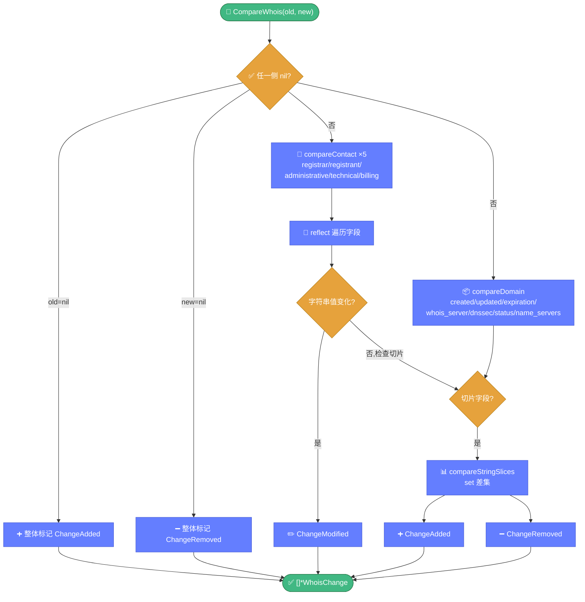

# 🔄 diff.go — WHOIS 信息差异比较

> 📖 比较两份 WHOIS 信息的字段差异，输出结构化的变更列表（新增/删除/修改），是域名监控与变更告警的基础。

---

## 📋 概览

| 项目 | 内容 |
|------|------|
| 文件 | `pkg/whois/diff.go` |
| 核心职责 | WHOIS 字段级差异比较 |
| 比较范围 | Domain 区段 + 5 个 Contact 区段 |
| 依赖 | `reflect`、`whoisparser.WhoisInfo` |

---

## 🚀 快速使用

```go
import "github.com/cyberspacesec/whois-skills/pkg/whois"

changes := whois.CompareWhois(oldInfo, newInfo)
for _, c := range changes {
    fmt.Printf("[%s] %s: %v -> %v\n", c.Type, c.Field, c.OldValue, c.NewValue)
}
```

---

## 📊 核心类型

### ChangeType 常量

| 常量 | 含义 |
|------|------|
| `ChangeAdded` | 新增字段 |
| `ChangeRemoved` | 删除字段 |
| `ChangeModified` | 修改字段 |

### WhoisChange

```go
type WhoisChange struct {
    Type      ChangeType     // 变更类型
    Field     string         // 字段名
    OldValue  interface{}    // 旧值
    NewValue  interface{}    // 新值
    Path      string         // 字段路径（如 "registrant.email"）
}
```

---

## 🔧 导出函数

| 函数 | 说明 |
|------|------|
| `CompareWhois(old, new *whoisparser.WhoisInfo) []*WhoisChange` | 比较两份 WHOIS 信息 |

---

## 🔍 关键实现要点

`CompareWhois` 按 Domain 区段与 5 个 Contact 区段逐字段比对，输出新增/删除/修改三类变更：



::: details 比较范围
`CompareWhois` 比较以下区段：

1. **Domain 区段** — `compareDomain`
   - 字符串字段：`created` / `updated` / `expiration` / `whois_server` / `dnssec`
   - 切片字段：`status` / `name_servers`
2. **5 个 Contact 区段** — `compareContact`
   - `registrar` / `registrant` / `administrative` / `technical` / `billing`
:::

::: details compareContact 反射遍历
`compareContact` 使用 `reflect.ValueOf` 遍历 Contact 结构体的所有字段：

- 对每个字段调用 `String()` 取值
- 比较新旧字符串，不同则生成 `ChangeModified`
- 一侧为 nil 时整体标记为 `ChangeAdded` 或 `ChangeRemoved`
:::

::: details compareStringSlices 切片比较
对于 `status` 和 `name_servers` 等切片字段：

- 将旧切片转为 map set
- 新切片中不在 set 的元素 → `ChangeAdded`
- set 中不在新切片的元素 → `ChangeRemoved`
- 顺序不同但内容相同 → 不报告变更
:::

::: details nil 处理
若一侧 `WhoisInfo` 或某个 Contact 为 nil：

- old 为 nil → 整体标记为 added
- new 为 nil → 整体标记为 removed
- 避免空指针 panic
:::

---

## 📝 使用示例

### 示例 1：基础比较

```go
oldInfo, _ := whois.ExecuteQuery(&whois.QueryOptions{Domain: "example.com"})
// ... 一段时间后 ...
newInfo, _ := whois.ExecuteQuery(&whois.QueryOptions{Domain: "example.com"})

changes := whois.CompareWhois(oldInfo, newInfo)
fmt.Printf("检测到 %d 处变更\n", len(changes))
for _, c := range changes {
    fmt.Printf("[%s] %s\n", c.Type, c.Field)
}
```

### 示例 2：筛选重要变更

```go
changes := whois.CompareWhois(oldInfo, newInfo)
for _, c := range changes {
    // 只关注注册人变更
    if strings.Contains(c.Field, "registrant") {
        fmt.Printf("⚠️ 注册人变更：%s\n", c.Field)
    }
}
```

### 示例 3：结合监控器

```go
// monitor.go 内部使用 CompareWhois 检测变更
changes := whois.CompareWhois(lastState.LastInfo, currentInfo)
for _, c := range changes {
    if c.Type == whois.ChangeModified {
        // 生成 DomainAlert
    }
}
```

---

## 🔗 相关

- 📡 [monitor.md](./monitor.md) — 域名监控器（使用 diff 检测变更）
- 🎯 [quality.md](./quality.md) — 数据质量评估
- 📈 [关联分析教程](../../guide/tutorial-correlation.md)
