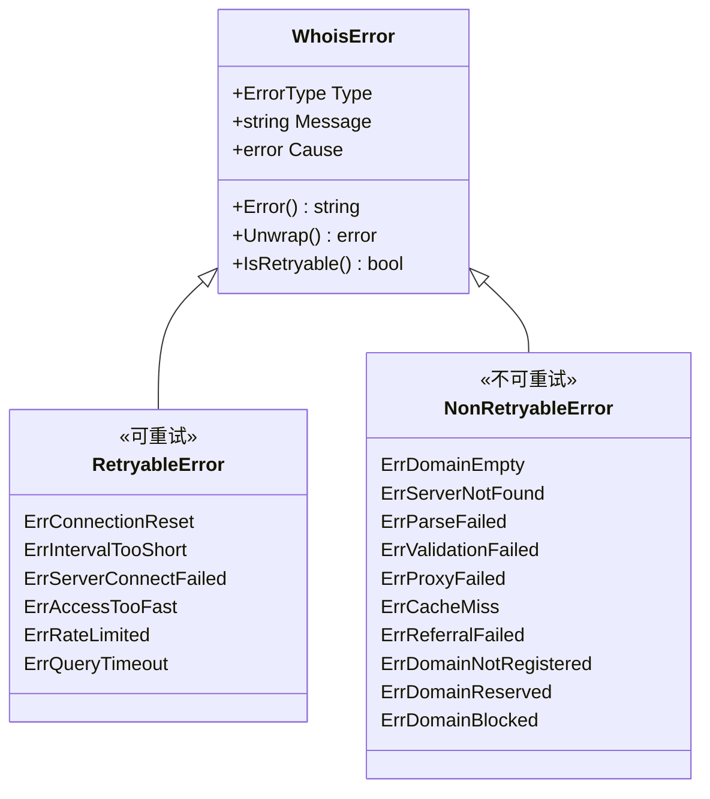
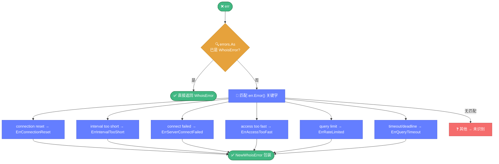

# ❌ errors.go — 统一错误类型体系

> 📖 WHOIS 库的统一错误类型体系，提供错误分类、可重试判断、向后兼容别名，是查询重试与错误处理的核心。

---

## 📋 概览

| 项目 | 内容 |
|------|------|
| 文件 | `pkg/whois/errors.go` |
| 核心职责 | 错误分类、可重试判断、向后兼容 |
| 主类型 | `WhoisError` |
| 分类方式 | 字符串匹配（`CheckError`） |

---

## 🚀 快速使用

```go
import "github.com/cyberspacesec/whois-skills/pkg/whois"

// 创建错误
err := whois.NewWhoisError(whois.ErrQueryTimeout, "查询超时", cause)

// 检查可重试
if we := whois.CheckError(err); we != nil && we.IsRetryable() {
    // 重试
}

// 类型断言
var we *whois.WhoisError
if errors.As(err, &we) {
    fmt.Println("错误类型：", we.Type)
}
```

---

## 📊 ErrorType 枚举

| 常量 | 说明 | 可重试 |
|------|------|--------|
| `ErrConnectionReset` | 连接被重置 | ✅ |
| `ErrIntervalTooShort` | 查询间隔过短 | ✅ |
| `ErrServerConnectFailed` | 服务器连接失败 | ✅ |
| `ErrAccessTooFast` | 访问过快 | ✅ |
| `ErrQueryTimeout` | 查询超时 | ✅ |
| `ErrDomainEmpty` | 域名为空 | ❌ |
| `ErrServerNotFound` | 服务器未找到 | ❌ |
| `ErrParseFailed` | 解析失败 | ❌ |
| `ErrValidationFailed` | 校验失败 | ❌ |
| `ErrProxyFailed` | 代理失败 | ❌ |
| `ErrCacheMiss` | 缓存未命中 | ❌ |
| `ErrRateLimited` | 被限速 | ✅ |
| `ErrReferralFailed` | 引导失败 | ❌ |
| `ErrDomainNotRegistered` | 域名未注册 | ❌ |
| `ErrDomainReserved` | 域名保留 | ❌ |
| `ErrDomainBlocked` | 域名封锁 | ❌ |

---

## 📦 WhoisError 结构

```go
type WhoisError struct {
    Type    ErrorType  // 错误类型
    Message string     // 错误消息
    Cause   error      // 原始错误
}
```

### 方法

| 方法 | 说明 |
|------|------|
| `Error() string` | 返回错误消息 |
| `Unwrap() error` | 返回 Cause（支持 `errors.Is/As`） |
| `IsRetryable() bool` | 判断是否可重试 |

### IsRetryable 规则

以下类型返回 `true`：

- `ErrConnectionReset`
- `ErrIntervalTooShort`
- `ErrAccessTooFast`
- `ErrServerConnectFailed`
- `ErrRateLimited`
- `ErrQueryTimeout`

其余类型返回 `false`。

---

## 🔧 导出函数

| 函数 | 说明 |
|------|------|
| `NewWhoisError(errType, message, cause) *WhoisError` | 创建错误 |
| `CheckError(err) *WhoisError` | 字符串匹配分类（被 `query.go` 使用） |

---

## 🔍 关键实现要点

错误类型体系围绕 `WhoisError` 展开，按可重试性分为两大类：



`CheckError` 通过字符串匹配将原始错误归类为 `WhoisError`，已被分类的错误直接返回避免重复包装：



::: details CheckError 字符串匹配分类器
`CheckError` 通过匹配 `err.Error()` 中的关键字进行分类：

| 关键字 | 分类 |
|--------|------|
| `connection reset by peer` | `ErrConnectionReset` |
| `queried interval is too short` | `ErrIntervalTooShort` |
| `connect to whois server failed` | `ErrServerConnectFailed` |
| `access is too fast` | `ErrAccessTooFast` |
| `query limit exceeded` | `ErrRateLimited` |
| `timeout` | `ErrQueryTimeout` |
| `context deadline` | `ErrQueryTimeout` |

这是基于错误消息文本的启发式分类，依赖 WHOIS 服务器返回的固定文案。
:::

::: details errors.As 避免重复包装
`CheckError` 内部使用 `errors.As` 检查 err 是否已经是 `*WhoisError`，若是则直接返回，避免对已分类错误重复包装。

```go
var we *WhoisError
if errors.As(err, &we) {
    return we // 已分类，直接返回
}
// 否则做字符串匹配
```
:::

::: details 向后兼容别名
为兼容旧版 API，导出了一批 deprecated 别名：

| 别名 | 等价于 |
|------|--------|
| `ErrorWrapper` | `WhoisError` |
| `ConnectionResetByPeer` | `ErrConnectionReset` |
| ... | ... |

新代码应使用 `WhoisError` 与 `ErrXxx` 常量。
:::

---

## 📝 使用示例

### 示例 1：错误分类与重试

```go
result, err := whois.ExecuteQueryWithResultContext(ctx, opts)
if err != nil {
    if we := whois.CheckError(err); we != nil && we.IsRetryable() {
        fmt.Println("可重试错误：", we.Type)
        // 延迟后重试
        time.Sleep(time.Duration(opts.GetIntervalMilsOrDefault()) * time.Millisecond)
    } else {
        return err // 不可重试，直接返回
    }
}
```

### 示例 2：判断域名状态

```go
_, err := whois.ExecuteQuery(&whois.QueryOptions{Domain: "test12345.com"})
if err != nil {
    we := whois.CheckError(err)
    switch we.Type {
    case whois.ErrDomainNotRegistered:
        fmt.Println("域名未注册")
    case whois.ErrDomainReserved:
        fmt.Println("域名保留")
    case whois.ErrRateLimited:
        fmt.Println("被限速，稍后重试")
    }
}
```

### 示例 3：创建并包装错误

```go
if connErr := dialServer(); connErr != nil {
    return whois.NewWhoisError(
        whois.ErrServerConnectFailed,
        "无法连接到 whois 服务器",
        connErr,
    )
}
```

### 示例 4：errors.Is/As 链式判断

```go
var we *whois.WhoisError
if errors.As(err, &we) && we.Type == whois.ErrQueryTimeout {
    // 处理超时
}
```

---

## 🔗 相关

- 🔎 [query.md](./query.md) — 查询引擎（使用 `CheckError` 判断重试）
- 🚦 [ratelimit.md](./ratelimit.md) — 限速（触发 `ErrRateLimited`）
- 📡 [monitor.md](./monitor.md) — 监控器错误处理
