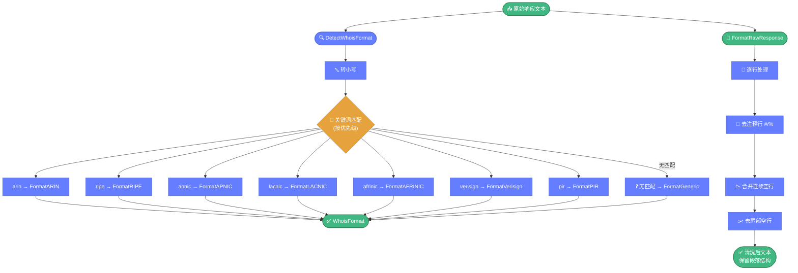

# 🎨 format.go — 响应格式检测与清洗

> 📖 WHOIS 响应文本的格式检测（识别 5 大 RIR 与常见注册商）与原始文本清洗（去注释、合并空行），是解析前的预处理基础。

---

## 📋 概览

| 项目 | 内容 |
|------|------|
| 文件 | `pkg/whois/format.go` |
| 核心职责 | 格式检测、文本清洗 |
| 识别格式 | 9 种（5 RIR + Verisign + PIR + Generic + Unknown） |

---

## 🚀 快速使用

```go
import "github.com/cyberspacesec/whois-skills/pkg/whois"

raw, _ := whois.DirectWhois("8.8.8.8")

// 检测格式
fmt := whois.DetectWhoisFormat(raw)
fmt.Println("格式：", fmt) // FormatARIN

// 清洗
cleaned := whois.FormatRawResponse(raw)
fmt.Println(cleaned)
```

---

## 📊 WhoisFormat 常量

| 常量 | 说明 |
|------|------|
| `FormatUnknown` | 未知格式 |
| `FormatARIN` | ARIN（北美） |
| `FormatRIPE` | RIPE NCC（欧洲） |
| `FormatAPNIC` | APNIC（亚太） |
| `FormatLACNIC` | LACNIC（拉美） |
| `FormatAFRINIC` | AFRINIC（非洲） |
| `FormatVerisign` | Verisign（.com/.net） |
| `FormatPIR` | PIR（.org） |
| `FormatGeneric` | 通用格式 |

---

## 🔧 导出函数

| 函数 | 说明 |
|------|------|
| `DetectWhoisFormat(response string) WhoisFormat` | 按关键词检测格式 |
| `FormatRawResponse(response string) string` | 清洗原始响应 |

---

## 🔍 关键实现要点

`DetectWhoisFormat` 按关键词识别 5 大 RIR 与注册商格式，`FormatRawResponse` 逐行清洗保留段落结构：



::: details DetectWhoisFormat 关键词匹配
将响应文本转为小写后，按子串匹配判断格式：

| 关键词 | 格式 |
|--------|------|
| `arin` | FormatARIN |
| `ripe` | FormatRIPE |
| `apnic` | FormatAPNIC |
| `lacnic` | FormatLACNIC |
| `afrinic` | FormatAFRINIC |
| `verisign` | FormatVerisign |
| `pir` | FormatPIR |

匹配优先级从前到后，未匹配则 `FormatGeneric`。
:::

::: details FormatRawResponse 清洗规则
逐行处理：

1. **去除注释行** — 以 `#` 或 `%` 开头的行（WHOIS 注释）
2. **合并连续空行** — 保留段落结构：前一行非空时保留一个空行，连续多个空行压缩为一个
3. **去尾部空行** — 结尾的空行全部去除

清洗后保留段落的视觉结构，便于人工查阅。
:::

::: details 段落保留逻辑
FormatRawResponse 不是简单地去掉所有空行，而是：

```
line1
            ← 保留（前一行非空）
line2
            ← 压缩（前一行已空）
            ← 压缩
line3
```

这样保证每个"字段块"之间有一个空行分隔。
:::

---

## 📝 使用示例

### 示例 1：检测 RIR 格式

```go
raw, _ := whois.QueryIP("8.8.8.8") // ARIN
fmt := whois.DetectWhoisFormat(raw.RawResponse)
switch fmt {
case whois.FormatARIN:
    // 用 ARIN 解析器
case whois.FormatRIPE:
    // 用 RIPE 解析器
}
```

### 示例 2：清洗后存储

```go
raw, _ := whois.DirectWhois("example.com")
cleaned := whois.FormatRawResponse(raw)
os.WriteFile("example.whois", []byte(cleaned), 0644)
```

### 示例 3：解析前预处理

```go
raw, _ := whois.DirectWhois(domain)
cleaned := whois.FormatRawResponse(raw)
info, _ := whoisparser.Parse(cleaned) // 清洗后解析率更高
```

---

## 🔗 相关

- 🌐 [ipparser.md](./ipparser.md) — IP WHOIS 解析（按 RIR 分派）
- 📤 [export.md](./export.md) — 信息导出
- 🔎 [query.md](./query.md) — 查询引擎
