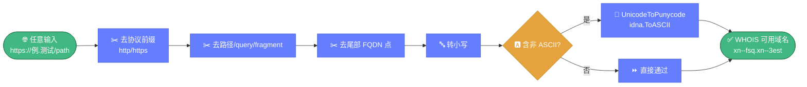
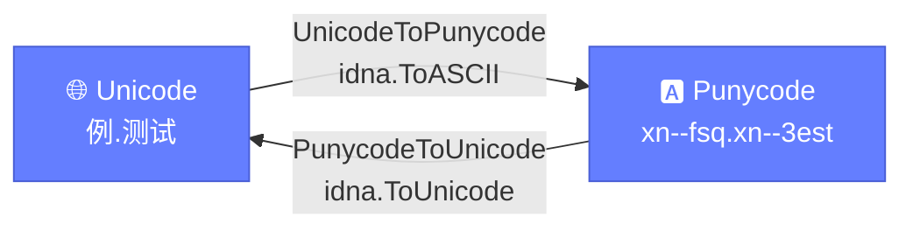

# 🌐 idn.go — 国际化域名处理

> 📖 国际化域名（IDN）的 Punycode 转换与规范化，支持 Unicode ↔ Punycode 互转、域名预处理，是 IDN 查询的前置步骤。

---

## 📋 概览

| 项目 | 内容 |
|------|------|
| 文件 | `pkg/whois/idn.go` |
| 核心职责 | Punycode 转换、域名规范化 |
| 依赖 | `golang.org/x/net/idna` |

---

## 🚀 快速使用

```go
import "github.com/cyberspacesec/whois-skills/pkg/whois"

// 规范化（查询前预处理）
n, err := whois.NormalizeDomain("https://例.测试/path")
// n = "xn--fsq.xn--3est"

// Unicode → Punycode
p, _ := whois.UnicodeToPunycode("例.测试")
// p = "xn--fsq.xn--3est"

// Punycode → Unicode
u, _ := whois.PunycodeToUnicode("xn--fsq.xn--3est")
// u = "例.测试"
```

---

## 🔧 导出函数

| 函数 | 说明 |
|------|------|
| `PunycodeToUnicode(domain string) (string, error)` | Punycode → Unicode（`idna.ToUnicode`） |
| `UnicodeToPunycode(domain string) (string, error)` | Unicode → Punycode（`idna.ToASCII`） |
| `NormalizeDomain(domain string) (string, error)` | 域名规范化 |
| `IsIDN(domain string) bool` | 判断是否为 IDN |

---

## 🔍 关键实现要点

`NormalizeDomain` 是 IDN 查询前的标准预处理流水线，将任意域名输入收敛为 WHOIS 协议可接受的 Punycode 形式：



Unicode 与 Punycode 双向转换关系：



::: details NormalizeDomain 规范化步骤
`NormalizeDomain` 适合查询前预处理，依次执行：

1. **去协议前缀** — 去除 `http://`、`https://` 等
2. **去路径** — 去除 `/path`、`?query`、`#fragment`
3. **去尾部点** — 去除 FQDN 结尾的 `.`
4. **转小写** — 统一小写
5. **非 ASCII 转 Punycode** — 含非 ASCII 字符时调 `UnicodeToPunycode`

```
"https://例.测试/path" → "xn--fsq.xn--3est"
"EXAMPLE.COM."        → "example.com"
```
:::

::: details IsIDN 判断逻辑
`IsIDN` 满足以下任一条件即返回 `true`：

- 域名以 `xn--` 前缀开头（已是 Punycode）
- 域名含非 ASCII 字符（Unicode 形式）

```go
whois.IsIDN("例.测试")     // true
whois.IsIDN("xn--fsq.xn--3est") // true
whois.IsIDN("example.com") // false
```
:::

::: details isASCII 实现
`isASCII` 遍历字节切片，若任一字节值 `> 127` 则返回 `false`。这是判断字符串是否含非 ASCII 字符的简单高效实现。
:::

---

## 📝 使用示例

### 示例 1：查询前规范化

```go
input := "https://谷歌.搜索/"
domain, _ := whois.NormalizeDomain(input)
info, _ := whois.ExecuteQuery(&whois.QueryOptions{Domain: domain})
```

### 示例 2：展示用 Unicode

```go
raw := "xn--fsq502c.xn--3est44d"
unicode, _ := whois.PunycodeToUnicode(raw)
fmt.Println("显示名：", unicode) // 中文域名
```

### 示例 3：批量规范化

```go
inputs := []string{"https://例.测试/", "EXAMPLE.COM.", "中文.cn"}
for _, in := range inputs {
    n, _ := whois.NormalizeDomain(in)
    fmt.Printf("%s → %s\n", in, n)
}
```

### 示例 4：IDN 检测分流

```go
if whois.IsIDN(domain) {
    domain, _ = whois.UnicodeToPunycode(domain)
}
info, _ := whois.ExecuteQuery(&whois.QueryOptions{Domain: domain})
```

---

## ⚠️ 注意事项

- WHOIS 协议只接受 Punycode 形式的域名，IDN 查询前必须转 Punycode。
- `idna.ToASCII` 遵循 RFC 3490，会处理大小写与验证。
- 部分新 gTLD 的 IDN 支持有限，转 Punycode 后仍可能查询不到。

---

## 🔗 相关

- 🔎 [query.md](./query.md) — 查询引擎
- 🖥️ [servers.md](./servers.md) — 服务器查找
- 🎯 [IDN 教程](../../guide/tutorial-idn.md)
