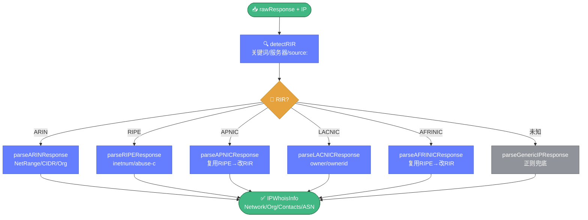

# 🌐 ipparser.go — IP WHOIS 解析器

> 📖 IP WHOIS 响应的结构化解析器，自动识别 5 大 RIR（ARIN/RIPE/APNIC/LACNIC/AFRINIC）并调用对应解析逻辑，输出统一的 `IPWhoisInfo` 结构。

---

## 📋 概览

| 项目 | 内容 |
|------|------|
| 文件 | `pkg/whois/ipparser.go` |
| 核心职责 | IP WHOIS 响应结构化解析 |
| 识别 RIR | ARIN / RIPE / APNIC / LACNIC / AFRINIC |
| 输出 | `IPWhoisInfo` 统一结构 |

---

## 🚀 快速使用

```go
import "github.com/cyberspacesec/whois-skills/pkg/whois"

// 查询 IP
result, _ := whois.QueryIP("8.8.8.8")

// 解析
info, err := whois.ParseIPWhois(result.RawResponse, "8.8.8.8")
if err != nil {
    log.Fatal(err)
}

fmt.Println("RIR：", info.RIR)              // ARIN
fmt.Println("CIDR：", info.Network.CIDR)     // 8.8.8.0/24
fmt.Println("组织：", info.Organization.Name) // Google LLC
fmt.Println("ASN：", info.ASN.Number)        // 15169
```

---

## 📊 核心类型

### IPWhoisInfo

```go
type IPWhoisInfo struct {
    Query        string           // 查询的 IP
    Network      *IPNetwork       // 网络信息
    Organization *IPOrganization  // 组织信息
    Contacts     []*IPContact     // 联系人列表
    ASN          *ASNInfo         // ASN 信息
    RIR          string           // RIR（ARIN/RIPE/APNIC/LACNIC/AFRINIC）
    RawResponse  string           // 原始响应
}
```

### IPNetwork

```go
type IPNetwork struct {
    Range     string // IP 范围
    CIDR      string // CIDR 表示
    StartIP   string
    EndIP     string
    PrefixLen int
    Name      string // 网络名
    Type      string // 网络类型（allocation/assignment）
    Country   string
    Status    string
}
```

### IPOrganization

```go
type IPOrganization struct {
    ID          string
    Name        string
    Address     string
    Country     string
    CreatedDate string
    UpdatedDate string
}
```

### IPContact

```go
type IPContact struct {
    Role        string // abuse/admin/tech
    Name        string
    Email       string
    Phone       string
    Organization string
    Handle      string
}
```

### ASNInfo

```go
type ASNInfo struct {
    Number      int
    Name        string
    Holder      string
    Country     string
    CreatedDate string
    UpdatedDate string
}
```

---

## 🔧 导出函数

| 函数 | 说明 |
|------|------|
| `ParseIPWhois(rawResponse, query string) (*IPWhoisInfo, error)` | 解析 IP WHOIS 响应 |

---

## 🔍 关键实现要点

`ParseIPWhois` 通过 `detectRIR` 识别响应来源，分派到 5 大 RIR 专用解析器，最终归一为统一的 `IPWhoisInfo`：



::: details detectRIR 多层匹配
`detectRIR` 通过多层策略识别 RIR：

1. **关键词匹配** — 响应文本中的 `ARIN`/`RIPE`/`APNIC`/`LACNIC`/`AFRINIC` 关键词
2. **whois 服务器域名** — 响应来源服务器的域名（如 `whois.arin.net`）
3. **source: 字段** — RADB 风格的 `source:` 字段
:::

::: details 各 RIR 解析器

#### parseARINResponse
键值解析：`NetRange`/`CIDR`/`NetName`/`NetType`/`Country`/`OriginAS`/`Organization`（括号提取 ID）/`RegDate`/`Updated`。联系人用 `Role`/`Handle`/`Name`/`Email`/`Phone` 前缀模式。

#### parseRIPEResponse
`inetnum`/`netname`/`descr`/`country`/`status`/`org`/`abuse-c`/`admin-c`/`tech-c`/`abuse-mailbox`/`created`/`last-modified`。CIDR 缺失时用 `calculateCIDR` 推算。

#### parseAPNICResponse / parseAFRINICResponse
复用 RIPE 解析逻辑后修正 `RIR` 字段为 APNIC/AFRINIC。

#### parseLACNICResponse
类似 RIPE，但用 `owner`/`ownerid` 字段。

#### parseGenericIPResponse
正则 + `containsAny` 关键词匹配，作为兜底解析器。
:::

::: details 辅助函数
| 函数 | 说明 |
|------|------|
| `parseIPRange` | 解析 IP 范围字符串 |
| `calculateCIDR` | 由范围推算 CIDR |
| `extractPrefixLen` | 提取前缀长度 |
| `extractASNNumber` | 提取 ASN 数字 |
| `normalizeDate` | 规范化日期格式 |
| `ipToInt` | IP 转整数 |
| `lastIP` | 计算网段末 IP |
:::

---

## 📝 使用示例

### 示例 1：完整 IP 查询解析

```go
result, _ := whois.QueryIP("1.1.1.1")
info, _ := whois.ParseIPWhois(result.RawResponse, "1.1.1.1")

fmt.Printf("RIR: %s\n", info.RIR)
fmt.Printf("CIDR: %s\n", info.Network.CIDR)
fmt.Printf("Country: %s\n", info.Network.Country)
for _, c := range info.Contacts {
    if c.Role == "abuse" {
        fmt.Printf("Abuse 联系人: %s <%s>\n", c.Name, c.Email)
    }
}
```

### 示例 2：解析已有响应

```go
raw := `... ARIN 响应文本 ...`
info, _ := whois.ParseIPWhois(raw, "8.8.8.8")
if info.ASN != nil {
    fmt.Printf("ASN %d: %s\n", info.ASN.Number, info.ASN.Holder)
}
```

### 示例 3：批量 IP 信息收集

```go
ips := []string{"8.8.8.8", "1.1.1.1", "9.9.9.9"}
for _, ip := range ips {
    r, _ := whois.QueryIP(ip)
    info, _ := whois.ParseIPWhois(r.RawResponse, ip)
    fmt.Printf("%s -> %s (%s, %s)\n",
        ip, info.Organization.Name, info.Network.Country, info.RIR)
}
```

---

## 🔗 相关

- 📡 [ipwhois.md](./ipwhois.md) — IP 查询（IANA 引导）
- 🎨 [format.md](./format.md) — 格式检测
- 📡 [rdap.md](./rdap.md) — RDAP IP 查询（替代方案）
