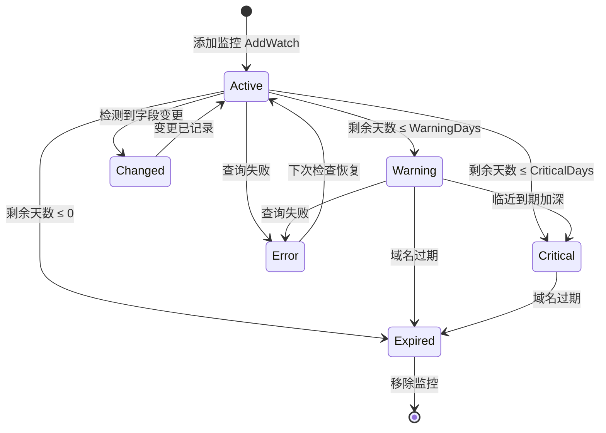
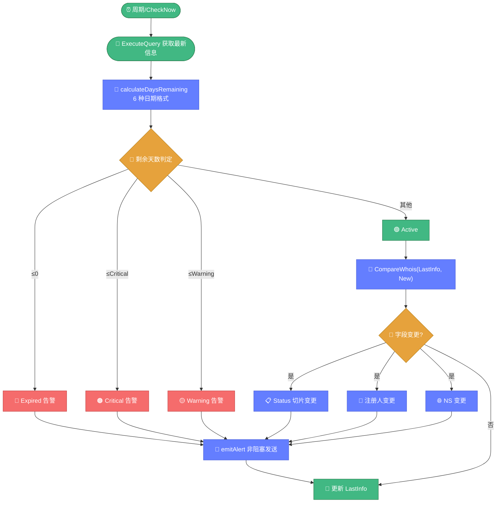

# 📡 monitor.go — 域名监控器

> 📖 域名监控器，周期检查域名到期情况与状态/注册人/NS/DNS 变更，通过告警 channel 与回调通知上层，是持续资产监控的核心组件。

---

## 📋 概览

| 项目 | 内容 |
|------|------|
| 文件 | `pkg/whois/monitor.go` |
| 核心职责 | 到期检查、变更告警、状态跟踪 |
| 依赖 | `query.go`、`diff.go` |

---

## 🚀 快速使用

```go
import "github.com/cyberspacesec/whois-skills/pkg/whois"

m := whois.NewDomainMonitor(whois.DefaultMonitorConfig())

// 添加监控域名
m.AddWatch("example.com", nil)

// 告警回调
m.OnAlert(func(a *whois.DomainAlert) {
    fmt.Printf("[%s] %s: %s\n", a.Level, a.Domain, a.Message)
})

// 启动周期检查
go m.Start(ctx)

// 收集告警
alerts := whois.CollectAlerts(m.Alerts())
```

---

## 📊 核心类型

### MonitorConfig

```go
type MonitorConfig struct {
    CheckInterval        time.Duration // 检查间隔
    ExpiryWarningDays    int           // 到期警告阈值（天）
    ExpiryCriticalDays   int           // 到期严重阈值（天）
    WatchStatusChange    bool          // 监控状态变更
    WatchRegistrantChange bool         // 监控注册人变更
    WatchNSChange        bool          // 监控 NS 变更
    WatchDNSChange       bool          // 监控 DNS 变更
    QueryTimeout         int           // 查询超时（秒）
    MaxConcurrentChecks  int           // 最大并发检查数
}
```

### 默认配置（DefaultMonitorConfig）

| 字段 | 默认值 |
|------|--------|
| `CheckInterval` | 60 min |
| `ExpiryWarningDays` | 30 |
| `ExpiryCriticalDays` | 7 |
| 所有 Watch 开关 | true |
| `MaxConcurrentChecks` | 5 |

### DomainWatchState

```go
type DomainWatchState struct {
    Domain         string
    LastCheck      time.Time
    LastInfo       *whoisparser.WhoisInfo
    LastRaw        string
    Status         WatchStatus
    ExpirationDate string
    DaysRemaining  int
    AlertCount     int
    AddedAt        time.Time
}
```

### WatchStatus 常量

| 常量 | 含义 |
|------|------|
| `WatchStatusActive` | 正常 |
| `WatchStatusWarning` | 即将到期 |
| `WatchStatusCritical` | 严重到期 |
| `WatchStatusExpired` | 已过期 |
| `WatchStatusError` | 查询错误 |
| `WatchStatusChanged` | 发生变更 |

### DomainAlert

```go
type DomainAlert struct {
    ID        string
    Domain    string
    Type      AlertType
    Level     AlertLevel
    Message   string
    OldValue  interface{}
    NewValue  interface{}
    Timestamp time.Time
    Action    string
}
```

### AlertType 常量

| 常量 | 含义 |
|------|------|
| `AlertExpiryWarning` | 到期警告 |
| `AlertExpiryCritical` | 到期严重 |
| `AlertExpiryPassed` | 已过期 |
| `AlertStatusChange` | 状态变更 |
| `AlertRegistrantChange` | 注册人变更 |
| `AlertNSChange` | NS 变更 |
| `AlertDNSChange` | DNS 变更 |
| `AlertQueryError` | 查询错误 |

### AlertLevel 常量

| 常量 | 含义 |
|------|------|
| `AlertLevelInfo` | 信息 |
| `AlertLevelWarning` | 警告 |
| `AlertLevelCritical` | 严重 |

---

## 🔧 方法

### 创建与配置

| 方法 | 说明 |
|------|------|
| `DefaultMonitorConfig() MonitorConfig` | 默认配置 |
| `NewDomainMonitor(config) *DomainMonitor` | 创建监控器 |

### 域名管理

| 方法 | 说明 |
|------|------|
| `AddWatch(domain, initialInfo)` | 添加监控域名 |
| `RemoveWatch(domain)` | 移除监控域名 |
| `GetWatchList() []DomainWatchState` | 获取监控列表 |
| `GetWatchState(domain) *DomainWatchState` | 获取单个状态 |

### 告警与执行

| 方法 | 说明 |
|------|------|
| `Alerts() <-chan *DomainAlert` | 告警 channel |
| `OnAlert(callback)` | 设置告警回调 |
| `Start(ctx)` | 启动周期检查（首次立即执行） |
| `Stop()` | 停止 |
| `CheckNow(ctx, domain) error` | 立即检查指定域名 |
| `CollectAlerts(alertChan) []*DomainAlert` | 阻塞收集所有告警 |

---

## 🔍 关键实现要点

监控器周期检查域名，按剩余天数与字段变更生成告警，域名的监控状态在以下状态间流转：



`checkDomain` 在每次检查时同时进行到期评估与变更检测：



::: details Start 周期检查
`Start` 创建 ticker 按 `CheckInterval` 周期触发 `checkAll`，并在启动时**立即执行首次检查**，避免等待一个周期才出结果。

```go
ticker := time.NewTicker(m.config.CheckInterval)
m.checkAll(ctx) // 首次立即
for {
    select {
    case <-ticker.C:
        m.checkAll(ctx)
    case <-ctx.Done():
        return
    }
}
```
:::

::: details checkAll 并发检查
`checkAll` 快照当前 watchlist 的域名列表，用信号量（容量 `MaxConcurrentChecks`）限制并发，对每个域名调用 `checkDomain`。
:::

::: details checkDomain 变更检测
`checkDomain` 流程：

1. 调用 `ExecuteQueryWithResultContextContext` 获取最新信息
2. 与 `LastInfo` 比较检测变更：
   - **到期天数** — 计算 `DaysRemaining`，按阈值生成告警
   - **Status 切片** — 比较 `Domain.Status`
   - **注册人** — 比较 `Registrant.Name`/`Email`/`Organization`
   - **NS 切片** — 比较 `Domain.NameServers`
3. 生成 `DomainAlert` 写入 channel
:::

::: details determineWatchStatus 状态判定
按剩余天数判定状态：

| 条件 | 状态 |
|------|------|
| `days <= 0` | Expired |
| `days <= ExpiryCriticalDays` | Critical |
| `days <= ExpiryWarningDays` | Warning |
| 其他 | Active |

:::

::: details calculateDaysRemaining 日期解析
尝试 6 种常见日期格式解析 `ExpirationDate`，计算与当前时间的差值天数。支持 WHOIS 各注册局的不同日期格式。
:::

::: details emitAlert 非阻塞发送
`emitAlert` 先调用 `alertCallback`（若设置），再**非阻塞**写入 `alertChan`。若 channel 已满则丢弃告警，避免监控器因 channel 阻塞而停滞。
:::

---

## 📝 使用示例

### 示例 1：完整监控流程

```go
m := whois.NewDomainMonitor(whois.DefaultMonitorConfig())
m.AddWatch("company.com", nil)
m.AddWatch("product.io", nil)

m.OnAlert(func(a *whois.DomainAlert) {
    switch a.Level {
    case whois.AlertLevelCritical:
        notifyOps(a) // 通知运维
    case whois.AlertLevelWarning:
        logWarning(a)
    }
})

ctx, cancel := context.WithCancel(context.Background())
defer cancel()
go m.Start(ctx)

// 运行一段时间后停止
time.Sleep(24 * time.Hour)
m.Stop()
```

### 示例 2：立即检查

```go
if err := m.CheckNow(ctx, "example.com"); err != nil {
    log.Fatal(err)
}
// 告警会通过 OnAlert 回调或 Alerts() channel 到达
```

### 示例 3：自定义检查间隔

```go
config := whois.DefaultMonitorConfig()
config.CheckInterval = 30 * time.Minute
config.ExpiryWarningDays = 60
config.ExpiryCriticalDays = 14
config.WatchNSChange = false // 关闭 NS 监控

m := whois.NewDomainMonitor(config)
```

---

## 🔗 相关

- 🔄 [diff.md](./diff.md) — WHOIS 差异比较（监控器内部使用）
- 📈 [关联分析教程](../../guide/tutorial-correlation.md)
- 🔎 [query.md](./query.md) — 查询引擎
