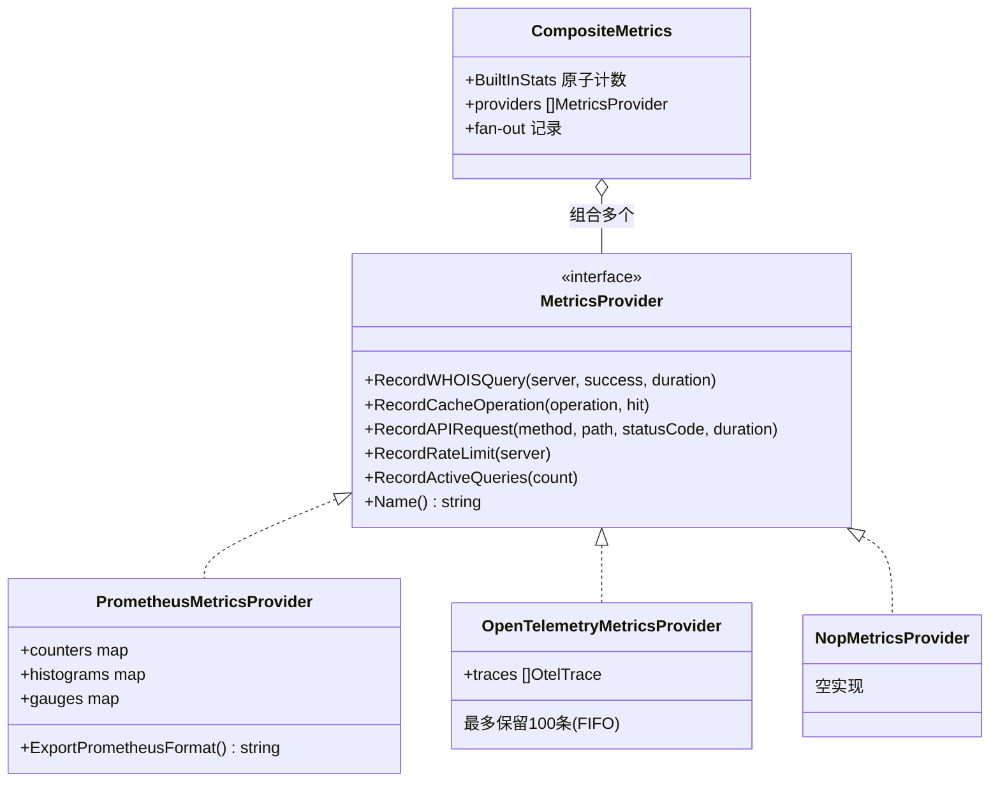
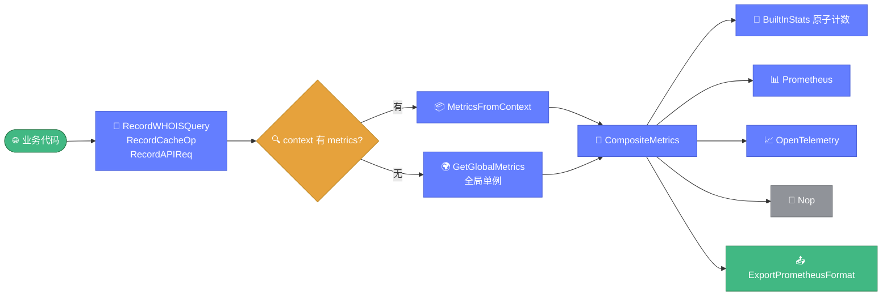

# 📊 observability.go — 可观测性指标体系

> 📖 WHOIS 库的可观测性指标体系，定义 `MetricsProvider` 接口并提供 Prometheus、OpenTelemetry、Nop 三种实现，以及组合多 provider 的 `CompositeMetrics` 与内置原子计数。

---

## 📋 概览

| 项目 | 内容 |
|------|------|
| 文件 | `pkg/whois/observability.go` |
| 核心职责 | 指标采集与导出 |
| 接口 | `MetricsProvider` |
| 实现 | Prometheus / OpenTelemetry / Nop / Composite |

---

## 🚀 快速使用

```go
import "github.com/cyberspacesec/whois-skills/pkg/whois"

// 初始化全局指标
whois.InitMetricsWithProviders(
    whois.NewPrometheusMetricsProvider(),
    whois.NewOpenTelemetryMetricsProvider(),
)

// 便捷函数记录
whois.RecordWHOISQuery("whois.verisign-grs.com", true, 150*time.Millisecond)
whois.RecordCacheOp("get", true)
whois.RecordAPIReq("GET", "/api/whois/example.com", 200, 5*time.Millisecond)

// 导出 Prometheus 文本
prom := whois.GetGlobalMetrics()
fmt.Println(prom.ExportPrometheusFormat())
```

---

## 📊 核心类型

### MetricsProvider 接口

```go
type MetricsProvider interface {
    RecordWHOISQuery(server string, success bool, duration time.Duration)
    RecordCacheOperation(operation string, hit bool)
    RecordAPIRequest(method, path string, statusCode int, duration time.Duration)
    RecordRateLimit(server string)
    RecordActiveQueries(count int)
    Name() string
}
```

### BuiltInStats 内置统计

```go
type BuiltInStats struct {
    TotalQueries      int64
    SuccessfulQueries int64
    FailedQueries     int64
    CacheHits         int64
    CacheMisses       int64
    APIRequests       int64
    RateLimitEvents   int64
    TotalQueryTimeMs  int64
}
```

### CompositeMetrics 组合器

```go
type CompositeMetrics struct {
    // 内置原子计数 + provider 列表（fan-out）
}
```

组合多个 provider，每次记录同时更新内置计数并 fan-out 到所有 provider。

### PrometheusMetricsProvider

```go
type PrometheusMetricsProvider struct {
    counters   map[string]int64
    histograms map[string]*SimpleHistogram
    gauges     map[string]int64
}

type SimpleHistogram struct {
    Count int64
    Sum   float64
    Min   float64
    Max   float64
    Avg   float64
}
```

### OpenTelemetryMetricsProvider

```go
type OpenTelemetryMetricsProvider struct {
    traces []*OtelTrace
}

type OtelTrace struct {
    TraceID    string
    SpanID     string
    Name       string
    Kind       string
    Start      time.Time
    End        time.Time
    Attributes map[string]interface{}
    Status     string
}
```

---

## 🔧 函数与方法

### CompositeMetrics

| 函数/方法 | 说明 |
|-----------|------|
| `NewCompositeMetrics(providers...) *CompositeMetrics` | 创建组合器 |
| `AddProvider(provider)` | 添加 provider |
| `GetBuiltInStats() BuiltInStats` | 获取内置统计 |
| `ExportPrometheusFormat() string` | 导出 Prometheus 文本 |

### Prometheus

| 函数/方法 | 说明 |
|-----------|------|
| `NewPrometheusMetricsProvider()` | 创建 |
| `GetCounters()` / `GetHistograms()` / `GetGauges()` | 获取内部 map |

### OpenTelemetry

| 函数/方法 | 说明 |
|-----------|------|
| `NewOpenTelemetryMetricsProvider()` | 创建 |
| `GetTraces() []OtelTrace` | 获取 trace 列表 |
| `GetCounters() map` | 获取计数器 |

### 全局与便捷

| 函数/方法 | 说明 |
|-----------|------|
| `GetGlobalMetrics() *CompositeMetrics` | 全局单例 |
| `InitMetricsWithProviders(providers...)` | 初始化全局 |
| `RecordWHOISQuery(server, success, duration)` | 便捷函数 |
| `RecordCacheOp(operation, hit)` | 便捷函数 |
| `RecordAPIReq(method, path, statusCode, duration)` | 便捷函数 |
| `RecordRateLimitEvent(server)` | 便捷函数 |
| `NewNopMetricsProvider()` | 空实现 |
| `ContextWithMetrics(ctx, metrics) context.Context` | 注入 context |
| `MetricsFromContext(ctx) *CompositeMetrics` | 从 context 取（无则全局） |

---

## 🔍 关键实现要点

指标体系围绕 `MetricsProvider` 接口展开，`CompositeMetrics` 作为组合器将记录操作 fan-out 到多个实现：



便捷记录函数与全局单例的调用链：



::: details CompositeMetrics fan-out
`CompositeMetrics` 维护：

1. 内置 `BuiltInStats`（原子计数，`sync/atomic`）
2. provider 列表

每次记录操作：
- 更新内置原子计数
- 遍历 provider 列表，调用对应方法（fan-out）

这样即使所有 provider 都失败，内置统计仍可用。
:::

::: details Prometheus 文本导出
`ExportPrometheusFormat` 输出标准 Prometheus 文本格式：

```
# HELP whois_queries_total Total WHOIS queries
# TYPE whois_queries_total counter
whois_queries_total 1234
whois_queries_total{server="whois.verisign-grs.com",success="true"} 1000
...
```

含 `# HELP` 与 `# TYPE` 注释行。
:::

::: details OpenTelemetry trace 生成
OTel provider 在 `RecordAPIRequest` 时创建简化 trace：

- `TraceID = time.Now().UnixNano()`
- 最多保留 **100 条** trace（FIFO，超出丢弃最旧的）
- 记录 method/path/statusCode/duration 为 attributes
:::

::: details MetricsFromContext 回退
`MetricsFromContext` 从 context 取注入的 metrics，若未注入则回退到 `GetGlobalMetrics()` 全局单例，保证总有可用的指标记录器。
:::

---

## 📝 使用示例

### 示例 1：HTTP 中间件记录

```go
func metricsMiddleware(next http.Handler) http.Handler {
    return http.HandlerFunc(func(w http.ResponseWriter, r *http.Request) {
        start := time.Now()
        next.ServeHTTP(w, r)
        whois.RecordAPIReq(r.Method, r.URL.Path, 200, time.Since(start))
    })
}
```

### 示例 2：Prometheus 端点

```go
http.HandleFunc("/metrics", func(w http.ResponseWriter, r *http.Request) {
    w.Header().Set("Content-Type", "text/plain")
    fmt.Fprint(w, whois.GetGlobalMetrics().ExportPrometheusFormat())
})
```

### 示例 3：context 传递

```go
metrics := whois.NewCompositeMetrics(whois.NewPrometheusMetricsProvider())
ctx := whois.ContextWithMetrics(r.Context(), metrics)
// 深层调用中
m := whois.MetricsFromContext(ctx)
m.RecordWHOISQuery(server, true, duration)
```

### 示例 4：查询内置统计

```go
stats := whois.GetGlobalMetrics().GetBuiltInStats()
fmt.Printf("总查询 %d，成功 %d，失败 %d\n",
    stats.TotalQueries, stats.SuccessfulQueries, stats.FailedQueries)
fmt.Printf("缓存命中率 %.1f%%\n",
    float64(stats.CacheHits)/float64(stats.CacheHits+stats.CacheMisses)*100)
```

---

## 🔗 相关

- ⚙️ [config.md](./config.md) — 可观测性配置
- 🔎 [query.md](./query.md) — 查询引擎（记录指标）
- 💾 [cache.md](./cache.md) — 缓存（记录命中指标）
