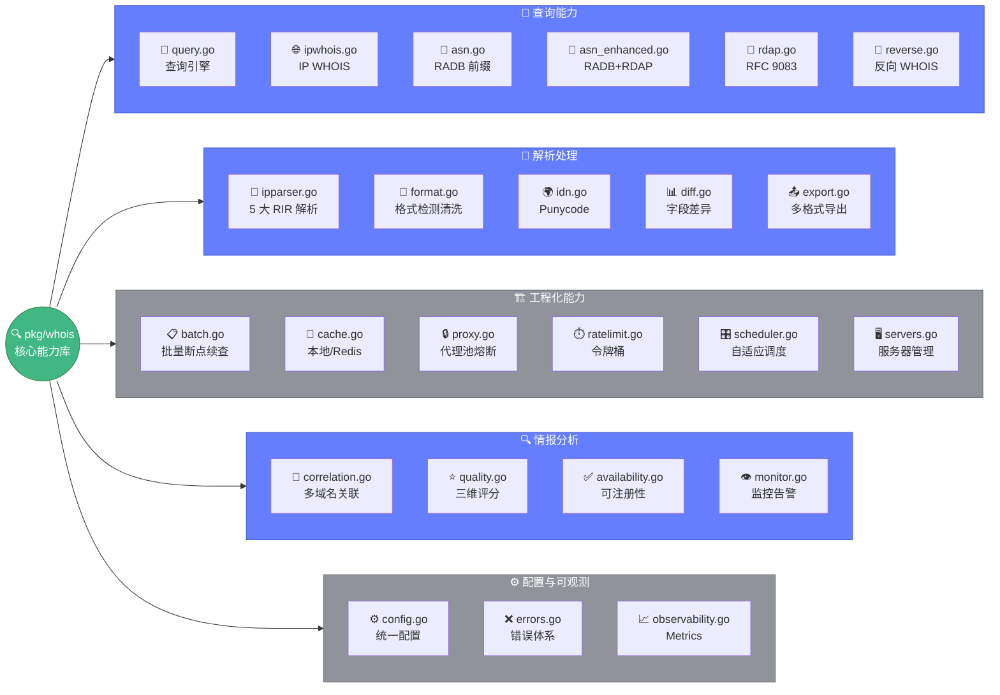

# 📖 WHOIS 核心包概览

> 🔍 `pkg/whois` 是 Whois Hacker 的核心能力库，包含 23 个源文件，提供完整的 WHOIS 情报查询与分析能力。

---

## 📦 包信息

| 项目 | 值 |
|------|-----|
| 导入路径 | `github.com/cyberspacesec/whois-skills/pkg/whois` |
| 源文件数 | 23 |
| 核心依赖 | `likexian/whois` · `whois-parser` · `golang.org/x/net/idna` · `golang.org/x/net/proxy` |

---

## 🗂️ 文件分类

### 🔎 查询能力

| 文档 | 能力 |
|------|------|
| [🔎 query.go](./query.md) | 域名 WHOIS 查询引擎、优先级队列聚合 |
| [🌐 ipwhois.go](./ipwhois.md) | IP WHOIS 查询（IANA 引导 → RIR） |
| [🔢 asn.go](./asn.md) | ASN 基础查询（RADB） |
| [🚀 asn_enhanced.go](./asn-enhanced.md) | ASN 增强（RADB + RDAP） |
| [📡 rdap.go](./rdap.md) | RDAP 标准查询（RFC 9083） |
| [🔄 reverse.go](./reverse.md) | 反向 WHOIS（Provider 抽象） |

### 🔬 解析处理

| 文档 | 能力 |
|------|------|
| [🔬 ipparser.go](./ipparser.md) | IP WHOIS 响应结构化解析（5 大 RIR） |
| [📝 format.go](./format.md) | 格式检测与原始文本清洗 |
| [🌍 idn.go](./idn.md) | 国际化域名 Punycode |
| [📊 diff.go](./diff.md) | WHOIS 字段差异对比 |
| [📤 export.go](./export.md) | JSON/CSV/Markdown 导出 |

### 🏗️ 工程化能力

| 文档 | 能力 |
|------|------|
| [📋 batch.go](./batch.md) | 流式批量查询、断点续查 |
| [💾 cache.go](./cache.md) | 本地/Redis 双缓存、预热 |
| [🔒 proxy.go](./proxy.md) | SOCKS5/HTTP 代理池、熔断 |
| [⏱️ ratelimit.go](./ratelimit.md) | 令牌桶限速 |
| [🎛️ scheduler.go](./scheduler.md) | 自适应智能调度 |
| [🖥️ servers.go](./servers.md) | WHOIS 服务器管理 |

### 🔍 情报分析

| 文档 | 能力 |
|------|------|
| [🔗 correlation.go](./correlation.md) | 多域名关联分析、资产画像 |
| [⭐ quality.go](./quality.md) | 质量三维评分、隐私检测 |
| [✅ availability.go](./availability.md) | 域名可注册性检测 |
| [👁️ monitor.go](./monitor.md) | 域名监控、变更告警 |

### ⚙️ 配置与可观测

| 文档 | 能力 |
|------|------|
| [⚙️ config.go](./config.md) | 统一配置结构 |
| [❌ errors.go](./errors.md) | 错误类型体系 |
| [📈 observability.go](./observability.md) | Metrics 接口、Prometheus/OTel |

下面用一张图概览 `pkg/whois` 23 个源文件的五大分类与归属：



---

## 🚀 快速入口

### 查询域名

```go
import "github.com/cyberspacesec/whois-skills/pkg/whois"

result, err := whois.ExecuteQueryWithResult(&whois.QueryOptions{
	Domain: "example.com",
})
```

### 查询 IP

```go
result, err := whois.QueryIP("8.8.8.8")
```

### 查询 ASN

```go
detail, err := whois.QueryASN(13335)
```

### 关联分析

```go
engine := whois.NewCorrelationEngine()
engine.AddDomain("a.com", infoA)
result := engine.Analyze()
```

---

## 🔗 相关

- 📖 [查询流程](../../guide/query-flow.md)
- 🎯 [域名查询教程](../../guide/tutorial-domain.md)
- 🧩 [whois 模块详解](../../modules/whois.md)
