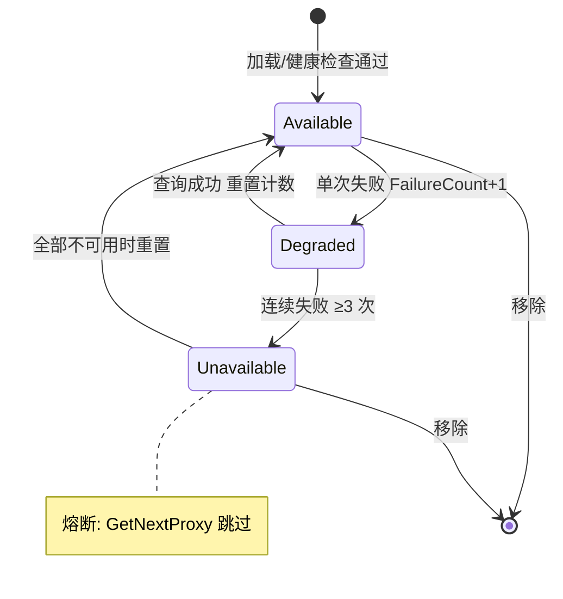
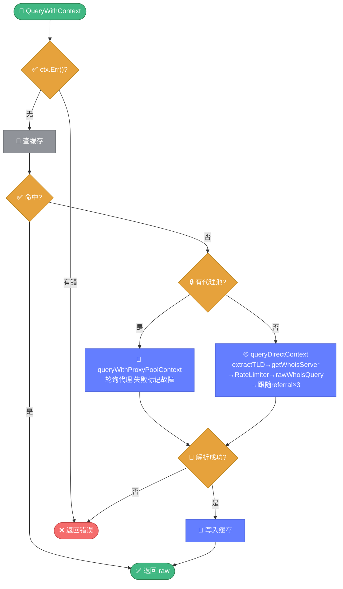

# 🔒 proxy.go — 代理与自定义 WHOIS 客户端

> 📖 代理配置、SOCKS5/HTTP 拨号器、代理池（轮询+健康检查+故障熔断）与自定义 WHOIS 客户端，是绕过 IP 封锁与分布式查询的关键组件。

---

## 📋 概览

| 项目 | 内容 |
|------|------|
| 文件 | `pkg/whois/proxy.go` |
| 核心职责 | 代理拨号、代理池管理、自定义客户端 |
| 代理类型 | SOCKS5 / HTTP（CONNECT 隧道） |
| 全局客户端 | `defaultClient = NewWhoisClient()` |

---

## 🚀 快速使用

```go
import "github.com/cyberspacesec/whois-skills/pkg/whois"

// 1. 从文件加载代理池
whois.LoadProxiesFromFile("proxies.json")

// 2. 创建客户端并设置代理池
client := whois.NewWhoisClient()
client.SetProxyPool(whois.GetProxyPool())

// 3. 查询
ctx := context.Background()
raw, err := client.QueryWithContext(ctx, "example.com")

// 4. 全局设置代理
whois.SetWhoisProxy(&whois.ProxyConfig{
    Address:  "socks5://127.0.0.1:1080",
    Type:     "socks5",
    Enabled:  true,
})
raw, _ = whois.DirectWhois("example.com")
```

---

## 📊 核心类型

### ProxyConfig

```go
type ProxyConfig struct {
    Address       string        // 代理地址
    Type          string        // socks5 / http
    Username      string
    Password      string
    Timeout       int           // 超时（秒）
    MaxRetries    int
    RetryInterval int
    Enabled       bool
    // 内含私有 dialer（懒创建缓存）
}
```

`GetDialer()` 懒创建并缓存 `proxy.Dialer`。

### WhoisDialer

```go
type WhoisDialer struct {
    ProxyDialer proxy.Dialer
    Timeout     time.Duration
}

func (d *WhoisDialer) Dial(network, addr string) (net.Conn, error)
```

### ProxyPool

```go
type ProxyPool struct {
    proxies     []*ProxyConfig
    status      map[string]*ProxyStatus
    currentIndex int
    lastUpdated  time.Time
}

type ProxyStatus struct {
    Available      bool
    FailureCount   int
    AvgResponseTime time.Duration
    LastCheck      time.Time
}
```

### WhoisClient

```go
type WhoisClient struct {
    dialer        proxy.Dialer
    pool          *ProxyPool
    cache         *WhoisCache
    cacheDisabled bool
    rateLimiter   *RateLimiter
}
```

---

## 🔧 函数与方法

### 代理池

| 函数/方法 | 说明 |
|-----------|------|
| `GetProxyPool() *ProxyPool` | 全局单例 |
| `LoadProxiesFromFile(filename) error` | 从 JSON 加载代理列表 |
| `GetNextProxy() *ProxyConfig` | 轮询取下一个可用代理 |
| `MarkProxySuccess(prx, responseTime)` | 标记成功 |
| `MarkProxyFailure(prx)` | 标记失败（连续≥3 标记不可用） |
| `GetProxyStats() map` | 代理状态统计 |
| `ProxyCount() int` | 代理总数 |
| `StartProxyHealthCheck(interval)` | 启动健康检查 |

### WhoisClient

| 方法 | 说明 |
|------|------|
| `NewWhoisClient() *WhoisClient` | 创建（默认超时 30s） |
| `SetProxyPool(pool)` | 设置代理池 |
| `SetProxy(cfg)` | 设置单个代理 |
| `SetTimeout(timeout)` | 设置超时 |
| `SetCache(cache)` | 设置缓存 |
| `DisableCache()` | 禁用缓存 |
| `SetCacheTTL(ttl)` | 设置缓存 TTL |
| `SetRateLimiter(rl)` | 设置限速器 |
| `Query(domain) (string, error)` | 查询 |
| `QueryWithContext(ctx, domain) (string, error)` | 带上下文（**主流程**） |

### 全局便捷

| 函数 | 说明 |
|------|------|
| `SetWhoisProxy(cfg) error` | 设置全局默认客户端代理 |
| `DirectWhois(domain) (string, error)` | 全局客户端查询 |
| `DirectWhoisWithContext(ctx, domain) (string, error)` | 带上下文 |
| `isValidProxyAddress(address) bool` | 校验代理地址 |

---

## 🔍 关键实现要点

代理池通过轮询取代理，连续失败 3 次触发熔断，全部熔断时重置给恢复机会。代理节点的状态流转如下：



`QueryWithContext` 主流程在缓存、代理池、直连三条路径间分派：



::: details HTTP 代理 CONNECT 隧道
HTTP 代理通过 `httpProxyDialer.Dial` 实现 CONNECT 隧道：

1. 拨号到代理服务器
2. 发送 `CONNECT addr HTTP/1.1` 请求（含 Basic Auth 头）
3. 读取响应，检查状态码 `200`
4. 读取空行（响应头结束）
5. 返回已建立的隧道连接

SOCKS5 代理通过 `golang.org/x/net/proxy` 库直接支持。
:::

::: details QueryWithContext 主流程
1. 检查 `ctx.Err()`
2. 查缓存（未禁用时）
3. 若有代理池 → `queryWithProxyPoolContext`（轮询每个代理，失败标记故障）
4. 否则 → `queryDirectContext`
5. 解析成功才写入缓存
:::

::: details queryDirectContext 流程
1. `extractTLD(domain)` 提取 TLD
2. `getWhoisServer(tld)` 获取 WHOIS 服务器
3. `RateLimiter.Allow(server)` 限速检查
4. `rawWhoisQuery` 发送查询
5. 跟随 referral（默认最多 3 次）
6. `whoisparser.Parse` 解析
:::

::: details rawWhoisQuery 底层
拨号到 `server:43`，发送 `domain\r\n`，用 `io.Copy` 读取全部响应。若设置了代理 dialer 则走代理，否则直连。
:::

::: details 代理池轮询与熔断
- `GetNextProxy` 轮询返回下一个可用代理，全部不可用时**重置状态**全部标记可用（给恢复机会）
- `MarkProxyFailure` 累加 `FailureCount`，连续失败 **≥3** 标记不可用
- `MarkProxySuccess` 重置 `FailureCount` 并更新平均响应时间
:::

::: details extractReferralServer
匹配响应中的：

- `Registrar WHOIS Server: `（.com 等注册局返回）
- `whois: `（部分服务器）

提取引导目标，实现 thin/thick WHOIS 跟随。
:::

---

## 📝 使用示例

### 示例 1：代理池批量查询

```go
whois.LoadProxiesFromFile("proxies.json")
client := whois.NewWhoisClient()
client.SetProxyPool(whois.GetProxyPool())
client.SetTimeout(15)

for _, domain := range domains {
    raw, err := client.QueryWithContext(ctx, domain)
    if err != nil {
        fmt.Printf("%s: %v\n", domain, err)
        continue
    }
    // 处理 raw
}
```

### 示例 2：单个 SOCKS5 代理

```go
client := whois.NewWhoisClient()
client.SetProxy(&whois.ProxyConfig{
    Address: "127.0.0.1:1080",
    Type:    "socks5",
    Enabled: true,
})
raw, _ := client.Query("example.com")
```

### 示例 3：启动健康检查

```go
pool := whois.GetProxyPool()
go pool.StartProxyHealthCheck(5 * time.Minute)
// 后台每 5 分钟检查所有代理可用性
```

### 示例 4：proxies.json 格式

```json
[
  {"address": "socks5://1.2.3.4:1080", "type": "socks5", "enabled": true},
  {"address": "http://5.6.7.8:8080", "type": "http", "username": "u", "password": "p", "enabled": true}
]
```

---

## 🔗 相关

- 💾 [cache.md](./cache.md) — 缓存（客户端集成）
- 🚦 [ratelimit.md](./ratelimit.md) — 限速器
- 🖥️ [servers.md](./servers.md) — 服务器查找
- 🔎 [query.md](./query.md) — 查询引擎
