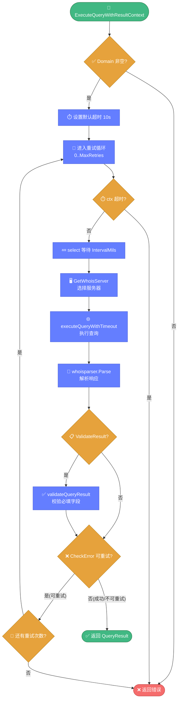

# 🔎 query.go — 域名 WHOIS 查询引擎

> 📖 WHOIS 查询的核心入口，定义查询选项、结果结构与优先级队列聚合器，提供单次查询与批量并发聚合查询能力。

---

## 📋 概览

| 项目 | 内容 |
|------|------|
| 文件 | `pkg/whois/query.go` |
| 核心职责 | 域名 WHOIS 查询、重试、错误分类、结果校验、并发聚合 |
| 依赖 | `errors.go`（错误分类）、`servers.go`（服务器查找）、`proxy.go`（代理查询） |

---

## 🚀 快速使用

```go
import "github.com/cyberspacesec/whois-skills/pkg/whois"

// 1. 简化入口
info, err := whois.ExecuteQuery(&whois.QueryOptions{Domain: "example.com"})

// 2. 完整结果
result, err := whois.ExecuteQueryWithResult(&whois.QueryOptions{
	Domain:     "example.com",
	Timeout:    10,
	MaxRetries: 5,
})

// 3. Context 版本
result, err := whois.ExecuteQueryWithResultContext(ctx, &whois.QueryOptions{
	Domain: "example.com",
})

// 4. 旧版兼容
info, err := whois.Execute(&whois.Query{Domain: "example.com"})
```

---

## ⚙️ QueryOptions 配置

```go
type QueryOptions struct {
	Domain         string   // 域名（必填）
	IntervalMils   int      // 重试间隔（毫秒），默认 1000
	MaxRetries     int      // 最大重试次数，默认 5
	UseProxy       bool     // 是否走代理
	Priority       int      // 优先级 1-10，越小越优先（聚合器用）
	Timeout        int      // 超时（秒），默认 10
	ValidateResult bool     // 是否校验结果完整性
	RequiredFields []string // 必填字段
	FollowReferral bool     // 是否跟随引导，默认 true
	MaxReferrals   int      // 最大引导次数，默认 3
}
```

### 默认值获取方法

| 方法 | 默认值 |
|------|--------|
| `GetIntervalMilsOrDefault()` | 1000 |
| `GetMaxRetriesOrDefault()` | 5 |
| `GetMaxReferralsOrDefault()` | 3 |

---

## 📊 QueryResult 结果

```go
type QueryResult struct {
	Info             *whoisparser.WhoisInfo // 解析后的结构化数据
	RawResponse      string                 // 原始 WHOIS 文本
	QueryTime        time.Time              // 查询时刻
	Latency          int64                  // 延迟（毫秒）
	Server           string                 // 实际查询的服务器
	UsedProxy        bool                   // 是否用了代理
	RetryCount       int                    // 重试次数
	ValidationResult *ValidationResult      // 结果校验
}

type ValidationResult struct {
	Valid         bool     // 是否通过校验
	MissingFields []string // 缺失字段
	Errors        []string // 错误列表
}
```

---

## 🔧 包级函数

| 函数 | 说明 |
|------|------|
| `ExecuteQuery(q *QueryOptions) (*whoisparser.WhoisInfo, error)` | 简化入口，返回解析结果 |
| `ExecuteQueryWithResult(q *QueryOptions) (*QueryResult, error)` | 返回完整结果 |
| `ExecuteQueryWithContext(ctx, q) (*whoisparser.WhoisInfo, error)` | 带 context |
| `ExecuteQueryWithResultContext(ctx, q) (*QueryResult, error)` | 带 context 的完整结果（**主流程**） |
| `Execute(query *Query) (*whoisparser.WhoisInfo, error)` | 旧版兼容入口 |

---

## 🔄 查询主流程

`ExecuteQueryWithResultContext` 的处理步骤：

1. ✅ 校验 `Domain` 非空
2. ⏱️ 设置默认超时 10s
3. 🔁 **重试循环**（0 .. MaxRetries）
   - 检查 `ctx.Err()`，超时则退出
   - 重试前用 `select` 等待 `IntervalMils`
   - `GetServerManager().GetWhoisServer(domain)` 获取服务器
   - `executeQueryWithTimeout` 执行查询
   - `whoisparser.Parse` 解析
   - 计算 `Latency`
   - 若 `ValidateResult` 则 `validateQueryResult`
4. ❌ 错误分类：`isRetryableError`（调用 `CheckError`）判断是否可重试
5. 📊 返回 `QueryResult`

下面是主流程的精简版（完整版见 [guide/query-flow.md](../../guide/query-flow.md)）：



::: details 🔍 executeQueryWithTimeout 内部
- 若 ctx 无 deadline 则附加 `Timeout`
- 用 goroutine + channel + `select` 实现超时
- `UseProxy=true` → `DirectWhoisWithContext`（自定义拨号）
- `UseProxy=false` → `whois.Whois`（likexian 库直连）
:::

::: details 🔍 validateQueryResult 内部
- 用 `reflect` 遍历结构体字段校验 `RequiredFields`
- 校验 `Domain`/`Registrar` 基本信息完整性
:::

---

## 📦 QueryAggregator 聚合器

基于优先级队列（`container/heap`）的并发查询聚合器。

### 创建与配置

```go
type AggregatorConfig struct {
	Concurrency       int              // 并发数，默认 5
	ProgressCallback  ProgressCallback // 进度回调
}

type ProgressCallback func(completed int, total int, domain string, result *QueryResult, err error)

agg := whois.NewQueryAggregator(whois.AggregatorConfig{
	Concurrency: 10,
	ProgressCallback: func(completed, total int, domain string, r *whois.QueryResult, err error) {
		fmt.Printf("[%d/%d] %s\n", completed, total, domain)
	},
})
```

### 方法

| 方法 | 说明 |
|------|------|
| `AddQuery(domain, options)` | 入队查询任务（按 Priority 排序） |
| `ExecuteAll() *BatchResult` | 并发执行所有任务 |
| `SetProgressCallback(cb)` | 设置进度回调 |
| `GetStats() QueryStats` | 获取统计 |

### BatchResult

```go
type BatchResult struct {
	Results map[string]*QueryResult // 成功结果
	Errors  map[string]error        // 失败错误
	Stats   QueryStats              // 统计
}

type QueryStats struct {
	TotalQueries       int64
	SuccessfulQueries  int64
	FailedQueries      int64
	AvgLatency         int64
	MaxLatency         int64
	MinLatency         int64
	ValidationFailures int64
}
```

---

## 🎯 PriorityQueue 优先级队列

```go
type QueryTask struct {
	Domain   string
	Options  *QueryOptions
	Priority int
	Index    int
}

type PriorityQueue []*QueryTask
```

| 方法 | 说明 |
|------|------|
| `PushTask(task)` | 类型安全入队 |
| `PopTask() *QueryTask` | 类型安全出队 |

实现 `heap.Interface`，`Less` 按 `Priority` **升序**（越小越优先）。

### 使用示例

```go
agg := whois.NewQueryAggregator(whois.AggregatorConfig{Concurrency: 10})
agg.AddQuery("high.com", &whois.QueryOptions{Domain: "high.com", Priority: 1})
agg.AddQuery("low.com", &whois.QueryOptions{Domain: "low.com", Priority: 10})
batch := agg.ExecuteAll()
```

---

## 📜 旧版 Query 结构

```go
type Query struct {
	Domain       string
	IntervalMils int
	UseProxy     bool
}
```

`Execute(query)` 内部转换为 `QueryOptions` 后委托给 `ExecuteQueryWithContext`，保持向后兼容。

---

## 🔗 相关

- ❌ [errors.go](./errors.md) — 错误分类
- 🖥️ [servers.go](./servers.md) — 服务器查找
- 🔒 [proxy.go](./proxy.md) — 代理查询路径
- 🎯 [域名查询教程](../../guide/tutorial-domain.md)
