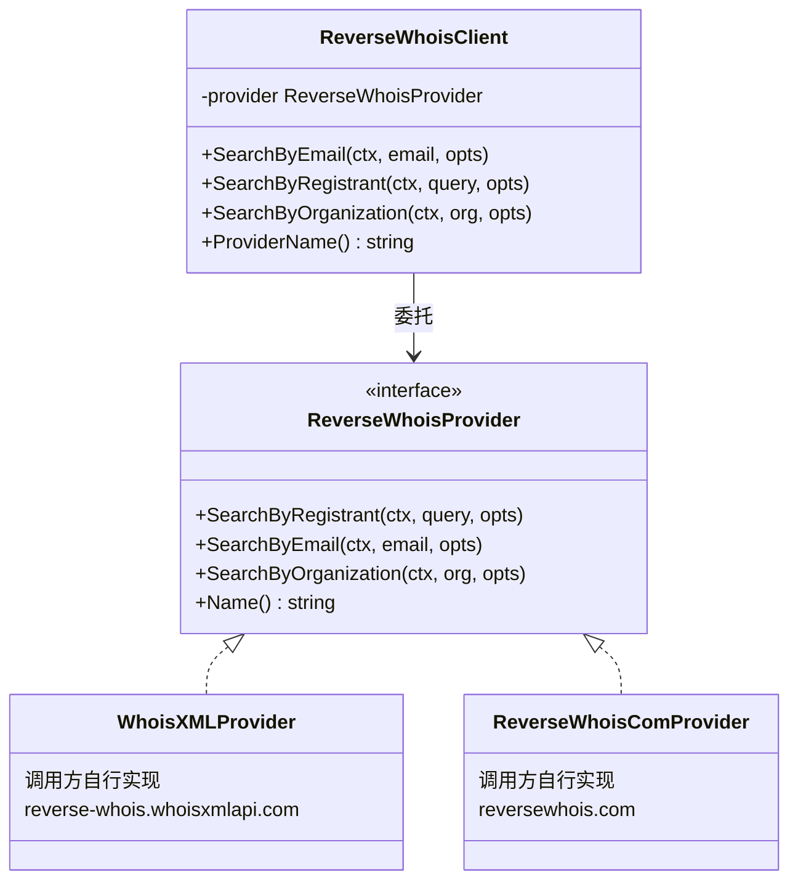
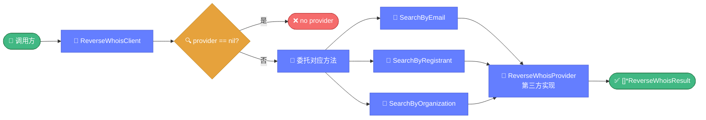

# 🔄 reverse.go — 反向 WHOIS 查询

> 📖 反向 WHOIS 查询客户端抽象层，定义 `ReverseWhoisProvider` 接口与客户端封装，按邮箱/注册人/组织反查关联域名。

---

## 📋 概览

| 项目 | 内容 |
|------|------|
| 文件 | `pkg/whois/reverse.go` |
| 核心职责 | 反向 WHOIS 查询抽象 |
| 模式 | Provider 接口 + 客户端委托 |
| 数据源 | 需调用方自行实现 Provider |

---

## 🚀 快速使用

```go
import "github.com/cyberspacesec/whois-skills/pkg/whois"

// 需先实现 ReverseWhoisProvider 接口（对接第三方服务）
client := whois.NewReverseWhoisClient(myProvider)

// 按邮箱反查
results, err := client.SearchByEmail(ctx, "admin@example.com",
    &whois.ReverseWhoisOptions{Limit: 100, IncludeExpired: false})
if err != nil {
    log.Fatal(err)
}
for _, r := range results {
    fmt.Println(r.Domain, r.Registrar)
}
```

---

## 📊 核心类型

### ReverseWhoisProvider 接口

```go
type ReverseWhoisProvider interface {
    SearchByRegistrant(ctx, query string, opts *ReverseWhoisOptions) ([]*ReverseWhoisResult, error)
    SearchByEmail(ctx, email string, opts *ReverseWhoisOptions) ([]*ReverseWhoisResult, error)
    SearchByOrganization(ctx, org string, opts *ReverseWhoisOptions) ([]*ReverseWhoisResult, error)
    Name() string
}
```

:::tip
本库**不内置**任何 Provider 实现。调用方需自行实现该接口，对接 ReverseWhois.com、WhoisXML API 等第三方反向 WHOIS 服务。
:::

### ReverseWhoisOptions

```go
type ReverseWhoisOptions struct {
    Limit           int  // 结果数量上限
    IncludeExpired  bool // 是否包含已过期域名
}
```

### ReverseWhoisResult

```go
type ReverseWhoisResult struct {
    Domain         string
    Registrant     string
    Email          string
    Organization   string
    CreationDate   string
    ExpirationDate string
    Registrar      string
}
```

### ReverseWhoisClient

```go
type ReverseWhoisClient struct {
    provider ReverseWhoisProvider
}
```

---

## 🔧 函数与方法

| 函数/方法 | 说明 |
|-----------|------|
| `NewReverseWhoisClient(provider) *ReverseWhoisClient` | 创建客户端 |
| `SearchByRegistrant(ctx, query, opts) ([]*ReverseWhoisResult, error)` | 按注册人反查 |
| `SearchByEmail(ctx, email, opts) ([]*ReverseWhoisResult, error)` | 按邮箱反查 |
| `SearchByOrganization(ctx, org, opts) ([]*ReverseWhoisResult, error)` | 按组织反查 |
| `ProviderName() string` | 返回 provider 名称（nil 时返回 `"none"`） |

---

## 🔍 关键实现要点

`ReverseWhoisClient` 是纯委托层，所有查询转发给注入的 `ReverseWhoisProvider`，支持多源替换与 mock：



三种反查维度统一经客户端委托到 Provider：



::: details 纯抽象层
`reverse.go` 是纯抽象层，所有方法**委托**给 `provider`：

```go
func (c *ReverseWhoisClient) SearchByEmail(ctx, email, opts) ([]*ReverseWhoisResult, error) {
    if c.provider == nil {
        return nil, errors.New("no provider")
    }
    return c.provider.SearchByEmail(ctx, email, opts)
}
```

这种设计允许：

- 上层代码依赖 `ReverseWhoisClient` 抽象，与具体服务商解耦
- 可轻松切换不同 Provider（测试时用 mock，生产用真实 API）
:::

::: details ProviderName nil 安全
`ProviderName()` 在 `provider == nil` 时返回字符串 `"none"`，避免空指针，便于日志与诊断。

```go
func (c *ReverseWhoisClient) ProviderName() string {
    if c.provider == nil {
        return "none"
    }
    return c.provider.Name()
}
```
:::

::: details 自行实现 Provider 示例
对接 WhoisXML API 的示意：

```go
type WhoisXMLProvider struct {
    APIKey string
}

func (p *WhoisXMLProvider) SearchByEmail(ctx, email, opts) ([]*whois.ReverseWhoisResult, error) {
    // 调用 https://reverse-whois.whoisxmlapi.com
    // 解析 JSON 响应
    // 转换为 []*ReverseWhoisResult
}

func (p *WhoisXMLProvider) Name() string {
    return "whoisxmlapi"
}
```
:::

---

## 📝 使用示例

### 示例 1：按邮箱反查

```go
client := whois.NewReverseWhoisClient(myProvider)
results, _ := client.SearchByEmail(ctx, "admin@example.com",
    &whois.ReverseWhoisOptions{Limit: 500})
fmt.Printf("找到 %d 个关联域名\n", len(results))
for _, r := range results {
    fmt.Printf("  %s (注册商 %s, 到期 %s)\n",
        r.Domain, r.Registrar, r.ExpirationDate)
}
```

### 示例 2：按注册人反查

```go
results, _ := client.SearchByRegistrant(ctx, "John Doe",
    &whois.ReverseWhoisOptions{Limit: 100, IncludeExpired: true})
```

### 示例 3：按组织反查

```go
results, _ := client.SearchByOrganization(ctx, "ACME Corp",
    &whois.ReverseWhoisOptions{Limit: 200})
```

### 示例 4：结合关联分析

```go
// 反查邮箱关联的所有域名
results, _ := client.SearchByEmail(ctx, targetEmail, &whois.ReverseWhoisOptions{Limit: 1000})

// 再用关联分析引擎聚类
engine := whois.NewCorrelationEngine()
for _, r := range results {
    info, _ := whois.ExecuteQuery(&whois.QueryOptions{Domain: r.Domain})
    engine.AddDomain(r.Domain, info)
}
analysis := engine.Analyze()
```

---

## 🔗 相关

- 🔗 [correlation.md](./correlation.md) — 关联分析（常与反查配合）
- 🔎 [query.md](./query.md) — 正向查询
- 📈 [反向查询教程](../../guide/tutorial-reverse.md)
