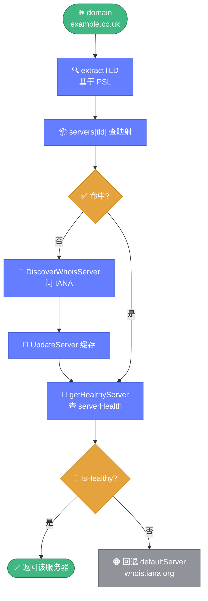
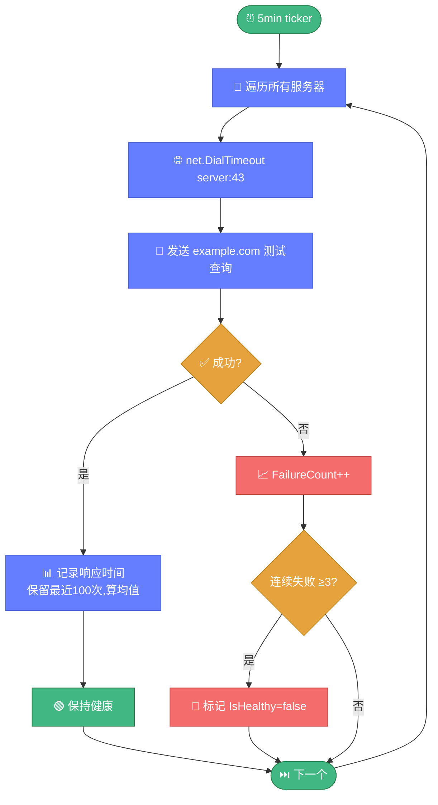

# 🖥️ servers.go — WHOIS 服务器管理

> 📖 WHOIS 服务器列表管理器，维护 TLD → 服务器的映射，提供健康检查、IANA 自动发现与持久化能力，是查询路由的基础。

---

## 📋 概览

| 项目 | 内容 |
|------|------|
| 文件 | `pkg/whois/servers.go` |
| 核心职责 | TLD→服务器映射、健康检查、IANA 发现、持久化 |
| 内置映射 | 约 130+ TLD（gTLD/ccTLD/新 gTLD） |
| 全局单例 | `GetServerManager()` |

---

## 🚀 快速使用

```go
import "github.com/cyberspacesec/whois-skills/pkg/whois"

// 初始化（可选，从配置文件加载）
whois.InitWhoisServerManager("config/servers.json")

// 查询域名对应的服务器
server, err := whois.GetServerManager().GetWhoisServer("example.com")
// server = "whois.verisign-grs.com"

// 解析域名结构
info, _ := whois.ParseDomain("sub.example.co.uk")
// info.TLD = "co.uk", info.FullDomain = "sub.example.co.uk"

// IANA 发现新 TLD 的服务器
server, _ := whois.GetServerManager().DiscoverWhoisServer("app")
```

---

## 📊 核心类型

### WhoisServerManager

```go
type WhoisServerManager struct {
    servers       map[string]string  // TLD → WHOIS 服务器
    serverHealth  map[string]*ServerHealth
    defaultServer string              // 默认回退服务器
    lastUpdated   time.Time
    configPath    string
    // 健康检查参数
}
```

### ServerHealth

```go
type ServerHealth struct {
    LastCheck      time.Time
    IsHealthy      bool
    FailureCount   int
    AvgResponseTime time.Duration
    // 内含 recentResponseTimes（保留最近 100）、maxResponseRecords
}
```

### DomainInfo

```go
type DomainInfo struct {
    FullDomain   string // 完整域名
    TLD          string // 顶级域
    Domain       string // 主域名
    SubDomain    string // 子域名
    WildcardBase string // 通配基础
}
```

---

## 🔧 函数与方法

### 全局单例与初始化

| 函数/方法 | 说明 |
|-----------|------|
| `GetServerManager() *WhoisServerManager` | 全局单例（`managerOnce`） |
| `InitWhoisServerManager(configPath) error` | 初始化并从文件加载 |

### 服务器查询

| 方法 | 说明 |
|------|------|
| `GetWhoisServer(domain) (string, error)` | 按 TLD 查健康服务器，回退默认 |
| `GetServerStats() map` | 服务器统计 |
| `GetAllServers() map` | 全部映射 |
| `GetLastUpdated() time.Time` | 最后更新时间 |

### 域名解析

| 函数 | 说明 |
|------|------|
| `ExtractTLD(domain) (string, error)` | 公开 TLD 提取 |
| `ExtractEffectiveTLD(domain) (string, error)` | 用 PSL 提取有效 TLD |
| `ParseDomain(domain) (*DomainInfo, error)` | 完整解析（用 go-domain-util） |

### 更新与发现

| 方法 | 说明 |
|------|------|
| `UpdateServer(tld, server)` | 更新单个 |
| `UpdateServers(map)` | 批量更新 |
| `SetDefaultServer(server)` | 设置默认服务器 |
| `DiscoverWhoisServer(tld) (string, error)` | 查 IANA 发现并缓存 |
| `RefreshServerList() error` | 刷新所有 TLD |

### 持久化

| 方法 | 说明 |
|------|------|
| `LoadFromFile(path) error` | 从文件加载 |
| `SaveToFile(path) error` | 保存到文件 |

---

## 🔍 关键实现要点

`GetWhoisServer` 按 TLD 查映射并校验健康，未命中或不健康时回退到默认服务器：



后台健康检查定期探活每台 WHOIS 服务器：



::: details 单例与初始化
`GetServerManager` 通过 `managerOnce sync.Once` 初始化：

1. `loadDefaultServers` — 加载约 130+ TLD 映射（gTLD + ccTLD + 新 gTLD）
2. `go startHealthCheck()` — 启动后台健康检查（5 分钟间隔 ticker）
:::

::: details extractTLD 实现
优先使用 `domain_util.FldDomain`（基于 Public Suffix List）提取有效 TLD，回退到简单的「最后一段」逻辑：

```go
tld, err := extractTLD("sub.example.co.uk")
// PSL: tld = "co.uk"
// 简单回退: tld = "uk"
```

:::

::: details GetWhoisServer 路由
1. `extractTLD(domain)` 提取 TLD
2. `getHealthyServer(tld)` — 查 `servers[tld]`，再查 `serverHealth[server].IsHealthy`
3. 健康则返回，不健康回退到 `defaultServer`（`whois.iana.org`）
:::

::: details checkServerHealth 健康检查
- `net.DialTimeout` 拨 `server:43`
- 发送 `example.com\r\n` 测试查询
- 失败 → `FailureCount++`，连续 ≥ `maxFailures`(3) 标记不健康
- 成功 → 更新 `recentResponseTimes`（保留最近 100），算均值
:::

::: details DiscoverWhoisServer IANA 发现
1. 查 `whois.iana.org` 获取 TLD 的 referral
2. `UpdateServer` 缓存到本地映射
3. 后续查询直接命中缓存

`RefreshServerList` 遍历所有 TLD 调用 `DiscoverWhoisServer`，刷新整个列表。
:::

::: details InitWhoisServerManager 文件处理
- 文件存在 → `LoadFromFile` 加载
- 文件不存在 → `SaveToFile` 创建默认配置文件

```go
func InitWhoisServerManager(configPath string) error {
    if _, err := os.Stat(configPath); os.IsNotExist(err) {
        manager.SaveToFile(configPath) // 创建默认
    } else {
        manager.LoadFromFile(configPath)
    }
}
```
:::

---

## 📝 使用示例

### 示例 1：查询服务器

```go
server, _ := whois.GetServerManager().GetWhoisServer("example.com")
fmt.Println("服务器：", server) // whois.verisign-grs.com

server, _ = whois.GetServerManager().GetWhoisServer("example.co.uk")
fmt.Println("服务器：", server) // whois.nic.uk
```

### 示例 2：解析域名结构

```go
info, _ := whois.ParseDomain("blog.sub.example.co.uk")
fmt.Println("完整域名:", info.FullDomain)   // blog.sub.example.co.uk
fmt.Println("TLD:", info.TLD)               // co.uk
fmt.Println("主域名:", info.Domain)          // example.co.uk
fmt.Println("子域名:", info.SubDomain)       // blog.sub
```

### 示例 3：IANA 发现

```go
// 发现新 gTLD 的 WHOIS 服务器
server, _ := whois.GetServerManager().DiscoverWhoisServer("app")
fmt.Println(".app 服务器:", server)
```

### 示例 4：持久化

```go
whois.InitWhoisServerManager("/var/whois/servers.json")
// 修改后保存
mgr := whois.GetServerManager()
mgr.UpdateServer("newtld", "whois.newtld.tld")
mgr.SaveToFile("/var/whois/servers.json")
```

### 示例 5：健康状态

```go
stats := whois.GetServerManager().GetServerStats()
for server, s := range stats {
    fmt.Printf("%s: %v\n", server, s)
}
```

---

## 🔗 相关

- 🔎 [query.md](./query.md) — 查询引擎（使用服务器查找）
- 🔒 [proxy.md](./proxy.md) — 代理客户端
- 🎯 [域名查询教程](../../guide/tutorial-domain.md)
