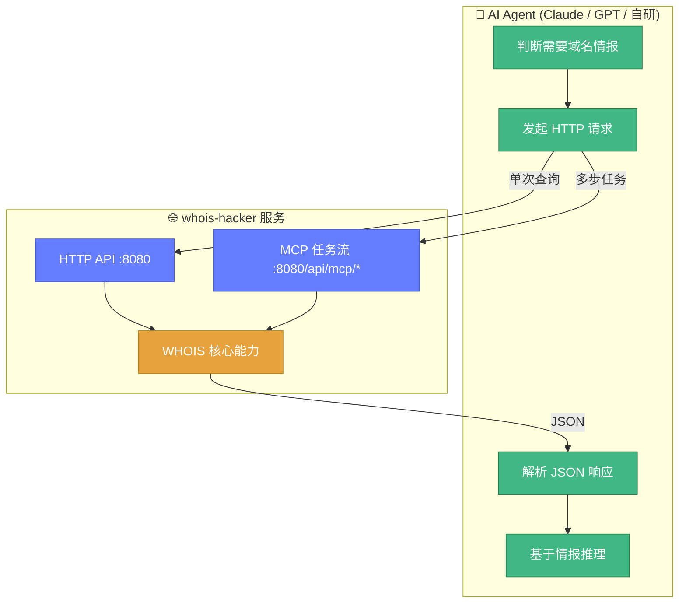
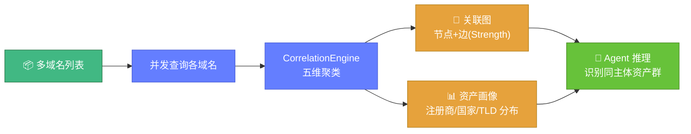
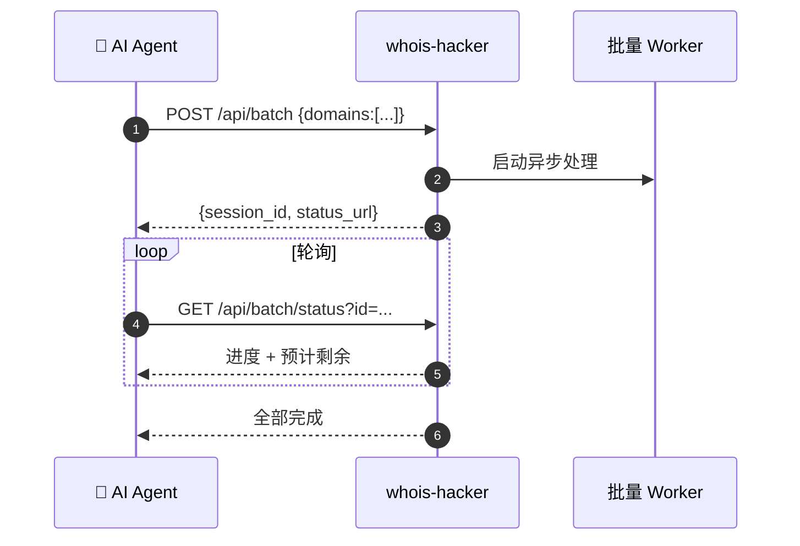
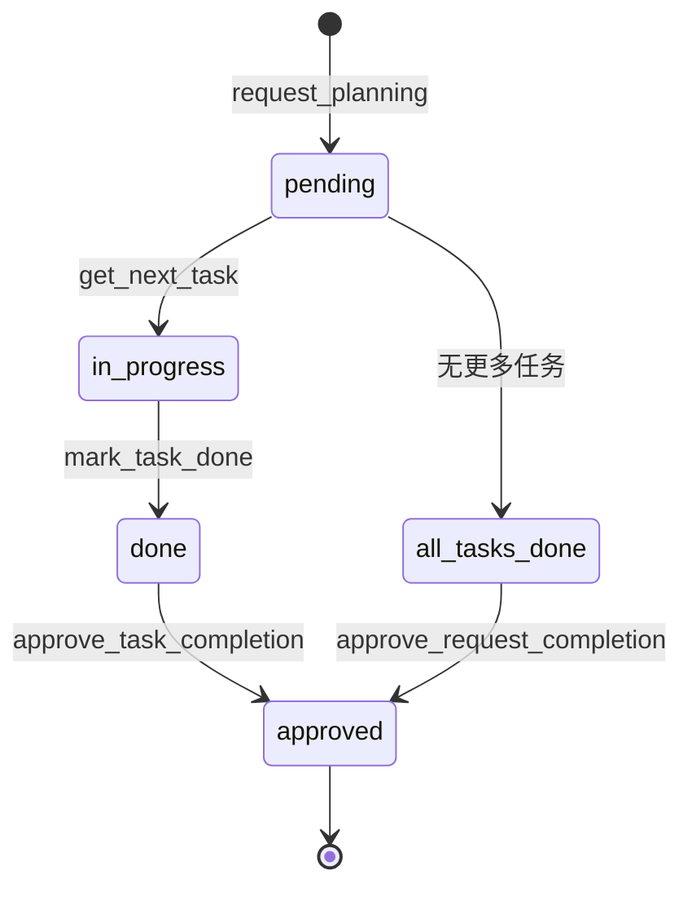
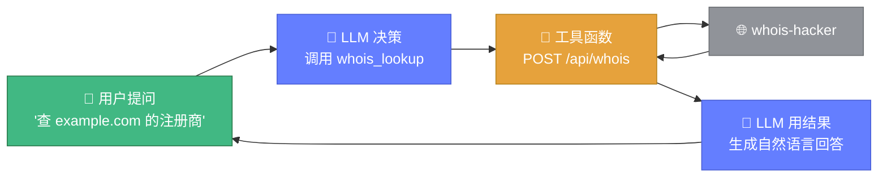

# 🤖 AI 集成示例

> 🎯 Whois Hacker 是面向 AI 的工具。本页给出 AI Agent 集成 WHOIS 情报能力的完整模式——从单次查询到批量任务流，可直接作为 Agent 的工具调用模板。

---

## 🧠 集成模型



**两种集成模式**：

| 模式 | 适用 | 端点前缀 | 特点 |
|------|------|----------|------|
| 直接 HTTP | 单次/独立查询 | `/api/*` | 无状态，一次请求一次响应 |
| MCP 任务流 | 多步、需审批、长任务 | `/api/mcp/*` | 有状态，任务规划→执行→审批 |

---

## 0️⃣ 前置：启动服务

AI 集成前，服务必须已运行。详见 [启动与运行](./usage.md)。

```bash
# 启动（AI 自助或由部署脚本启动）
./bin/whois-hacker --host 0.0.0.0 --port 8080 --log-format json

# 验证
curl http://127.0.0.1:8080/api/health
```

::: tip 🤖 Agent 自检步骤
Agent 集成时应先 `GET /api/health`，确认 `status: ok` 再发起查询，避免服务未就绪导致连环失败。
:::

---

## 1️⃣ 单次查询

### 域名 WHOIS

```bash
curl -X POST http://127.0.0.1:8080/api/whois \
  -H "Content-Type: application/json" \
  -d '{"domain":"example.com"}'
```

可选字段：

```json
{
  "domain": "example.com",
  "use_proxy": false,
  "timeout": 10,
  "max_retries": 5,
  "validate_result": true,
  "required_fields": ["registrar", "creation_date"]
}
```

### IP WHOIS

```bash
curl -X POST http://127.0.0.1:8080/api/ip \
  -H "Content-Type: application/json" \
  -d '{"ip":"8.8.8.8"}'
```

### ASN 查询

```bash
curl -X POST http://127.0.0.1:8080/api/asn \
  -H "Content-Type: application/json" \
  -d '{"asn":15169}'
```

### RDAP 标准查询

```bash
# 域名 RDAP
curl -X POST http://127.0.0.1:8080/api/rdap/domain \
  -H "Content-Type: application/json" -d '{"domain":"example.com"}'

# IP RDAP
curl -X POST http://127.0.0.1:8080/api/rdap/ip \
  -H "Content-Type: application/json" -d '{"ip":"8.8.8.8"}'

# ASN RDAP
curl -X POST http://127.0.0.1:8080/api/rdap/asn \
  -H "Content-Type: application/json" -d '{"asn":15169}'
```

---

## 2️⃣ 情报分析

### 域名可注册性检测

```bash
curl -X POST http://127.0.0.1:8080/api/availability \
  -H "Content-Type: application/json" -d '{"domain":"newidea-12345.com"}'
```

### WHOIS 差异对比（监控域名变更）

```bash
curl -X POST http://127.0.0.1:8080/api/diff \
  -H "Content-Type: application/json" \
  -d '{"domain":"example.com"}'
# 返回本次与上次缓存记录的字段差异
```

### 数据质量评估

```bash
curl -X POST http://127.0.0.1:8080/api/quality \
  -H "Content-Type: application/json" -d '{"domain":"example.com"}'
# 返回完整性/时效性/可信度三维评分
```

### 多域名关联分析

```bash
curl -X POST http://127.0.0.1:8080/api/correlation \
  -H "Content-Type: application/json" \
  -d '{"domains":["a.com","b.com","c.com"]}'
# 返回聚类、关联图、资产画像
```



---

## 3️⃣ 批量查询（异步任务流）

大批量查询走异步 batch 端点，避免长连接超时。

### 提交批量任务

```bash
curl -X POST http://127.0.0.1:8080/api/batch \
  -H "Content-Type: application/json" \
  -d '{
    "domains": ["a.com","b.com","c.com","d.com"],
    "concurrency": 5,
    "timeout": 10,
    "max_retries": 3,
    "query_delay_ms": 200
  }'
# 返回 {"session_id":"batch-...","status_url":"/api/batch/status?id=batch-..."}
```

### 轮询状态

```bash
curl "http://127.0.0.1:8080/api/batch/status?id=batch-..."
# 返回 completed/total、success_count、failure_count、estimated_remaining
```



---

## 4️⃣ 导出与格式化

### 导出为 JSON / CSV / Markdown

```bash
# 导出 JSON
curl -X POST http://127.0.0.1:8080/api/export/json \
  -H "Content-Type: application/json" -d '{"domain":"example.com"}'

# 导出 CSV
curl -X POST http://127.0.0.1:8080/api/export/csv \
  -H "Content-Type: application/json" -d '{"domain":"example.com"}'

# 导出 Markdown
curl -X POST http://127.0.0.1:8080/api/export/markdown \
  -H "Content-Type: application/json" -d '{"domain":"example.com"}'
```

### IDN 国际化域名转换

```bash
curl -X POST http://127.0.0.1:8080/api/idn \
  -H "Content-Type: application/json" \
  -d '{"domain":"中文.com","action":"to_ascii"}'
# 返回 Punycode: xn--fiq228c.com
```

### 仅格式检测

```bash
curl -X POST http://127.0.0.1:8080/api/format \
  -H "Content-Type: application/json" -d '{"raw":"...whois文本...","detect_only":true}'
```

---

## 5️⃣ MCP 任务流（多步、可审批）

MCP 协议适合需要"规划→执行→人工/AI 审批"的复杂情报收集任务。



### 提交任务规划

```bash
curl -X POST http://127.0.0.1:8080/api/mcp/request_planning \
  -H "Content-Type: application/json" \
  -d '{"description":"调查 example.com 资产","tasks":[...]}'
# 返回 request_id
```

### 获取并执行下一任务

```bash
curl -X POST http://127.0.0.1:8080/api/mcp/get_next_task \
  -H "Content-Type: application/json" -d '{"request_id":"..."}'
```

### 标记完成 / 审批

```bash
# 标记单任务完成
curl -X POST http://127.0.0.1:8080/api/mcp/mark_task_done \
  -H "Content-Type: application/json" -d '{"request_id":"...","task_id":"..."}'

# 审批任务完成
curl -X POST http://127.0.0.1:8080/api/mcp/approve_task_completion \
  -H "Content-Type: application/json" -d '{"request_id":"...","task_id":"..."}'

# 审批整个请求完成
curl -X POST http://127.0.0.1:8080/api/mcp/approve_request_completion \
  -H "Content-Type: application/json" -d '{"request_id":"..."}'
```

📖 完整端点见 [MCP 协议](../api/mcp/overview.md)。

---

## 6️⃣ Python 集成示例

```python
import requests

BASE = "http://127.0.0.1:8080"

def health():
    return requests.get(f"{BASE}/api/health").json()

def whois(domain):
    r = requests.post(f"{BASE}/api/whois",
                      json={"domain": domain, "validate_result": True})
    return r.json()

def correlate(domains):
    r = requests.post(f"{BASE}/api/correlation", json={"domains": domains})
    return r.json()

def batch(domains):
    r = requests.post(f"{BASE}/api/batch",
                      json={"domains": domains, "concurrency": 5})
    return r.json()

# 用法
print(whois("example.com"))
print(correlate(["a.com", "b.com", "c.com"]))
```

---

## 7️⃣ Agent 工具定义（Function Calling 示例）

给 LLM 的工具定义（以 OpenAI / Claude function calling 格式为例）：

```json
{
  "name": "whois_lookup",
  "description": "查询域名的 WHOIS 注册信息，返回注册商、注册人、日期、NS 等",
  "parameters": {
    "type": "object",
    "properties": {
      "domain": {"type": "string", "description": "要查询的域名"}
    },
    "required": ["domain"]
  }
}
```

Agent 后端实现该函数时，调用 `POST /api/whois`：

```python
def whois_lookup(domain):
    resp = requests.post(f"{BASE}/api/whois", json={"domain": domain})
    data = resp.json()
    # 把结构化结果摘要给 LLM
    info = data.get("data", {}).get("info", {})
    return {
        "domain": domain,
        "registrar": info.get("registrar", {}).get("name"),
        "creation_date": info.get("creation_date"),
        "name_servers": info.get("name_servers"),
    }
```



---

## 📋 端点速查表

| 能力 | 方法 | 端点 |
|------|------|------|
| 健康检查 | GET | `/api/health` |
| 域名 WHOIS | POST | `/api/whois` |
| IP WHOIS | POST | `/api/ip` |
| ASN 查询 | POST | `/api/asn` |
| RDAP 域名 | POST | `/api/rdap/domain` |
| RDAP IP | POST | `/api/rdap/ip` |
| RDAP ASN | POST | `/api/rdap/asn` |
| 可注册性 | POST | `/api/availability` |
| 差异对比 | POST | `/api/diff` |
| 质量评估 | POST | `/api/quality` |
| 关联分析 | POST | `/api/correlation` |
| 批量查询 | POST | `/api/batch` |
| 批量状态 | GET | `/api/batch/status` |
| 格式检测 | POST | `/api/format` |
| 导出 JSON | POST | `/api/export/json` |
| 导出 CSV | POST | `/api/export/csv` |
| 导出 Markdown | POST | `/api/export/markdown` |
| IDN 转换 | POST | `/api/idn` |
| 服务器列表 | GET | `/api/servers` |
| 指标 | GET | `/api/metrics` |
| 告警 | GET | `/api/alerts` |
| MCP 规划 | POST | `/api/mcp/request_planning` |
| MCP 取任务 | POST | `/api/mcp/get_next_task` |
| MCP 完成任务 | POST | `/api/mcp/mark_task_done` |
| MCP 审批任务 | POST | `/api/mcp/approve_task_completion` |
| MCP 审批请求 | POST | `/api/mcp/approve_request_completion` |
| MCP 任务详情 | POST | `/api/mcp/open_task_details` |
| MCP 列出请求 | GET | `/api/mcp/list_requests` |
| MCP 添加任务 | POST | `/api/mcp/add_tasks_to_request` |
| MCP 更新任务 | POST | `/api/mcp/update_task` |
| MCP 删除任务 | POST | `/api/mcp/delete_task` |

📖 每个端点的详细请求/响应见 [HTTP API](../api/http/endpoints.md)。

---

## 🔗 相关文档

- 🌐 [HTTP API 总览](../api/http/overview.md) — 端点体系
- 📡 [端点详解](../api/http/endpoints.md) — 每个端点的完整说明
- 🤖 [MCP 协议](../api/mcp/overview.md) — 任务流状态机
- 🚀 [启动与运行](./usage.md) — 让服务跑起来
