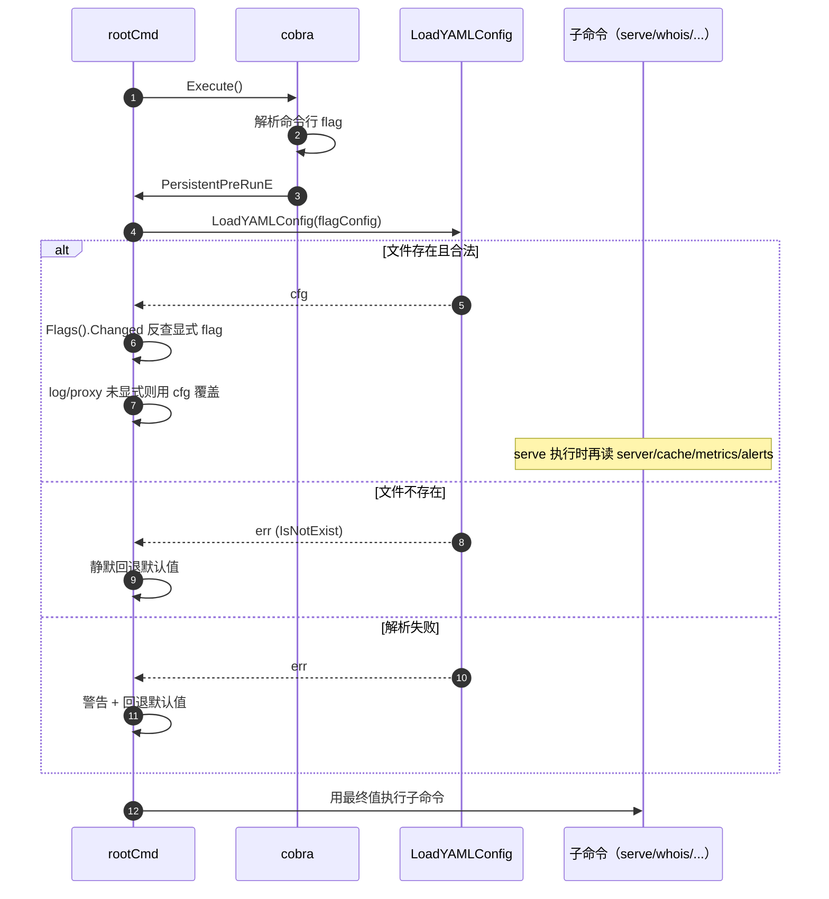
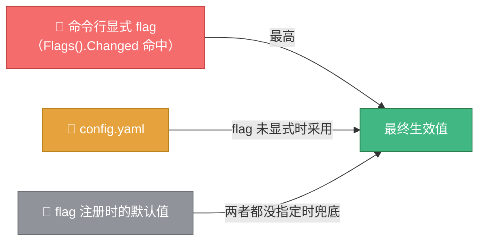

# ⚙️ 配置文件

> 📄 `config/config.yaml` —— 用一份文件管理所有启动参数，避免长串命令行 flag。

::: tip 🔁 谁读这份配置
CLI 重构为 cobra 子命令后，配置文件由根命令的 `PersistentPreRunE` 在所有子命令执行前加载（`helpers.go` 的 `loadConfigFromFile`，负责 `log`/`proxy` 字段）。**`serve` 子命令通过自身的 `applyServeConfigFromYAML` 读取 `server`/`cache`/`metrics`/`alerts` 字段**来配置常驻服务；查询类子命令（`whois`/`ip`/`asn` 等）则主要用全局 flag 与各自专属 flag，继承 `log` 与 `proxy` 配置。命令行显式 flag 仍优先于配置文件。
:::


---

## 📁 默认路径与加载

| 项 | 值 |
|----|----|
| 默认路径 | `config/config.yaml` |
| 自定义路径 | `--config /path/to/config.yaml` |
| 文件不存在 | 静默回退到 flag 默认值（仅 debug 日志提示） |
| 文件解析失败 | 警告日志，继续用 flag 默认值启动 |
| 格式 | YAML |

加载时机：cobra 解析命令行 flag 之后、子命令执行之前（`PersistentPreRunE` 钩子）。



---

## 📝 完整配置文件示例

```yaml
# WhoisHacker 应用配置文件
# 命令行 flag 优先级高于此文件中的值

# HTTP 服务配置
server:
  host: "127.0.0.1"
  port: 8080

# 日志配置
log:
  level: "info"       # debug/info/warn/error
  format: "text"      # text/json

# 缓存配置
cache:
  enabled: true
  type: "local"       # local/redis
  ttl: 3600           # 缓存有效期（秒）
  warmup: false       # 是否启用缓存预热
  warmup_file: "config/warmup.json"

# 代理配置
proxy:
  enabled: false
  file: "config/proxies.json"

# 监控配置
metrics:
  enabled: true
  interval: 60        # 采集间隔（秒）

# 告警配置
alerts:
  enabled: true
  interval: 60        # 检查间隔（秒）
```

---

## 🔗 YAML 字段与 flag 对照表

所有 YAML 字段都会在命令行未显式设置对应 flag 时生效（命令行优先级最高）。

| YAML 路径 | 对应 flag | 类型 | 默认值 | 读取点 |
|-----------|-----------|------|--------|--------|
| `server.host` | `serve --host` | string | `127.0.0.1` | serve 子命令 |
| `server.port` | `serve --port` | int | `8080` | serve 子命令 |
| `log.level` | `--log-level` | string | `info` | 全局 PersistentPreRun |
| `log.format` | `--log-format` | string | `text` | 全局 PersistentPreRun |
| `cache.enabled` | `serve --cache` | bool | `true` | serve 子命令 |
| `cache.type` | `serve --cache-type` | string | `local` | serve 子命令 |
| `cache.ttl` | `serve --cache-ttl` | int64 | `3600` | serve 子命令 |
| `cache.warmup` | `serve --cache-warmup` | bool | `false` | serve 子命令 |
| `cache.warmup_file` | `serve --warmup-file` | string | `config/warmup.json` | serve 子命令 |
| `proxy.enabled` | `--use-proxy` | bool | `false` | 全局 PersistentPreRun |
| `proxy.file` | `--proxy-file` | string | `config/proxies.json` | 全局 PersistentPreRun |
| `metrics.enabled` | `serve --metrics` | bool | `true` | serve 子命令 |
| `metrics.interval` | `serve --metrics-interval` | int64 | `60` | serve 子命令 |
| `alerts.enabled` | `serve --alerts` | bool | `true` | serve 子命令 |
| `alerts.interval` | `serve --alerts-interval` | int64 | `60` | serve 子命令 |

::: tip ✅ 配置文件完整支持
`log`/`proxy` 字段在全局 `PersistentPreRunE` 阶段读取（所有子命令生效）；`server`/`cache`/`metrics`/`alerts` 字段在 `serve` 子命令的 `applyServeConfigFromYAML` 中读取。查询类子命令（whois/ip/asn 等）只继承 log 与 proxy 配置。
:::

::: tip 🤖 给 AI 的提示
YAML 字段名是 `snake_case`（如 `warmup_file`），flag 名是 `kebab-case`（如 `--warmup-file`）。两者命名风格不同，但语义对应。
:::

---

## 🎚️ 优先级规则



**判断逻辑**（`helpers.go` 的 `loadConfigFromFile` 处理 `log`/`proxy`；`cmd_serve.go` 的 `applyServeConfigFromYAML` 处理 `server`/`cache`/`metrics`/`alerts`）：对每个配置项，先用 `cmd.Flags().Changed("name")`（cobra 等价于旧 `flag.Visit`）检查该 flag 是否在命令行被显式设置：

- **显式设置** → 用命令行值，忽略 YAML
- **未显式设置** → 用 YAML 值（若 YAML 该字段非零值）
- **YAML 也是零值** → 用 flag 注册时的默认值

### 三种值并存示例

`config.yaml`：

```yaml
server:
  port: 8080
log:
  level: warn
```

命令行：

```bash
./bin/whois-hacker serve --port 9090
```

最终生效：

| 配置项 | 命令行 | YAML | flag 默认值 | 最终 | 原因 |
|--------|--------|------|--------|------|------|
| `port` | `9090` | `8080` | `8080` | **9090** | serve flag 显式设置，直接生效 |
| `log-level` | 未设置 | `warn` | `info` | **warn** | 未显式，YAML 覆盖默认 |
| `host` | 未设置 | 未设置 | `127.0.0.1` | **127.0.0.1** | 都没指定，用默认 |

---

## 🧪 典型配置场景

### 场景 1：本地开发

```yaml
server:
  host: "127.0.0.1"
  port: 8080
log:
  level: "debug"
  format: "text"
cache:
  enabled: true
  type: "local"
  ttl: 3600
proxy:
  enabled: false
metrics:
  enabled: true
alerts:
  enabled: false
```

### 场景 2：生产对外服务

```yaml
server:
  host: "0.0.0.0"
  port: 8080
log:
  level: "info"
  format: "json"        # 便于日志采集
cache:
  enabled: true
  type: "redis"
  ttl: 7200
  warmup: true
  warmup_file: "/data/warmup.json"
proxy:
  enabled: true
  file: "/etc/whois/proxies.json"
metrics:
  enabled: true
  interval: 30
alerts:
  enabled: true
  interval: 30
```

### 场景 3：最小化（低开销）

```yaml
server:
  host: "127.0.0.1"
  port: 8080
cache:
  enabled: false
metrics:
  enabled: false
alerts:
  enabled: false
```

---

## 📂 配置相关文件清单

| 文件 | 用途 | 格式 | 由谁读写 |
|------|------|------|----------|
| `config/config.yaml` | 应用配置 | YAML | 启动时读取 |
| `config/servers.json` | WHOIS 服务器映射 | JSON | 运行时生成/读取 |
| `config/proxies.json` | 代理列表 | JSON | 启动时读取 |
| `config/warmup.json` | 缓存预热域名列表 | JSON | 预热时读取 |
| `config/apikeys.json` | API 密钥 | JSON | `APIKeyManager` 读写（权限 0600） |

::: warning ⚠️ apikeys.json 不应入库
`config/apikeys.json` 由 `APIKeyManager.SaveConfig()` 写入，权限 `0600`，**不应提交到版本控制**。
:::

---

## 📚 库配置（不同于应用配置）

除应用配置 `config.yaml` 外，`pkg/whois` 内部还有一套**库配置** `WhoisLibraryConfig`，覆盖九大子系统（查询/缓存/代理/限速/批量/监控/调度/可观测/日志），通过 Go 代码或单独的库配置文件加载。

📖 详见 [配置系统](../guide/configuration.md#📚-库配置-whoislibraryconfig)。

---

## 🔗 相关文档

- 🚩 [命令行参数](./flags.md) — 每个 flag 详解
- ⚙️ [配置系统](../guide/configuration.md) — 应用配置与库配置总览
- 🚀 [启动与运行](./usage.md) — 用配置文件启动
