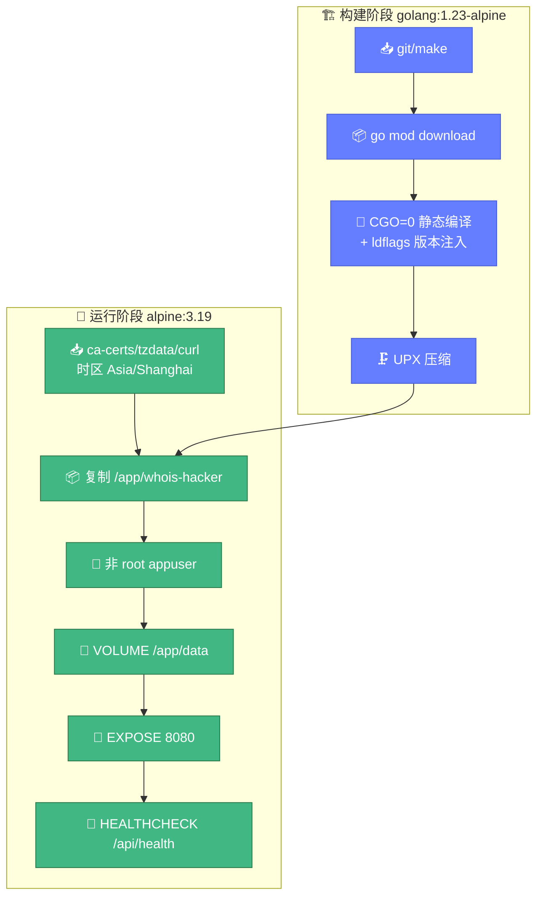
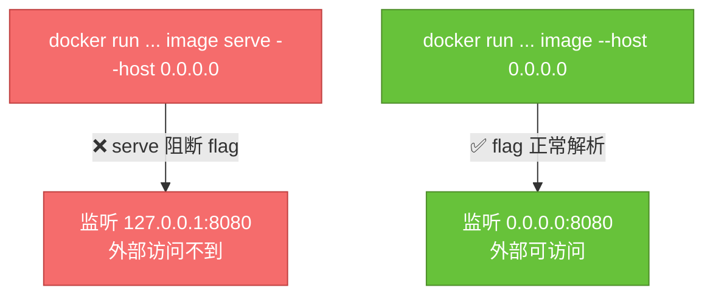

# 🐳 Docker 命令

> 📋 用容器运行 `whois-hacker` 的全部命令：构建、运行、传参、健康检查、compose 编排。

---

## 📦 镜像信息

| 项目 | 内容 |
|------|------|
| Dockerfile | 仓库根目录 `Dockerfile` |
| 构建镜像 | `golang:1.23-alpine`（builder）→ `alpine:3.19`（运行时） |
| 二进制路径（容器内） | `/app/whois-hacker` |
| 暴露端口 | `8080` |
| 数据卷 | `/app/data` |
| 运行用户 | `appuser`（非 root） |
| 健康检查端点 | `/api/health` |



---

## 🔨 构建镜像

```bash
# 本地构建
docker build -t cyberspacesec/whois-skills:latest .

# 带版本号
docker build -t cyberspacesec/whois-skills:0.1.0 -t cyberspacesec/whois-skills:latest .

# 多平台（amd64 + arm64，需 buildx）
docker buildx build --platform linux/amd64,linux/arm64 \
  -t cyberspacesec/whois-skills:latest --push .
```

或用 Makefile：

```bash
make docker          # 单平台
make docker-multi    # 多平台（需 buildx）
```

---

## ▶️ 运行容器

### 基础运行

```bash
docker run -d --name whois-hacker -p 8080:8080 \
  cyberspacesec/whois-skills:latest
```

### ⚠️ 关键：如何正确传参

容器内入口是 `/app/whois-hacker`。**Go 的 `flag` 包遇到第一个非 flag 位置参数即停止解析后续 flag**——所以 `serve` 这种子命令会阻断其后的 `--host`/`--port`，导致它们失效、回退默认值。

::: warning 🐛 当前 Dockerfile / compose 的已知问题
仓库 `Dockerfile` 的 `CMD ["serve", "--host", "0.0.0.0", "--port", "8080"]` 与 `docker-compose.yml` 的 `command: ["/app/bin/whois-hacker", "serve", ...]` 中的 `serve` 子命令**实际不被 `main.go` 处理**，且会让其后的 flag 失效。实测：

- `whois-hacker serve --host 0.0.0.0 --port 9090` → 实际监听 `127.0.0.1:8080`（flag 被吞）
- `whois-hacker --host 0.0.0.0 --port 9090` → 实际监听 `0.0.0.0:9090`（正确）

`main.go` 没有 `serve` 子命令，也无 `version` 子命令（compose 的 healthcheck 用了不存在的 `version`）。
:::

**正确用法**：直接覆盖 `CMD`，**不带 `serve`**：

```bash
# 正确：flag 直接跟在入口后
docker run -d --name whois-hacker -p 8080:8080 \
  cyberspacesec/whois-skills:latest \
  --host 0.0.0.0 --port 8080

# 正确：自定义日志与缓存
docker run -d --name whois-hacker -p 8080:8080 \
  -v $(pwd)/data:/app/data \
  cyberspacesec/whois-skills:latest \
  --host 0.0.0.0 --log-level info --log-format json --cache-ttl 7200
```



::: tip 🤖 给 AI 的修正建议
若要让 Dockerfile 的 `serve` 写法生效，需要在 `main.go` 中加入子命令处理（如用 `os.Args` 判断首参是否为 `serve`/`version` 并消费掉），或改用支持子命令的 CLI 框架（如 `cobra`）。当前最简修正：把 `CMD ["serve", "--host", "0.0.0.0", "--port", "8080"]` 改为 `CMD ["--host", "0.0.0.0", "--port", "8080"]`。详见 [FAQ](./faq.md)。
:::

---

## 🩺 健康检查

镜像内置 `HEALTHCHECK`：

```dockerfile
HEALTHCHECK --interval=30s --timeout=5s --start-period=5s --retries=3 \
    CMD curl -f http://localhost:8080/api/health || exit 1
```

查看健康状态：

```bash
docker inspect --format='{{.State.Health.Status}}' whois-hacker
# healthy / unhealthy / starting

docker inspect --format='{{json .State.Health}}' whois-hacker | jq
```

手动探测：

```bash
curl -f http://localhost:8080/api/health
# {"status":"ok",...}
```

::: warning ⚠️ 健康检查端点
端点是 **`/api/health`**（不是 `/health`）。若覆盖 `HEALTHCHECK` 命令，注意用正确路径。
:::

---

## 📂 挂载卷与配置

| 容器路径 | 用途 | 挂载建议 |
|----------|------|----------|
| `/app/data` | 指标导出、运行时数据 | 持久卷 |
| `/app/config/config.yaml` | 应用配置 | 只读挂载 `-v config.yaml:/app/config/config.yaml:ro` |
| `/app/config/proxies.json` | 代理列表 | 只读挂载 |
| `/app/config/warmup.json` | 预热域名 | 只读挂载 |

```bash
docker run -d --name whois-hacker -p 8080:8080 \
  -v whois_data:/app/data \
  -v $(pwd)/config:/app/config:ro \
  cyberspacesec/whois-skills:latest \
  --host 0.0.0.0 --config /app/config/config.yaml
```

---

## 🌐 端口与外部访问

默认 `EXPOSE 8080`。要让容器外的 AI/客户端访问，必须：

1. `-p 8080:8080` 端口映射
2. `--host 0.0.0.0` 让进程监听所有网卡（容器内 localhost 外部访问不到）

```bash
docker run -d -p 8080:8080 ... --host 0.0.0.0
```

---

## 🎼 docker-compose

仓库提供 `docker-compose.yml`：

```bash
docker compose up -d          # 启动
docker compose logs -f        # 看日志
docker compose down           # 停止
```

::: warning 🐛 compose 文件同样的问题
`docker-compose.yml` 的 `command` 和 `healthcheck` 也用了不存在的 `serve` / `version` 子命令，且 `command` 里的路径 `/app/bin/whois-hacker` 与 Dockerfile 实际产物路径 `/app/whois-hacker` 不一致。建议参照上文修正后使用。完整正确的 compose 写法见 [Docker Compose 部署](../deploy/compose.md)。
:::

修正后的 compose 片段：

```yaml
services:
  whois-hacker:
    image: cyberspacesec/whois-skills:latest
    container_name: whois-hacker
    restart: unless-stopped
    ports:
      - "8080:8080"
    command: ["--host", "0.0.0.0", "--port", "8080", "--log-format", "json"]
    healthcheck:
      test: ["CMD", "curl", "-f", "http://localhost:8080/api/health"]
      interval: 30s
      timeout: 5s
      retries: 3
      start_period: 5s
    volumes:
      - whois_data:/app/data
      - ./config:/app/config:ro
volumes:
  whois_data:
```

---

## 🔗 相关文档

- 🚀 [启动与运行](./usage.md) — 非容器的启动方式
- 🛑 [信号与优雅关闭](./signals.md) — 容器中信号传递的坑
- 🎼 [Docker Compose 部署](../deploy/compose.md) — 完整编排
- 🐳 [Docker 部署](../deploy/docker.md) — 镜像构建细节
