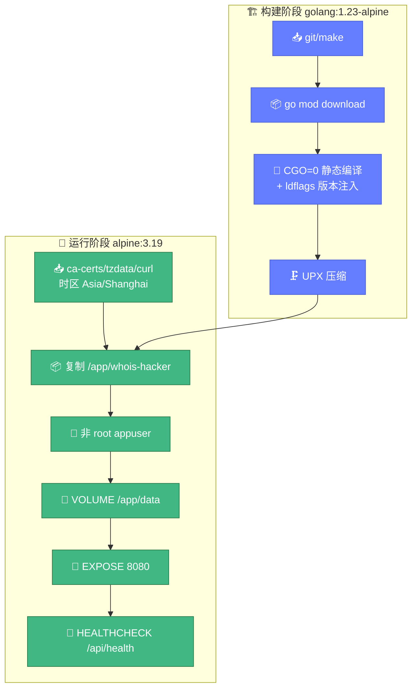
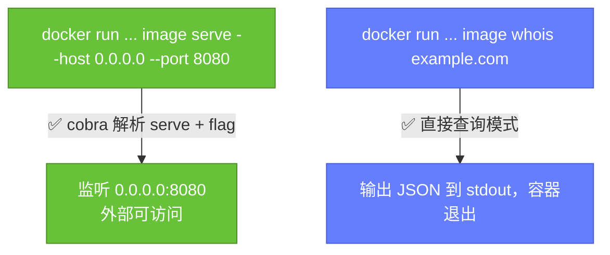

# 🐳 Docker 命令

> 📋 用容器运行 `whois-hacker` 的全部命令：构建、运行、传参、健康检查、compose 编排。

---

## 📦 镜像信息

| 项目 | 内容 |
|------|------|
| Dockerfile | 仓库根目录 `Dockerfile` |
| 构建镜像 | `golang:1.23-alpine`（builder）→ `alpine:3.19`（运行时） |
| 二进制路径（容器内） | `/app/whois-hacker` |
| 暴露端口 | `8080` |
| 数据卷 | `/app/data` |
| 运行用户 | `appuser`（非 root） |
| 健康检查端点 | `/api/health` |



---

## 🔨 构建镜像

```bash
# 本地构建
docker build -t cyberspacesec/whois-skills:latest .

# 带版本号
docker build -t cyberspacesec/whois-skills:0.1.0 -t cyberspacesec/whois-skills:latest .

# 多平台（amd64 + arm64，需 buildx）
docker buildx build --platform linux/amd64,linux/arm64 \
  -t cyberspacesec/whois-skills:latest --push .
```

或用 Makefile：

```bash
make docker          # 单平台
make docker-multi    # 多平台（需 buildx）
```

---

## ▶️ 运行容器

### 基础运行

```bash
docker run -d --name whois-hacker -p 8080:8080 \
  cyberspacesec/whois-skills:latest
```

镜像默认 `CMD ["serve", "--host", "0.0.0.0", "--port", "8080"]`，启动后即对外提供 HTTP 服务。

### ▶️ 如何正确传参

容器内入口是 `/app/whois-hacker`，CLI 已重构为基于 `cobra` 的子命令结构。`serve` 是真实的子命令，flag 可在其后正常解析——Dockerfile 的 `CMD ["serve", "--host", "0.0.0.0", "--port", "8080"]` 完全正确。

```bash
# 默认 CMD 即可：serve 子命令 + 对外监听
docker run -d --name whois-hacker -p 8080:8080 \
  cyberspacesec/whois-skills:latest

# 自定义日志与缓存（flag 跟在 serve 后）
docker run -d --name whois-hacker -p 8080:8080 \
  -v $(pwd)/data:/app/data \
  cyberspacesec/whois-skills:latest \
  serve --host 0.0.0.0 --log-level info --log-format json --cache-ttl 7200

# 也可直接用查询子命令（查完即退出，容器随后退出）
docker run --rm cyberspacesec/whois-skills:latest \
  whois example.com --format json
```



---

## 🩺 健康检查

镜像内置 `HEALTHCHECK`：

```dockerfile
HEALTHCHECK --interval=30s --timeout=5s --start-period=5s --retries=3 \
    CMD curl -f http://localhost:8080/api/health || exit 1
```

查看健康状态：

```bash
docker inspect --format='{{.State.Health.Status}}' whois-hacker
# healthy / unhealthy / starting

docker inspect --format='{{json .State.Health}}' whois-hacker | jq
```

手动探测：

```bash
curl -f http://localhost:8080/api/health
# {"status":"ok",...}
```

::: warning ⚠️ 健康检查端点
端点是 **`/api/health`**（不是 `/health`）。若覆盖 `HEALTHCHECK` 命令，注意用正确路径。
:::

---

## 📂 挂载卷与配置

| 容器路径 | 用途 | 挂载建议 |
|----------|------|----------|
| `/app/data` | 指标导出、运行时数据 | 持久卷 |
| `/app/config/config.yaml` | 应用配置 | 只读挂载 `-v config.yaml:/app/config/config.yaml:ro` |
| `/app/config/proxies.json` | 代理列表 | 只读挂载 |
| `/app/config/warmup.json` | 预热域名 | 只读挂载 |

```bash
docker run -d --name whois-hacker -p 8080:8080 \
  -v whois_data:/app/data \
  -v $(pwd)/config:/app/config:ro \
  cyberspacesec/whois-skills:latest \
  serve --host 0.0.0.0 --config /app/config/config.yaml
```

---

## 🌐 端口与外部访问

默认 `EXPOSE 8080`。要让容器外的 AI/客户端访问，必须：

1. `-p 8080:8080` 端口映射
2. `serve --host 0.0.0.0` 让进程监听所有网卡（容器内 localhost 外部访问不到）

```bash
docker run -d -p 8080:8080 ... serve --host 0.0.0.0
```

---

## 🎼 docker-compose

仓库提供 `docker-compose.yml`，已修正为正确的 `serve` 子命令与健康检查端点：

```bash
docker compose up -d          # 启动
docker compose logs -f        # 看日志
docker compose down           # 停止
```

`command` 用 `["serve", ...]` 配合 `ENTRYPOINT ["./whois-hacker"]`，cobra 正确解析子命令与其后 flag；healthcheck 用 `curl -f http://localhost:8080/api/health` 真实探测。修正后的 compose 片段：

```yaml
services:
  whois-hacker:
    image: cyberspacesec/whois-skills:latest
    container_name: whois-hacker
    restart: unless-stopped
    ports:
      - "8080:8080"
    command: ["serve", "--host", "0.0.0.0", "--port", "8080", "--log-format", "json"]
    healthcheck:
      test: ["CMD", "curl", "-f", "http://localhost:8080/api/health"]
      interval: 30s
      timeout: 5s
      retries: 3
      start_period: 5s
    volumes:
      - whois_data:/app/data
      - ./config:/app/config:ro
volumes:
  whois_data:
```

---

## 🔗 相关文档

- 🚀 [启动与运行](./usage.md) — 非容器的启动方式
- 🛑 [信号与优雅关闭](./signals.md) — 容器中信号传递的坑
- 🎼 [Docker Compose 部署](../deploy/compose.md) — 完整编排
- 🐳 [Docker 部署](../deploy/docker.md) — 镜像构建细节
