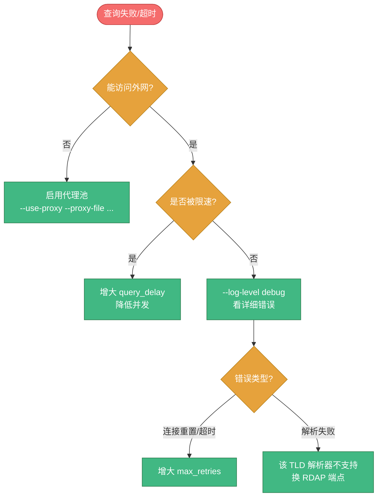

# ❓ CLI 常见问题

> 🐛 启动与运行中常见问题、已知 bug 及其规避方法。基于对源码（`cmd/whois-hacker/*`、`Makefile`、`Dockerfile`、`docker-compose.yml`）的实际验证整理。

::: tip ✅ CLI 已重构为 cobra 子命令结构
旧版基于 Go `flag` 包的"纯 flag 服务型"已重构为基于 `cobra` 的子命令结构：`whois-hacker` 既能直接查询（查完即退出），也能 `serve` 启动服务。历史上 Q1–Q4 描述的 bug（make run 引用 api.go、无 version 子命令、serve 吞 flag、compose healthcheck 用 version）**均已修复**，下文保留其排查记录并标注修复状态，供升级用户对照。
:::

---

## 🐛 已知问题

### Q1：`make run` 报错 `stat ./cmd/whois-hacker/api.go: no such file or directory` ✅ 已修复

::: tip ✅ 状态：已修复
`Makefile` 的 `run` 目标已改为 `go run ./cmd/whois-hacker serve`，不再引用不存在的 `api.go`，且正确传入 `serve` 子命令。下方为历史记录，供升级对照。
:::

**历史原因**：旧 `Makefile` 的 `run` 目标写的是：

```makefile
run:
	go run ./cmd/whois-hacker/main.go ./cmd/whois-hacker/api.go serve
```

但 `cmd/whois-hacker/` 目录下**只有 `main.go` 和 `main_test.go`**，不存在 `api.go`，且旧 `main.go` 不处理 `serve` 子命令。

**当前正确用法**：

```bash
# make run（已修复，等价于 go run ./cmd/whois-hacker serve）
make run

# 便捷查询目标（新增）
make query DOMAIN=example.com

# 或直接构建后运行
make build
./bin/whois-hacker serve
```

---

### Q2：没有 `--version` / `version` 命令显示版本号 ✅ 已修复

::: tip ✅ 状态：已修复
CLI 已新增 `version` 子命令，版本号由 `-ldflags` 注入 `main.Version`/`BuildTime`/`GitCommit`。下方为历史记录。
:::

**历史原因**：

- 旧 `main.go` 中**没有定义** `Version`、`BuildTime`、`GitCommit` 变量
- Makefile / Dockerfile 的 `-ldflags "-X main.Version=..."` 试图注入这些变量，但目标变量不存在，注入无效（静默失败）
- 旧 `flag` 包未注册 `--version` flag，也没有子命令处理

**当前正确用法**：

```bash
./bin/whois-hacker version
# 输出版本号、commit、构建时间
```

`cmd_version.go` 已定义 `version` 子命令，Makefile 与 Dockerfile 的 ldflags 注入生效。

---

### Q3：Docker / compose 里 `serve` 子命令导致 `--host`/`--port` 失效 ✅ 已修复

::: tip ✅ 状态：已修复
CLI 已迁移到 `cobra`，`serve` 是真实子命令，flag 在其前后均可正确解析。Dockerfile 的 `CMD ["serve", "--host", "0.0.0.0", "--port", "8080"]` 现在完全正确。下方为历史记录。
:::

**历史原因**：旧版用 Go 标准 `flag` 包，**遇到第一个非 flag 位置参数即停止解析后续 flag**。`serve` 被当作位置参数，其后的 `--host 0.0.0.0 --port 8080` 全部被忽略，回退到默认值 `127.0.0.1:8080`。容器内监听 localhost，外部自然访问不到。

**历史实测对照**：

| 命令 | 旧版实际监听 | 旧版结果 |
|------|----------|------|
| `whois-hacker serve --host 0.0.0.0 --port 9090` | `127.0.0.1:8080` | ❌ flag 被吞 |
| `whois-hacker --host 0.0.0.0 --port 9090` | `0.0.0.0:9090` | ✅ 正确 |

**当前正确用法**（cobra 下两种写法都对）：

```bash
# serve 是真实子命令，flag 正常解析
docker run -d -p 8080:8080 cyberspacesec/whois-skills:latest \
  serve --host 0.0.0.0 --port 8080

# 也可把 flag 放在 serve 前（cobra 全局持久 flag）
whois-hacker --host 0.0.0.0 serve --port 8080
```

📖 详见 [Docker 命令](./docker.md)。

---

### Q4：docker-compose 的 healthcheck 用 `version` 子命令失败 ✅ 已修复

::: tip ✅ 状态：已修复
`docker-compose.yml` 已修正：healthcheck 改用 `curl -f http://localhost:8080/api/health` 真实探测，`command` 改用 `["serve", ...]` 配合 `ENTRYPOINT`。下方为历史记录。
:::

**历史原因**：旧 `docker-compose.yml` 的 healthcheck 写的是 `["CMD", "/app/bin/whois-hacker", "version"]`，但旧版无 `version` 子命令（见 Q2），且路径 `/app/bin/whois-hacker` 与 Dockerfile 实际产物 `/app/whois-hacker` 不一致。

**当前正确写法**（已内置）：

```yaml
healthcheck:
  test: ["CMD", "curl", "-f", "http://localhost:8080/api/health"]
  interval: 30s
  timeout: 5s
  retries: 3
  start_period: 5s
```

---

### Q4.5：`batch` 查询成功但结果始终为 `results: null`、进度回调不输出 ✅ 已修复

::: tip ✅ 状态：已修复
`pkg/whois/batch.go` 的 `StreamBatchProcessor.Process` 已修复 cancel 时序问题：cancel 不再用 `defer` 在 Process 返回时触发，而是移到"所有 worker 完成、`resultChan` 关闭之后"的 goroutine 中，以及 `pendingDomains` 为空提前返回的分支里。现在 `batch` 与 `batch resume` 都能正常产出结果。下方为历史记录与当前正确用法。
:::

**历史现象**：执行 `whois-hacker batch domains.txt` 时，域名列表被正确读取、worker 也启动了，但最终 stdout 输出始终是：

```json
{"total": 100, "results": null}
```

且进度回调（`[N/M] 成功 X 失败 Y 剩余 Z`）一行都不打印，仿佛后台 worker 从未运行。

**历史根因**：`pkg/whois/batch.go` 的 `StreamBatchProcessor.Process` 用了：

```go
func (p *StreamBatchProcessor) Process(ctx context.Context, domains []string) error {
    ctx, p.cancel = context.WithCancel(ctx)
    defer p.cancel()   // ← 问题所在
    // ... 启动后台 worker（select <-ctx.Done() 退出）
    return nil
}
```

`Process` 启动后台 worker 后**立即返回**。`defer p.cancel()` 在返回瞬间触发，立即取消了 `ctx`。后台 worker 的主循环 `select { case <-ctx.Done(): return; ... }` 在 `ctx.Done()` 处立即退出，**根本来不及产出任何 result**，`resultChan` 被空关闭，CLI 主 goroutine `for r := range processor.Results()` 收到 0 个元素，于是 `results: null`。进度回调同理——worker 还没跑就退了，自然不会回调。

**修复**：把 `cancel` 调用移出 `defer`，放到两处正确位置：

```go
// 1) pendingDomains 为空、提前返回的分支：先 close(resultChan) 再 cancel
if len(pendingDomains) == 0 {
    close(p.resultChan)
    if p.cancel != nil { p.cancel() }
    return nil
}

// 2) 正常路径：等所有 worker 完成、resultChan 关闭后再 cancel
go func() {
    wg.Wait()
    close(p.resultChan)
    if p.cancel != nil { p.cancel() }
}()
```

这样 `ctx` 在 worker 真正运行期间保持有效，只有全部完成后才取消。

**当前正确用法**：

```bash
# 正常批量查询（结果通过 results 数组返回，进度回调输出到 stderr）
whois-hacker batch domains.txt --checkpoint cp.json

# 中断后续跑（只处理 cp.json 中尚未完成的域名）
whois-hacker batch resume --checkpoint cp.json
```

`batch` 相关 flag：`--concurrency`（并发，默认 5）、`--max-retries`（默认 3）、`--query-delay`（域间延迟毫秒，默认 200）、`--checkpoint`（断点文件路径）、`--checkpoint-interval`（每完成 N 个保存一次，默认 10）。

📖 详见 [运维与本地工具](./tools.md) 与 [命令行参数](./flags.md)。

---

### Q5：Redis 缓存连接地址无法通过 flag 配置

**现象**：`--cache-type redis` 时，Redis 地址固定为 `localhost:6379`（无密码、DB 0、连接池 10），源码中硬编码，无对应 flag 或 YAML 字段。

**原因**：`cmd_serve.go` 的 `setupCache` 中：

```go
if cacheType == "redis" {
    config.RedisConfig = &whois.RedisConfig{
        Addr:     "localhost:6379",
        // ...
    }
}
```

**规避**：Redis 必须与本服务同机部署且用默认端口。如需自定义地址，需修改源码或通过库配置 `WhoisLibraryConfig` 编程设置（见 [配置系统](../guide/configuration.md)）。

---

## 🚀 启动问题

### Q6：启动报 `address already in use` / 端口被占

**原因**：`8080` 端口已被其他进程占用。

**解决**：

```bash
# 查看占用进程
lsof -i :8080        # Linux/Mac
netstat -ano | grep 8080   # Windows

# 换端口启动
./bin/whois-hacker serve --port 9090
```

---

### Q7：日志警告 `加载WHOIS服务器配置失败: open config/servers.json: no such file or directory`

**原因**：`config/servers.json` 不存在。这是**正常**的——程序内置了 128 个默认 WHOIS 服务器映射，缺失该文件仅降级使用内置默认，不影响查询。

**解决**：可忽略；或运行后程序会自动生成该文件。

---

### Q8：日志警告 `配置文件 config/config.yaml 不存在`

**原因**：未提供配置文件。**正常**——会回退到 flag 默认值启动。

**解决**：可忽略，或创建配置文件（见 [配置文件](./config-file.md)）。

---

### Q9：`--config` 指定的文件解析失败

**现象**：日志 `加载配置文件失败: ...`，但服务仍启动。

**原因**：YAML 语法错误或字段类型不匹配。

**解决**：

1. 用 YAML 校验工具检查语法
2. 对照 [配置文件](./config-file.md#📝-完整配置文件示例) 的字段名与类型
3. 注意字段名是 `snake_case`（如 `warmup_file`），不是 `kebab-case`

---

## 🔧 运行问题

### Q10：查询一直超时或失败

**可能原因与排查**：



- **网络受限**：启用代理池 `--use-proxy`
- **被 WHOIS 服务器限速**：增大 `query_delay_ms`、降低批量 `concurrency`
- **特定 TLD 解析失败**：改用 RDAP 端点 `/api/rdap/domain`
- **看详细错误**：`--log-level debug`

📖 详见 [故障排查](../reference/troubleshooting.md)。

---

### Q11：缓存命中率为 0

::: tip ℹ️ 缓存 flag 属于 serve 子命令
`--cache`/`--cache-ttl`/`--cache-type` 等缓存 flag 是 `serve` 子命令专属。直接查询模式（`whois`/`ip` 等子命令）不经过 serve 的缓存层，每次都打上游。
:::

**检查**：

1. 确认 `serve --cache=true`（默认开）
2. 确认 `serve --cache-ttl` 未设过小
3. 本地缓存是进程内的，重启服务后清空——如需跨重启共享，用 `serve --cache-type redis`

---

### Q12：`Ctrl+C` 后进程不立即退出

**原因**：优雅关闭最多等待 5 秒让在途请求完成。若有长时间运行的查询，需等其超时或完成。详见 [信号与优雅关闭](./signals.md)。

---

## 🐳 Docker 问题

### Q13：`docker stop` 后容器要等 10 秒才停

**原因**：若 `whois-hacker` 不是 PID 1（如 Dockerfile 用了 shell 形式 ENTRYPOINT），`SIGTERM` 到不了进程，Docker 等 10 秒超时后发 `SIGKILL`。

**解决**：确保用 exec 形式 `ENTRYPOINT ["./whois-hacker"]`，详见 [信号与优雅关闭](./signals.md#🐳-docker-中的信号)。

---

### Q14：容器外访问不到服务

**检查清单**：

1. `-p 8080:8080` 端口映射是否加了
2. 启动参数是否 `serve --host 0.0.0.0`（不能是默认的 `127.0.0.1`）
3. Q3 的 `serve` 子命令坑已修复，可忽略；若仍访问不到，检查容器内进程是否真的在监听 `0.0.0.0:8080`（`docker exec ... netstat -tlnp`）

---

## 🔗 相关文档

- 🚀 [启动与运行](./usage.md) — 正确启动方式
- 🐳 [Docker 命令](./docker.md) — 容器化运行
- 🐛 [故障排查](../reference/troubleshooting.md) — 通用排查
- 📋 [HTTP 端点总览](../api/http/endpoints.md) — 端点速查
