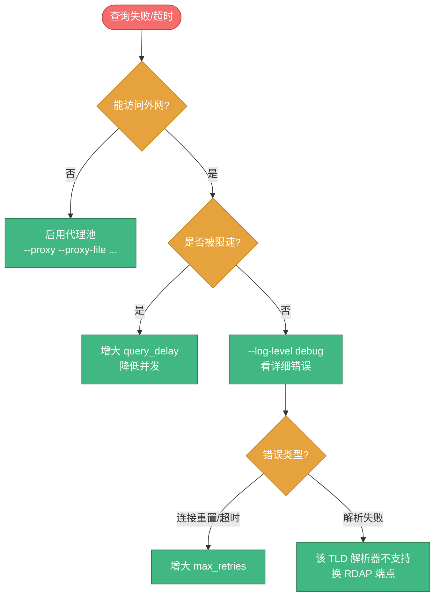

# ❓ CLI 常见问题

> 🐛 启动与运行中常见问题、已知 bug 及其规避方法。基于对源码（`cmd/whois-hacker/main.go`、`Makefile`、`Dockerfile`、`docker-compose.yml`）的实际验证整理。

---

## 🐛 已知问题

### Q1：`make run` 报错 `stat ./cmd/whois-hacker/api.go: no such file or directory`

**原因**：`Makefile` 的 `run` 目标写的是：

```makefile
run:
	go run ./cmd/whois-hacker/main.go ./cmd/whois-hacker/api.go serve
```

但 `cmd/whois-hacker/` 目录下**只有 `main.go` 和 `main_test.go`**，不存在 `api.go`，且 `main.go` 不处理 `serve` 子命令。

**规避**：直接用 `go run` 或构建后运行：

```bash
# 方式 1：go run（不带 serve 子命令）
go run ./cmd/whois-hacker --host 127.0.0.1 --port 8080

# 方式 2：先构建再运行（推荐）
make build
./bin/whois-hacker
```

**根治建议**：把 Makefile 的 `run` 目标改为：

```makefile
run:
	@echo "启动API服务..."
	go run ./cmd/whois-hacker
```

---

### Q2：没有 `--version` / `version` 命令显示版本号

**现象**：`./bin/whois-hacker --version` 或 `./bin/whois-hacker version` 都无法输出版本。

**原因**：

- `main.go` 中**没有定义** `Version`、`BuildTime`、`GitCommit` 变量
- Makefile / Dockerfile 的 `-ldflags "-X main.Version=..."` 试图注入这些变量，但目标变量不存在，注入无效（静默失败）
- `flag` 包未注册 `--version` flag，也没有子命令处理

**规避**：当前无法通过 CLI 获取版本号。如需版本信息，可：

- 查看构建时的 git tag 或 Release 页面版本
- 自行在 `main.go` 添加 `var Version string` 变量并注册 `--version` flag

**根治建议**：在 `main.go` 增加：

```go
var (
    Version   string
    BuildTime string
    GitCommit string
)

// init 中注册
flag.BoolFunc("version", "打印版本信息并退出", func(s string) error {
    fmt.Printf("whois-hacker %s (commit: %s, built: %s)\n", Version, GitCommit, BuildTime)
    os.Exit(0)
    return nil
})
```

---

### Q3：Docker / compose 里 `serve` 子命令导致 `--host`/`--port` 失效

**现象**：用 `Dockerfile` 默认 `CMD ["serve", "--host", "0.0.0.0", "--port", "8080"]` 启动容器后，外部无法访问 `8080` 端口，日志显示监听 `127.0.0.1:8080`（而非 `0.0.0.0`）。

**原因**：Go 的 `flag` 包**遇到第一个非 flag 位置参数即停止解析后续 flag**。`serve` 被当作位置参数，其后的 `--host 0.0.0.0 --port 8080` 全部被忽略，回退到默认值 `127.0.0.1:8080`。容器内监听 localhost，外部自然访问不到。

**实测对照**：

| 命令 | 实际监听 | 结果 |
|------|----------|------|
| `whois-hacker serve --host 0.0.0.0 --port 9090` | `127.0.0.1:8080` | ❌ flag 失效 |
| `whois-hacker --host 0.0.0.0 --port 9090` | `0.0.0.0:9090` | ✅ 正确 |

**规避**：覆盖 `CMD`，去掉 `serve`：

```bash
docker run -d -p 8080:8080 cyberspacesec/whois-skills:latest \
  --host 0.0.0.0 --port 8080
```

**根治建议**：

- 短期：把 `Dockerfile` 的 `CMD` 改为 `CMD ["--host", "0.0.0.0", "--port", "8080"]`
- 长期：在 `main.go` 增加子命令处理（消费 `serve`/`version` 首参）或改用 `cobra` 等 CLI 框架

📖 详见 [Docker 命令](./docker.md)。

---

### Q4：docker-compose 的 healthcheck 用 `version` 子命令失败

**现象**：`docker-compose.yml` 的 healthcheck 写的是 `["CMD", "/app/bin/whois-hacker", "version"]`，但该子命令不存在（见 Q2），且路径 `/app/bin/whois-hacker` 与 Dockerfile 实际产物 `/app/whois-hacker` 不一致。

**规避**：用真正的健康检查端点：

```yaml
healthcheck:
  test: ["CMD", "curl", "-f", "http://localhost:8080/api/health"]
  interval: 30s
  timeout: 5s
  retries: 3
  start_period: 5s
```

---

### Q5：Redis 缓存连接地址无法通过 flag 配置

**现象**：`--cache-type redis` 时，Redis 地址固定为 `localhost:6379`（无密码、DB 0、连接池 10），源码中硬编码，无对应 flag 或 YAML 字段。

**原因**：`main.go` 的 `setupCache` 中：

```go
if cacheType == "redis" {
    config.RedisConfig = &whois.RedisConfig{
        Addr:     "localhost:6379",
        // ...
    }
}
```

**规避**：Redis 必须与本服务同机部署且用默认端口。如需自定义地址，需修改源码或通过库配置 `WhoisLibraryConfig` 编程设置（见 [配置系统](../guide/configuration.md)）。

---

## 🚀 启动问题

### Q6：启动报 `address already in use` / 端口被占

**原因**：`8080` 端口已被其他进程占用。

**解决**：

```bash
# 查看占用进程
lsof -i :8080        # Linux/Mac
netstat -ano | grep 8080   # Windows

# 换端口启动
./bin/whois-hacker --port 9090
```

---

### Q7：日志警告 `加载WHOIS服务器配置失败: open config/servers.json: no such file or directory`

**原因**：`config/servers.json` 不存在。这是**正常**的——程序内置了 128 个默认 WHOIS 服务器映射，缺失该文件仅降级使用内置默认，不影响查询。

**解决**：可忽略；或运行后程序会自动生成该文件。

---

### Q8：日志警告 `配置文件 config/config.yaml 不存在`

**原因**：未提供配置文件。**正常**——会回退到 flag 默认值启动。

**解决**：可忽略，或创建配置文件（见 [配置文件](./config-file.md)）。

---

### Q9：`--config` 指定的文件解析失败

**现象**：日志 `加载配置文件失败: ...`，但服务仍启动。

**原因**：YAML 语法错误或字段类型不匹配。

**解决**：

1. 用 YAML 校验工具检查语法
2. 对照 [配置文件](./config-file.md#📝-完整配置文件示例) 的字段名与类型
3. 注意字段名是 `snake_case`（如 `warmup_file`），不是 `kebab-case`

---

## 🔧 运行问题

### Q10：查询一直超时或失败

**可能原因与排查**：



- **网络受限**：启用代理池 `--proxy`
- **被 WHOIS 服务器限速**：增大 `query_delay_ms`、降低批量 `concurrency`
- **特定 TLD 解析失败**：改用 RDAP 端点 `/api/rdap/domain`
- **看详细错误**：`--log-level debug`

📖 详见 [故障排查](../reference/troubleshooting.md)。

---

### Q11：缓存命中率为 0

**检查**：

1. 确认 `--cache=true`（默认开）
2. 确认 `--cache-ttl` 未设过小
3. 本地缓存是进程内的，重启服务后清空——如需跨重启共享，用 `--cache-type redis`

---

### Q12：`Ctrl+C` 后进程不立即退出

**原因**：优雅关闭最多等待 5 秒让在途请求完成。若有长时间运行的查询，需等其超时或完成。详见 [信号与优雅关闭](./signals.md)。

---

## 🐳 Docker 问题

### Q13：`docker stop` 后容器要等 10 秒才停

**原因**：若 `whois-hacker` 不是 PID 1（如 Dockerfile 用了 shell 形式 ENTRYPOINT），`SIGTERM` 到不了进程，Docker 等 10 秒超时后发 `SIGKILL`。

**解决**：确保用 exec 形式 `ENTRYPOINT ["./whois-hacker"]`，详见 [信号与优雅关闭](./signals.md#🐳-docker-中的信号)。

---

### Q14：容器外访问不到服务

**检查清单**：

1. `-p 8080:8080` 端口映射是否加了
2. 启动参数是否 `--host 0.0.0.0`（不能是默认的 `127.0.0.1`）
3. 是否踩了 Q3 的 `serve` 子命令坑（flag 被吞）

---

## 🔗 相关文档

- 🚀 [启动与运行](./usage.md) — 正确启动方式
- 🐳 [Docker 命令](./docker.md) — 容器化运行
- 🐛 [故障排查](../reference/troubleshooting.md) — 通用排查
- 📋 [HTTP 端点总览](../api/http/endpoints.md) — 端点速查
