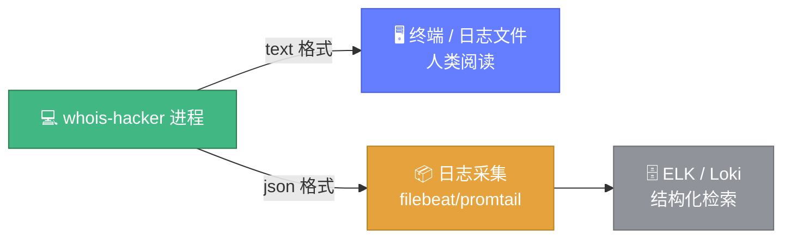
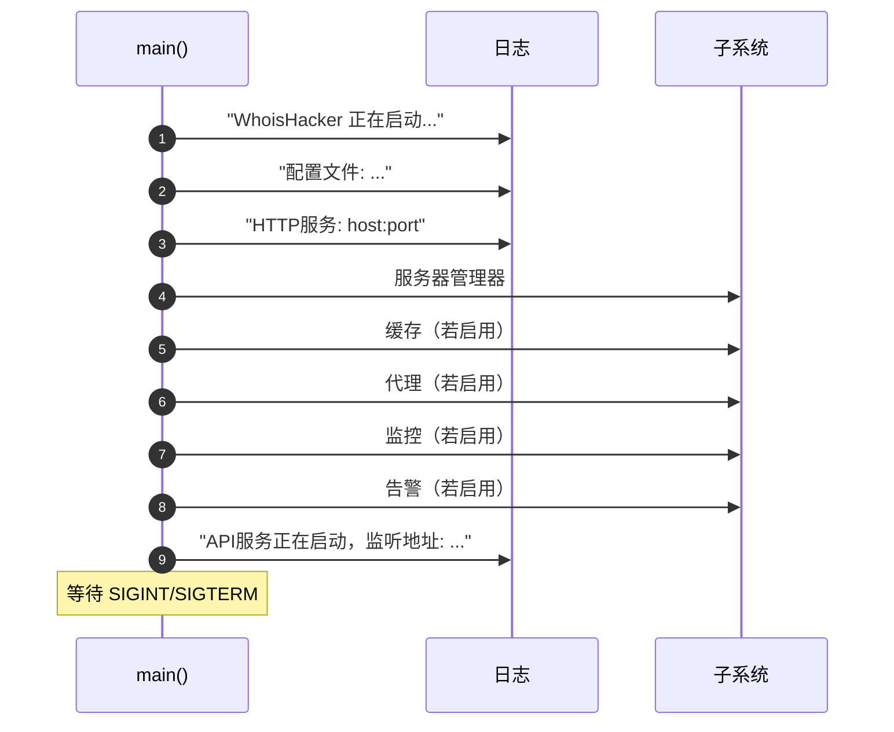

# 📝 日志与输出

> 📋 `whois-hacker` 基于 `logrus` 输出日志，支持四个级别与两种格式。本页说明各级别/格式的含义、典型内容与生产建议。

---

## 🎚️ 日志级别

通过 `--log-level` 控制。非法值回退到 `info`（仅警告，不中断启动）。

| 级别 | flag 值 | 用途 | 典型内容 |
|------|---------|------|----------|
| 🔍 Debug | `debug` | 开发调试 | 配置文件不存在、各子系统初始化细节 |
| ℹ️ Info | `info`（默认） | 关键运行事件 | 启动信息、子系统就绪、配置加载成功 |
| ⚠️ Warn | `warn` | 可恢复异常 | 配置文件解析失败、代理文件加载失败、加载服务器配置失败 |
| ❌ Error | `error` | 不可恢复错误 | 缓存初始化失败、API 服务启动失败、导出指标失败 |

```bash
# 开启 debug 看完整启动链路
./bin/whois-hacker --log-level debug

# 生产环境只看 error
./bin/whois-hacker --log-level error --log-format json
```

::: tip 🤖 给 AI 的建议
调试集成问题时优先 `--log-level debug`，能看到配置文件加载、各子系统开关状态、服务器映射加载等完整信息。生产环境用 `info` 或 `warn`。
:::

---

## 📐 日志格式

通过 `--log-format` 控制。

### text（默认）

人类可读的多行文本，带完整时间戳。

```
time="2026-07-04T10:00:00Z" level=info msg="WhoisHacker 正在启动..."
time="2026-07-04T10:00:00Z" level=info msg="配置文件: config/config.yaml"
time="2026-07-04T10:00:00Z" level=info msg="HTTP服务: 127.0.0.1:8080"
time="2026-07-04T10:00:00Z" level=info msg="API服务正在启动，监听地址: 127.0.0.1:8080"
```

### json

单行 JSON，便于 ELK/Loki/CloudWatch 等日志采集系统解析。

```json
{"level":"info","msg":"WhoisHacker 正在启动...","time":"2026-07-04T10:00:00Z"}
{"level":"info","msg":"配置文件: config/config.yaml","time":"2026-07-04T10:00:00Z"}
{"level":"info","msg":"API服务正在启动，监听地址: 127.0.0.1:8080","time":"2026-07-04T10:00:00Z"}
```



---

## 📋 启动日志解读

正常启动的日志序列（`info` 级别）：

```
WhoisHacker 正在启动...
配置文件: config/config.yaml
HTTP服务: 127.0.0.1:8080
（可选）加载WHOIS服务器配置失败: ...          # warn，可忽略
（可选）缓存已启用，类型: local                # --cache=true 时
（可选）缓存预热已启用                          # --cache-warmup 时
（可选）代理功能已启用                          # --proxy 时
（可选）监控功能已启用，采集间隔: 60s           # --metrics=true 时
（可选）告警功能已启用，检查间隔: 60s           # --alerts=true 时
API服务正在启动，监听地址: 127.0.0.1:8080
```



---

## 🛑 关闭日志序列

收到 `SIGINT`/`SIGTERM` 后：

```
收到信号: interrupt，开始优雅关闭...
（可选）导出最终指标失败: ...    # 仅当导出失败
服务已关闭
```

详见 [信号与优雅关闭](./signals.md)。

---

## 💡 生产日志建议

| 场景 | 推荐 `--log-level` | 推荐 `--log-format` |
|------|--------------------|---------------------|
| 本地开发调试 | `debug` | `text` |
| 生产常驻服务 | `info` | `json` |
| 高流量、仅关注异常 | `warn` | `json` |
| 故障排查期 | `debug` | `text`（临时） |

### 日志落盘（nohup / systemd）

```bash
# nohup
nohup ./bin/whois-hacker --log-format json \
  > /var/log/whois-hacker.log 2>&1 &

# systemd：在 service 文件中
[Service]
StandardOutput=append:/var/log/whois-hacker.log
StandardError=append:/var/log/whois-hacker.log
ExecStart=/opt/whois-hacker/bin/whois-hacker --log-format json
```

### 日志轮转（logrotate）

```ini
# /etc/logrotate.d/whois-hacker
/var/log/whois-hacker.log {
    daily
    rotate 14
    compress
    missingok
    notifempty
    copytruncate
}
```

---

## 🔗 相关文档

- 🚩 [命令行参数](./flags.md) — `--log-level` / `--log-format` 详解
- 🛑 [信号与优雅关闭](./signals.md) — 关闭时的日志与指标导出
- 🚀 [启动与运行](./usage.md) — 后台运行与日志重定向
