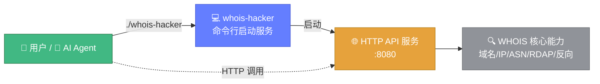
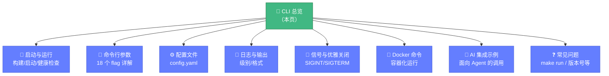

# 💻 CLI 总览

> 🤖 Whois Hacker 是一个**面向 AI 的工具**——它启动一个 HTTP 服务，AI Agent（或人类）通过标准 HTTP 调用即可获得结构化的 WHOIS 域名情报。本页是命令行手册的入口。

---

## 🎯 一句话定位



**Whois Hacker 的 CLI 不是"查一下就退出"的查询命令**，而是一个**常驻服务进程**的启动器：

- ✅ 你执行 `./whois-hacker`，它启动一个监听 `:8080` 的 HTTP 服务
- ✅ 之后所有查询（域名/IP/ASN/RDAP/批量/关联……）都通过 `curl` 或 HTTP 客户端发起
- ✅ AI Agent 只需能发 HTTP 请求即可集成，无需绑定任何语言 SDK

::: tip 🤖 为什么这样设计对 AI 友好
AI Agent（Claude、GPT 等）天然擅长发起 HTTP 请求并解析 JSON。把能力暴露为 HTTP API，比让 AI 去调用某个语言的 CLI 子命令更通用、更稳定、更易跨平台。CLI 只负责"把服务跑起来并调好所有旋钮"。
:::

---

## 📋 CLI 能力边界

| 能力 | 是否支持 | 说明 |
|------|---------|------|
| 启动 HTTP 服务 | ✅ | 默认 `127.0.0.1:8080` |
| 命令行 flag 调参 | ✅ | 18 个 flag 覆盖六大子系统 |
| YAML 配置文件 | ✅ | `config/config.yaml`，与 flag 可混用 |
| 缓存 / 代理 / 限流 / 监控 / 告警 | ✅ | 启动时按 flag 开关初始化 |
| 优雅关闭 | ✅ | `SIGINT`/`SIGTERM` 触发，5s 超时 |
| 版本号输出（`--version`） | ❌ | 当前版本未实现，详见 [FAQ](./faq.md) |
| 查询子命令（如 `whois-hacker query x.com`） | ❌ | 查询走 HTTP API，不走 CLI 子命令 |
| `make run` 直接运行 | ⚠️ | Makefile 的 `run` 目标当前有 bug，详见 [FAQ](./faq.md) |

---

## 🚀 30 秒快速开始

```bash
# 1. 构建（或从 Releases 下载预编译二进制）
make build                       # 产物：bin/whois-hacker

# 2. 启动服务（前台运行，日志输出到终端）
./bin/whois-hacker --host 127.0.0.1 --port 8080

# 3. 另开一个终端，发起第一次查询
curl -X POST http://127.0.0.1:8080/api/whois \
  -H "Content-Type: application/json" \
  -d '{"domain":"example.com"}'
```

看到 JSON 响应即表示 CLI 与服务正常工作。📖 完整启动选项见 [启动与运行](./usage.md)。

---

## 🧭 命令行手册导航



| 我想…… | 直接看 |
|--------|--------|
| 把服务跑起来 | [启动与运行](./usage.md) |
| 了解某个 flag 的含义 | [命令行参数](./flags.md) |
| 用配置文件而非 flag | [配置文件](./config-file.md) |
| 排查启动日志 | [日志与输出](./logging.md) |
| 安全停止服务 | [信号与优雅关闭](./signals.md) |
| 用 Docker 跑 | [Docker 命令](./docker.md) |
| 让 AI 调用 | [AI 集成示例](./ai-examples.md) |
| 遇到报错 | [常见问题](./faq.md) |

---

## 🔗 相关文档

- 📥 [安装指南](../guide/installation.md) — 三种安装方式
- ⚙️ [配置系统](../guide/configuration.md) — 应用配置与库配置
- 🌐 [HTTP API](../api/http/overview.md) — CLI 启动后调用的端点
- 🤖 [MCP 协议](../api/mcp/overview.md) — 面向 AI Agent 的任务流
