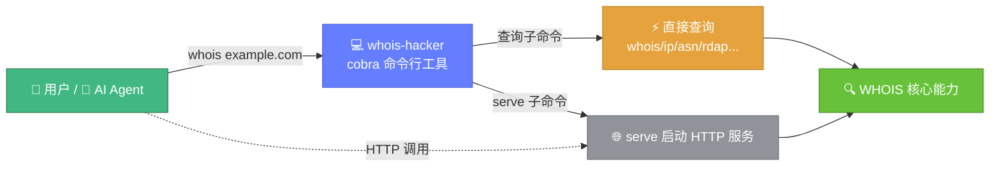
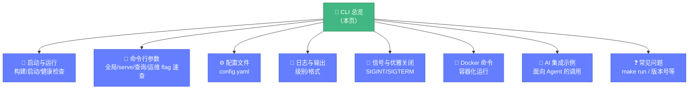

# 💻 CLI 总览

> 🤖 Whois Hacker 是一个**面向 AI 的工具**——它启动一个 HTTP 服务，AI Agent（或人类）通过标准 HTTP 调用即可获得结构化的 WHOIS 域名情报。本页是命令行手册的入口。

---

## 🎯 一句话定位



**Whois Hacker 的 CLI 基于 cobra，有两种工作模式**：

- ✅ **直接查询模式**：`whois-hacker whois example.com` —— 一次查询，结果输出到 stdout，查完即退出
- ✅ **服务模式**：`whois-hacker serve` —— 启动常驻 HTTP 服务，之后通过 HTTP/MCP 调用

所有 SDK 能力都通过子命令暴露：直接查询（域名/IP/ASN/RDAP/可注册性）、情报分析（差异/质量/关联/批量）、工具命令（IDN/格式/导出/服务器）、库配置管理（config）、缓存运维（cache）、代理池运维（proxy）、指标查看与导出（metrics）、本地解析工具（tools）。共 **20 个顶层命令**。

::: tip 🤖 为什么对 AI 友好
AI Agent 既能用子命令直接查（`whois-hacker whois x.com`，解析 stdout JSON），也能让服务常驻后批量 HTTP 调用。两种模式输出都是结构化 JSON，便于 Agent 消费。
:::

---

## 📋 CLI 能力边界

| 能力 | 是否支持 | 说明 |
|------|---------|------|
| 直接查询域名/IP/ASN/RDAP | ✅ | `whois`/`ip`/`asn`/`rdap` 子命令，查完即退出 |
| 情报分析（差异/质量/关联/批量） | ✅ | `diff`/`quality`/`correlation`/`batch` 子命令 |
| 工具命令（IDN/格式/导出/服务器） | ✅ | `idn`/`format`/`export`/`servers` 子命令 |
| 库配置管理（WhoisLibraryConfig） | ✅ | `config show/validate/save/merge/apply` |
| 缓存运维 | ✅ | `cache stats/get/delete/clear/clear-expired` + `cache asn list/clear` |
| 代理池运维 | ✅ | `proxy list/stats/set`，与 `--use-proxy` 配合 |
| 指标查看与导出 | ✅ | `metrics stats/export`（export 输出 Prometheus 文本） |
| 本地解析工具（不联网） | ✅ | `tools ip-parse/domain/tld/normalize/asn-prefixes/asn-ip-ranges` |
| 启动 HTTP 服务 | ✅ | `serve` 子命令，默认 `127.0.0.1:8080` |
| 命令行 flag 调参 | ✅ | 全局 flag + 各子命令专属 flag |
| YAML 配置文件 | ✅ | `--config config/config.yaml` |
| 优雅关闭 | ✅ | `serve` 模式下 `SIGINT`/`SIGTERM` 触发，5s 超时 |
| Shell 自动补全 | ✅ | `whois-hacker completion bash/zsh/fish` |
| 版本号输出 | ✅ | `whois-hacker version` |
| 结构化 JSON 输出 | ✅ | 默认 `--format json`，便于 AI 消费 |

---

## 🌳 命令树

```mermaid
flowchart TD
    Root["whois-hacker"]

    Root --> Serve["serve<br/>启动 HTTP 服务"]
    Root --> Version["version<br/>版本信息"]
    Root --> Query["🔍 查询类"]
    Root --> Analyze["🔬 分析类"]
    Root --> Tools["🛠️ 工具类"]
    Root --> Ops["⚙️ 运维类"]

    Query --> Whois["whois &lt;domain&gt;"]
    Query --> IP["ip &lt;ip&gt;"]
    Query --> ASN["asn &lt;asn&gt;"]
    Query --> RDAP["rdap"]
    Query --> Avail["availability &lt;domain&gt;"]
    RDAP --> RD1["rdap domain/ip/asn/entity"]
    RDAP --> RD2["rdap bootstrap --tld/--asn"]

    Analyze --> Diff["diff &lt;d1&gt; &lt;d2&gt;"]
    Analyze --> Quality["quality &lt;domain&gt;"]
    Analyze --> Corr["correlation &lt;d1&gt; &lt;d2&gt;..."]
    Analyze --> Batch["batch &lt;file&gt;"]
    Corr --> CR1["correlation analyze/profile/registrars"]
    Batch --> BT1["batch resume --checkpoint &lt;file&gt;"]

    Tools --> IDN["idn &lt;domain&gt;"]
    Tools --> Format["format [file]"]
    Tools --> Export["export &lt;domain&gt;"]
    Tools --> Servers["servers"]
    Tools --> TL["tools ip-parse/domain/tld/normalize<br/>asn-prefixes/asn-ip-ranges"]
    Servers --> SV1["servers list/stats/discover/refresh/save"]

    Ops --> Config["config show/validate/save/merge/apply"]
    Ops --> Cache["cache stats/get/delete/clear/clear-expired<br/>cache asn list/clear"]
    Ops --> Proxy["proxy list/stats/set"]
    Ops --> Metrics["metrics stats/export"]

    classDef root fill:#41b883,color:#fff,stroke:#2b7a4b
    classDef cat fill:#647eff,color:#fff,stroke:#4a5fd6
    classDef cmd fill:#e6a23c,color:#fff,stroke:#b7821c
    class Root root
    class Serve,Version,Query,Analyze,Tools,Ops,RDAP cat
    class Whois,IP,ASN,Avail,RD1,RD2,Diff,Quality,Corr,Batch,CR1,BT1,IDN,Format,Export,Servers,SV1,TL,Config,Cache,Proxy,Metrics cmd
```



---

## 🚀 30 秒快速开始

```bash
# 1. 构建
make build                       # 产物：bin/whois-hacker

# 2. 直接查询（查完即退出，输出 JSON）
./bin/whois-hacker whois example.com

# 3. 或启动服务（常驻，供 HTTP 调用）
./bin/whois-hacker serve --host 0.0.0.0 --port 8080
```

```bash
# 查看所有命令
./bin/whois-hacker --help

# 查看某命令的参数
./bin/whois-hacker whois --help
```

📖 完整启动选项见 [启动与运行](./usage.md)。

---

## 🧭 命令行手册导航



| 我想…… | 直接看 |
|--------|--------|
| 把服务跑起来 | [启动与运行](./usage.md) |
| 了解某个 flag 的含义 | [命令行参数](./flags.md) |
| 用配置文件而非 flag | [配置文件](./config-file.md) |
| 排查启动日志 | [日志与输出](./logging.md) |
| 安全停止服务 | [信号与优雅关闭](./signals.md) |
| 用 Docker 跑 | [Docker 命令](./docker.md) |
| 让 AI 调用 | [AI 集成示例](./ai-examples.md) |
| 遇到报错 | [常见问题](./faq.md) |

---

## 🔗 相关文档

- 📥 [安装指南](../guide/installation.md) — 三种安装方式
- ⚙️ [配置系统](../guide/configuration.md) — 应用配置与库配置
- 🌐 [HTTP API](../api/http/overview.md) — CLI 启动后调用的端点
- 🤖 [MCP 协议](../api/mcp/overview.md) — 面向 AI Agent 的任务流
