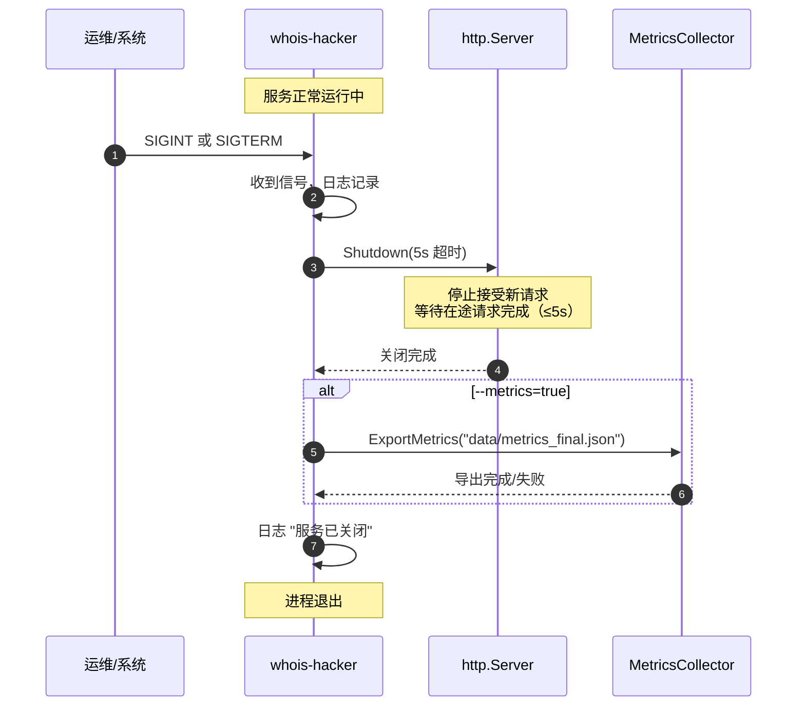
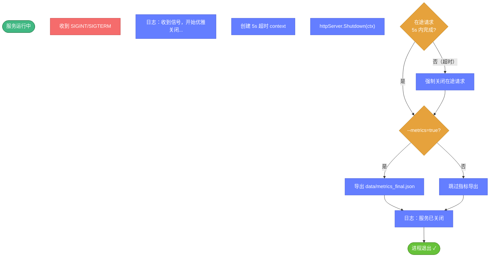

# 🛑 信号与优雅关闭

> 📋 `whois-hacker` 如何响应终止信号、优雅关闭的内部步骤，以及与 systemd 的集成。

---

## 📡 支持的信号

| 信号 | 触发方式 | 行为 |
|------|----------|------|
| `SIGINT` | `Ctrl+C` / `kill -INT` | 触发优雅关闭 |
| `SIGTERM` | `systemctl stop` / `kill` / `kill -TERM` | 触发优雅关闭 |
| 其他 | — | 未注册处理，采用 Go 默认行为 |

服务通过 `signal.Notify(sigChan, syscall.SIGINT, syscall.SIGTERM)` 注册监听这两个信号。



---

## 🔧 优雅关闭的内部步骤



关键点（来自 `main.go`）：

1. **不立即退出**：收到信号后先停止 HTTP 接收新请求
2. **5 秒宽限**：给在途请求最多 5 秒完成（`context.WithTimeout(..., 5*time.Second)`）
3. **指标导出**：`--metrics=true` 时导出最终指标到 `data/metrics_final.json`（失败仅记日志，不影响退出）
4. **最后才退出**：日志输出"服务已关闭"后进程结束

---

## 🖐️ 触发方式

### 前台运行

```bash
./bin/whois-hacker
# 按 Ctrl+C → 发送 SIGINT → 优雅关闭
```

### 后台 nohup

```bash
# 启动
nohup ./bin/whois-hacker > /var/log/wh.log 2>&1 &
echo $! > /var/run/wh.pid

# 优雅停止
kill -TERM $(cat /var/run/wh.pid)
# 或
kill -INT $(cat /var/run/wh.pid)
```

### systemd

```bash
sudo systemctl stop whois-hacker   # 自动发 SIGTERM
sudo systemctl restart whois-hacker
```

---

## 🐳 Docker 中的信号

::: warning ⚠️ 容器信号传递
Docker 容器中，`docker stop` 会向 PID 1 进程发 `SIGTERM`，10 秒后未退出才发 `SIGKILL`。**必须让 `whois-hacker` 作为 PID 1 运行**（或用 `tini` 等init 转发信号），否则信号无法到达。
:::

正确做法（Dockerfile 用 ENTRYPOINT 的 exec 形式）：

```dockerfile
# exec 形式：whois-hacker 替换 shell 成为 PID 1
ENTRYPOINT ["./whois-hacker"]
```

```bash
docker stop whois-hacker    # 发 SIGTERM → 优雅关闭
```

错误做法（shell 形式，信号到不了）：

```dockerfile
# shell 形式：whois-hacker 是 /bin/sh 的子进程，信号被 shell 吞掉
ENTRYPOINT ./whois-hacker
```

---

## 📊 关闭时的指标导出

| 条件 | 导出文件 | 触发点 |
|------|----------|--------|
| `--metrics=true` 且正常关闭 | `data/metrics_final.json` | `Shutdown` 之后 |
| `--metrics=true` 且运行中（每分钟） | `data/metrics.json` | 后台定时器 |
| `--metrics=false` | 不导出 | — |

导出失败仅记录 `error` 级别日志，不影响进程退出。

---

## ⏱️ 关于 5 秒超时

- 超时是**硬编码**的 `5*time.Second`，当前无 flag 可调
- 超时后仍有未完成的在途请求会被强制中断
- 对于长时间运行的批量查询任务，建议通过 HTTP API 层面管理（如批量任务的 `session_id` 状态轮询），而非依赖关闭超时

---

## 🔗 相关文档

- 📝 [日志与输出](./logging.md) — 关闭时的日志内容
- 🚀 [启动与运行](./usage.md) — nohup / systemd 配置
- 🐳 [Docker 命令](./docker.md) — 容器中的信号传递
- 📈 [监控 metrics 模块](../modules/metrics.md) — 指标体系
