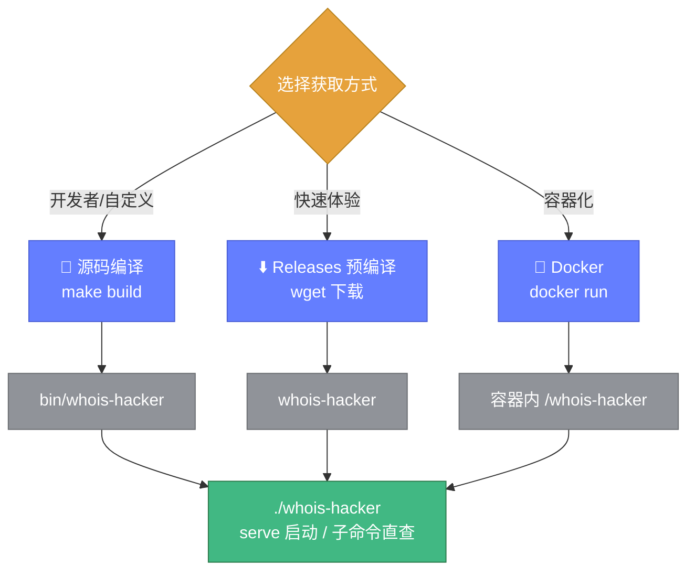
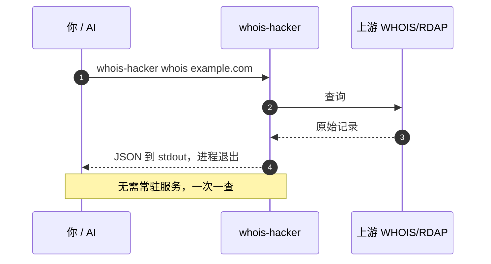
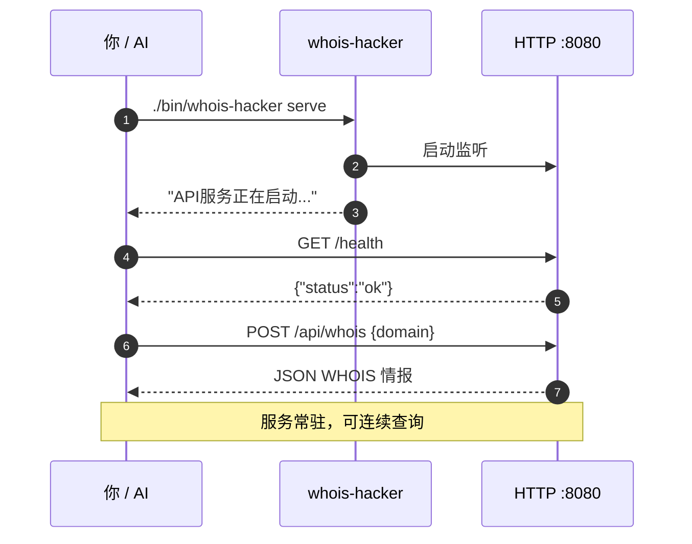
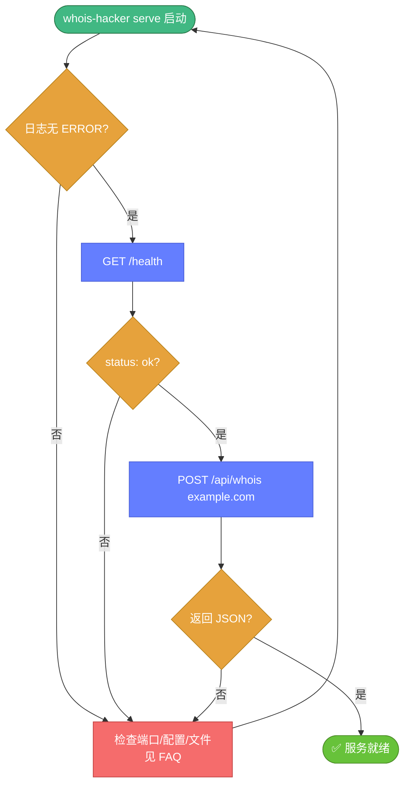

# 🚀 启动与运行

> 📖 从零到第一次查询：构建、启动、验证、调参。

CLI 已重构为基于 `cobra` 的子命令结构，支持两种工作模式：

| 模式 | 命令 | 适合场景 |
|------|------|----------|
| **直接查询** | `whois-hacker whois/ip/asn/...` | 单次查询、脚本编排、AI 工具调用；查完即退出 |
| **常驻服务** | `whois-hacker serve` | 多客户端共享、批量任务流、MCP 协议、需 HTTP API |

---

## 📦 第一步：获得可执行文件

三条路径，任选其一（详见 [安装指南](../guide/installation.md)）：



### 方式 A：源码编译

```bash
git clone https://github.com/cyberspacesec/whois-skills.git
cd whois-skills
go mod tidy
make build
# 产物：bin/whois-hacker
```

### 方式 B：下载预编译二进制

```bash
wget https://github.com/cyberspacesec/whois-skills/releases/latest/download/whois-hacker-linux-amd64
chmod +x whois-hacker-linux-amd64
mv whois-hacker-linux-amd64 whois-hacker
```

### 方式 C：Docker

```bash
docker run -d --name whois-hacker -p 8080:8080 \
  cyberspacesec/whois-skills:latest
```

📖 Docker 的完整命令见 [Docker 命令](./docker.md)。

---

## ⚡ 第二步（模式 A）：直接查询（查完即退出）

CLI 已重构为基于 `cobra` 的子命令结构。**无需启动常驻服务**，直接用子命令查询、结果输出到 stdout 后立即退出——最适合脚本编排与 AI 工具调用。



### 常用查询子命令

```bash
# 域名 WHOIS
./bin/whois-hacker whois example.com
# 带 flag：重试 5 次、要求字段、跟随 referral
./bin/whois-hacker whois example.com --max-retries 5 --validate --required-fields registrar,creation_date --follow-referral

# IP WHOIS
./bin/whois-hacker ip 8.8.8.8

# ASN 查询（radb/rdap/all 三种来源）
./bin/whois-hacker asn 15169 --source all --include-prefixes --include-bgp

# RDAP 标准查询（父命令 rdap）
./bin/whois-hacker rdap domain example.com
./bin/whois-hacker rdap ip 8.8.8.8
./bin/whois-hacker rdap asn 15169
./bin/whois-hacker rdap entity handle-xyz
```

### 情报分析与工具子命令

```bash
# 可注册性
./bin/whois-hacker availability newidea-12345.com

# 差异对比（本次 vs 上次缓存）
./bin/whois-hacker diff example.com example.com

# 质量评分
./bin/whois-hacker quality example.com

# 多域名关联分析
./bin/whois-hacker correlation a.com b.com c.com

# 批量查询（文件，支持 checkpoint）
./bin/whois-hacker batch domains.txt --concurrency 5 --checkpoint --checkpoint-interval 30

# IDN 转换
./bin/whois-hacker idn 中文.com --action to-ascii

# 格式检测（从文件或 stdin）
cat raw.txt | ./bin/whois-hacker format --detect-only
./bin/whois-hacker format raw.txt

# 导出
./bin/whois-hacker export example.com --format csv

# 服务器列表
./bin/whois-hacker servers --tld com

# 版本信息
./bin/whois-hacker version
```

### 全局 flag 与子命令搭配

全局持久 flag 可在子命令前或后用 `--` 传入：

```bash
# 子命令前
./bin/whois-hacker --log-level debug --format json whois example.com

# 子命令后（等价）
./bin/whois-hacker whois example.com --log-level debug --format json
```

::: tip 🤖 给 AI 的速查
直接查询模式输出的是干净的 JSON 到 stdout，AI Agent 可直接 `subprocess.run(["whois-hacker", "whois", "x.com"])` 后 `json.loads` 解析，不必先启动 HTTP 服务。详见 [AI 集成示例](./ai-examples.md#cli-直接查询)。
:::

---

## ▶️ 第二步（模式 B）：启动 HTTP 服务（serve 子命令）

需要常驻 API、批量任务流、MCP 协议或供多客户端共享时，用 `serve` 子命令启动。

### 最小启动

```bash
./bin/whois-hacker serve
```

默认监听 `127.0.0.1:8080`，缓存与监控默认开启，代理与告警按配置。

### 常用 serve 参数

```bash
# 监听所有网卡 9090 端口，debug 日志，JSON 格式
./bin/whois-hacker serve \
  --host 0.0.0.0 \
  --port 9090 \
  --log-level debug \
  --log-format json

# 启用代理池 + 缓存预热
./bin/whois-hacker serve \
  --use-proxy --proxy-file config/proxies.json \
  --cache-warmup --warmup-file config/warmup.json

# 用自定义配置文件
./bin/whois-hacker serve --config /etc/whois/config.yaml
```

::: tip 📋 所有 flag
全局 flag 与各子命令 flag 详见 [命令行参数](./flags.md)。`serve` 子命令专属 flag 见 [serve 专属 flag](./flags.md#serve-专属-flag)。
:::

---

## 🔄 前台 vs 后台运行

### 前台（调试推荐）

```bash
./bin/whois-hacker serve
# 日志直接输出到终端，Ctrl+C 触发优雅关闭
```

### 后台 nohup

```bash
nohup ./bin/whois-hacker serve > /var/log/whois-hacker.log 2>&1 &
echo $! > /var/run/whois-hacker.pid
```

### systemd 托管（生产推荐）

```ini
# /etc/systemd/system/whois-hacker.service
[Unit]
Description=Whois Hacker Service
After=network.target

[Service]
Type=simple
ExecStart=/opt/whois-hacker/bin/whois-hacker serve --config /etc/whois/config.yaml
Restart=on-failure
RestartSec=5
User=whois

[Install]
WantedBy=multi-user.target
```

```bash
sudo systemctl daemon-reload
sudo systemctl enable --now whois-hacker
sudo systemctl status whois-hacker
```

📖 信号行为详见 [信号与优雅关闭](./signals.md)。

---

## ✅ 第三步：验证服务

### 健康检查

```bash
curl http://127.0.0.1:8080/health
# {"status":"ok",...}
```

### 第一次查询

```bash
# 域名 WHOIS
curl -X POST http://127.0.0.1:8080/api/whois \
  -H "Content-Type: application/json" \
  -d '{"domain":"example.com"}'

# IP WHOIS
curl -X POST http://127.0.0.1:8080/api/ip \
  -H "Content-Type: application/json" \
  -d '{"ip":"8.8.8.8"}'

# ASN 查询
curl -X POST http://127.0.0.1:8080/api/asn \
  -H "Content-Type: application/json" \
  -d '{"asn":15169}'
```



---

## 🧪 启动后的完整自检流程



---

## 🛑 停止服务

```bash
# 前台运行：Ctrl+C
# 后台/systemd：
sudo systemctl stop whois-hacker
# 或发送信号
kill -TERM $(cat /var/run/whois-hacker.pid)
```

服务收到 `SIGINT`/`SIGTERM` 后会优雅关闭：停止接收新请求、给在途请求 5 秒完成、导出最终指标。详见 [信号与优雅关闭](./signals.md)。

---

## 🔗 下一步

- 🚩 [命令行参数](./flags.md) — 每个 flag 的精确含义
- ⚙️ [配置文件](./config-file.md) — 用 YAML 取代长串 flag
- 🤖 [AI 集成示例](./ai-examples.md) — 让 Agent 调用你的服务
