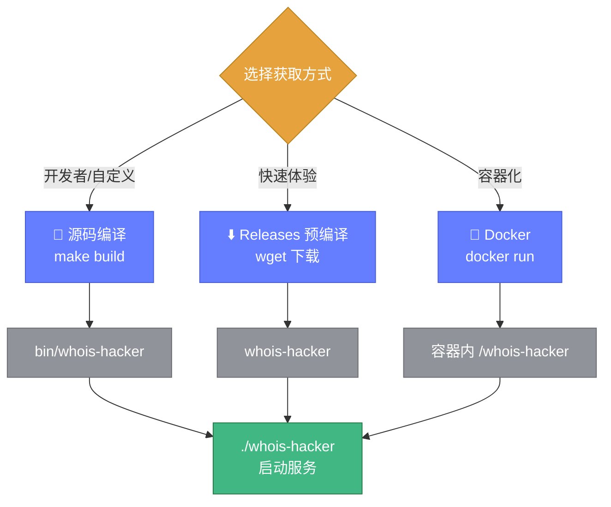
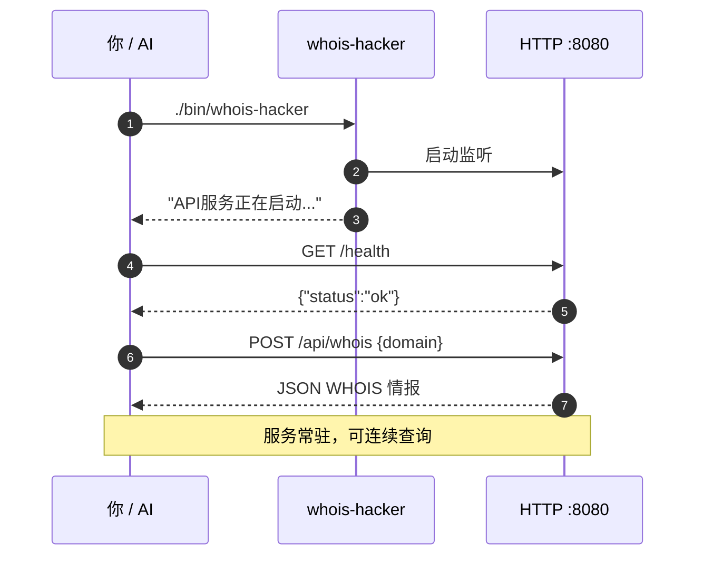
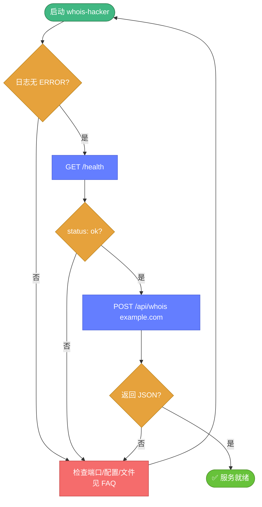

# 🚀 启动与运行

> 📖 从零到第一次查询：构建、启动、验证、调参。

---

## 📦 第一步：获得可执行文件

三条路径，任选其一（详见 [安装指南](../guide/installation.md)）：



### 方式 A：源码编译

```bash
git clone https://github.com/cyberspacesec/whois-skills.git
cd whois-skills
go mod tidy
make build
# 产物：bin/whois-hacker
```

### 方式 B：下载预编译二进制

```bash
wget https://github.com/cyberspacesec/whois-skills/releases/latest/download/whois-hacker-linux-amd64
chmod +x whois-hacker-linux-amd64
mv whois-hacker-linux-amd64 whois-hacker
```

### 方式 C：Docker

```bash
docker run -d --name whois-hacker -p 8080:8080 \
  cyberspacesec/whois-skills:latest
```

📖 Docker 的完整命令见 [Docker 命令](./docker.md)。

---

## ▶️ 第二步：启动服务

### 最小启动

```bash
./bin/whois-hacker
```

默认监听 `127.0.0.1:8080`，缓存与监控默认开启，代理与告警按配置。

### 常用启动参数

```bash
# 监听所有网卡 9090 端口，debug 日志，JSON 格式
./bin/whois-hacker \
  --host 0.0.0.0 \
  --port 9090 \
  --log-level debug \
  --log-format json

# 启用代理池 + 缓存预热
./bin/whois-hacker \
  --proxy --proxy-file config/proxies.json \
  --cache-warmup --warmup-file config/warmup.json

# 用自定义配置文件
./bin/whois-hacker --config /etc/whois/config.yaml
```

::: tip 📋 所有 flag
完整 18 个 flag 详见 [命令行参数](./flags.md)。
:::

---

## 🔄 前台 vs 后台运行

### 前台（调试推荐）

```bash
./bin/whois-hacker
# 日志直接输出到终端，Ctrl+C 触发优雅关闭
```

### 后台 nohup

```bash
nohup ./bin/whois-hacker > /var/log/whois-hacker.log 2>&1 &
echo $! > /var/run/whois-hacker.pid
```

### systemd 托管（生产推荐）

```ini
# /etc/systemd/system/whois-hacker.service
[Unit]
Description=Whois Hacker Service
After=network.target

[Service]
Type=simple
ExecStart=/opt/whois-hacker/bin/whois-hacker --config /etc/whois/config.yaml
Restart=on-failure
RestartSec=5
User=whois

[Install]
WantedBy=multi-user.target
```

```bash
sudo systemctl daemon-reload
sudo systemctl enable --now whois-hacker
sudo systemctl status whois-hacker
```

📖 信号行为详见 [信号与优雅关闭](./signals.md)。

---

## ✅ 第三步：验证服务

### 健康检查

```bash
curl http://127.0.0.1:8080/health
# {"status":"ok",...}
```

### 第一次查询

```bash
# 域名 WHOIS
curl -X POST http://127.0.0.1:8080/api/whois \
  -H "Content-Type: application/json" \
  -d '{"domain":"example.com"}'

# IP WHOIS
curl -X POST http://127.0.0.1:8080/api/ip \
  -H "Content-Type: application/json" \
  -d '{"ip":"8.8.8.8"}'

# ASN 查询
curl -X POST http://127.0.0.1:8080/api/asn \
  -H "Content-Type: application/json" \
  -d '{"asn":15169}'
```



---

## 🧪 启动后的完整自检流程



---

## 🛑 停止服务

```bash
# 前台运行：Ctrl+C
# 后台/systemd：
sudo systemctl stop whois-hacker
# 或发送信号
kill -TERM $(cat /var/run/whois-hacker.pid)
```

服务收到 `SIGINT`/`SIGTERM` 后会优雅关闭：停止接收新请求、给在途请求 5 秒完成、导出最终指标。详见 [信号与优雅关闭](./signals.md)。

---

## 🔗 下一步

- 🚩 [命令行参数](./flags.md) — 每个 flag 的精确含义
- ⚙️ [配置文件](./config-file.md) — 用 YAML 取代长串 flag
- 🤖 [AI 集成示例](./ai-examples.md) — 让 Agent 调用你的服务
