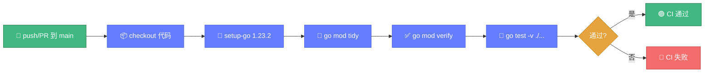
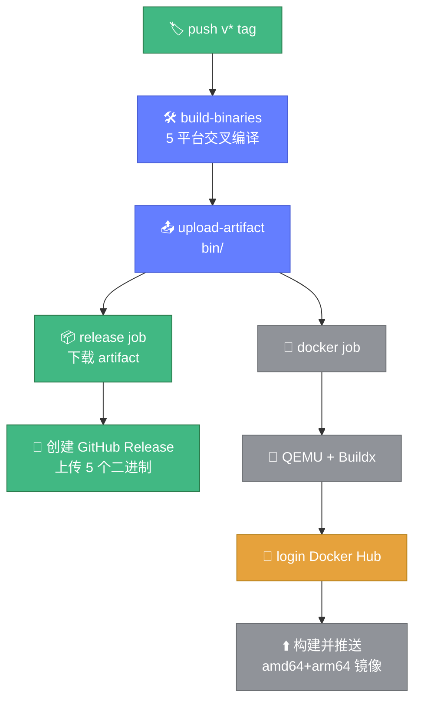

# 🤖 GitHub Actions

> 📖 whois-skills 仓库已包含 CI workflow（`.github/workflows/ci.yml`），本文说明现有 CI 并介绍如何用 GitHub Actions 自动构建多平台二进制、创建 Release、构建并推送 Docker 镜像。

---

## 📋 概览

| 项目 | 内容 |
|------|------|
| 现有 workflow | `.github/workflows/ci.yml` |
| CI 触发 | push 到 `main`、PR 到 `main` |
| 运行环境 | `ubuntu-latest` |
| Go 版本 | 1.23.2 |

---

## 🔍 现有 CI（ci.yml）

现有 CI 在 push/PR 到 main 时触发，单 test job 串行执行依赖整理与测试：



现有 `ci.yml` 工作流步骤：

```yaml
name: CI
on:
  push:
    branches: [main]
  pull_request:
    branches: [main]
jobs:
  test:
    runs-on: ubuntu-latest
    steps:
      - uses: actions/checkout@v3
      - uses: actions/setup-go@v4
        with:
          go-version: '1.23.2'
      - run: go mod tidy
      - run: go mod verify
      - run: go test -v ./...
```

说明：

| 步骤 | 作用 |
|------|------|
| `checkout` | 拉取代码 |
| `setup-go` | 安装 Go 1.23.2 |
| `go mod tidy` | 整理依赖 |
| `go mod verify` | 校验依赖完整性 |
| `go test -v ./...` | 运行全部测试 |

::: tip 💡 改进建议
建议后续将 `checkout`/`setup-go` 升级到 `@v4`，并缓存 Go 模块（`actions/cache` 或 `setup-go` 的 `cache: true`）以加速 CI。
:::

---

## 🚀 自动构建发布（示例 workflow）

下面是一个完整的发布 workflow 示例，在推送 `v*` tag 时触发：构建多平台二进制 → 上传 Release 资产 → 构建并推送多平台 Docker 镜像。

新建 `.github/workflows/release.yml`：

```yaml
name: Release

on:
  push:
    tags:
      - 'v*'  # 推送 v 开头的 tag 触发

permissions:
  contents: write   # 创建 Release
  packages: write   # 推送镜像

jobs:
  build-binaries:
    runs-on: ubuntu-latest
    steps:
      - uses: actions/checkout@v4

      - uses: actions/setup-go@v5
        with:
          go-version: '1.23.2'
          cache: true

      - name: Build all platforms
        run: make build-all

      - name: Upload artifacts
        uses: actions/upload-artifact@v4
        with:
          name: binaries
          path: bin/

  release:
    needs: build-binaries
    runs-on: ubuntu-latest
    steps:
      - uses: actions/download-artifact@v4
        with:
          name: binaries
          path: bin/

      - name: Create GitHub Release
        uses: softprops/action-gh-release@v2
        with:
          files: |
            bin/whois-hacker-linux-amd64
            bin/whois-hacker-linux-arm64
            bin/whois-hacker-windows-amd64.exe
            bin/whois-hacker-darwin-amd64
            bin/whois-hacker-darwin-arm64
          generate_release_notes: true

  docker:
    needs: build-binaries
    runs-on: ubuntu-latest
    steps:
      - uses: actions/checkout@v4

      - name: Set up QEMU
        uses: docker/setup-qemu-action@v3

      - name: Set up Buildx
        uses: docker/setup-buildx-action@v3

      - name: Login to Docker Hub
        uses: docker/login-action@v3
        with:
          username: ${{ secrets.DOCKER_USERNAME }}
          password: ${{ secrets.DOCKER_TOKEN }}

      - name: Build and push
        uses: docker/build-push-action@v6
        with:
          context: .
          platforms: linux/amd64,linux/arm64
          push: true
          tags: |
            cyberspacesec/whois-skills:latest
            cyberspacesec/whois-skills:${{ github.ref_name }}
```

---

## 📌 触发与发布流程

release workflow 在推送 `v*` tag 时触发，三个 job 并行/串行协作完成二进制构建、Release 发布与镜像推送：



```bash
# 1. 打 tag
git tag v0.1.0
git push origin v0.1.0

# 2. GitHub Actions 自动触发 release.yml
#    - 构建 5 平台二进制
#    - 创建 Release 并上传资产
#    - 构建并推送多平台 Docker 镜像
```

---

## 🔐 所需 Secrets

在仓库 `Settings → Secrets and variables → Actions` 配置：

| Secret | 用途 |
|--------|------|
| `DOCKER_USERNAME` | Docker Hub 用户名 |
| `DOCKER_TOKEN` | Docker Hub Access Token |

如推送到 GitHub Container Registry（ghcr.io），可用默认 `GITHUB_TOKEN`，无需额外配置。

---

## 🔗 相关链接

- [GitHub Pages 部署文档站](./github-pages.md)
- [Docker 部署](./docker.md)
- [二进制部署](./binary.md)
