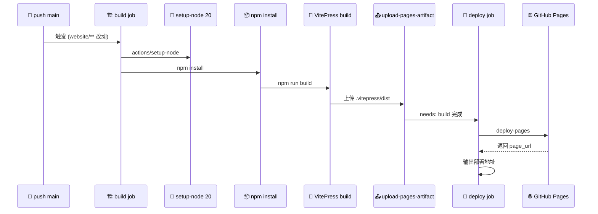

# 🌐 GitHub Pages 部署文档站

> 📖 文档站位于 `website/`，基于 VitePress 构建，`base` 配置为 `/whois-skills/`。通过 GitHub Actions 自动构建 VitePress 并部署到 GitHub Pages。

---

## 📋 概览

| 项目 | 内容 |
|------|------|
| 文档框架 | VitePress |
| 源码目录 | `website/` |
| 构建产物 | `website/.vitepress/dist` |
| `base` 配置 | `/whois-skills/` |
| 部署方式 | GitHub Actions → GitHub Pages |
| 访问地址 | `https://<user>.github.io/whois-skills/` |

---

## ⚙️ VitePress 配置要点

`website/.vitepress/config.ts` 关键配置：

```ts
export default defineConfig({
  lang: 'zh-CN',
  title: 'Whois Hacker',
  base: '/whois-skills/',   // 仓库名，部署到子路径必须配置
  cleanUrls: true,
  lastUpdated: true,
  // ...
})
```

::: tip 💡 base 必须匹配仓库名
因为仓库为 `whois-skills`，GitHub Pages 会部署到 `https://<user>.github.io/whois-skills/`，所以 `base` 必须设为 `/whois-skills/`，否则静态资源路径会 404。
:::

---

## 🚀 部署 workflow 示例

deploy workflow 由 main 分支 website 改动触发，build job 构建产物并上传为 Pages artifact，deploy job 随后发布到 GitHub Pages：



新建 `.github/workflows/deploy.yml`：

```yaml
name: Deploy Docs

on:
  push:
    branches: [main]
    paths:
      - 'website/**'
      - '.github/workflows/deploy.yml'
  workflow_dispatch:

permissions:
  contents: read
  pages: write
  id-token: write

concurrency:
  group: pages
  cancel-in-progress: false

jobs:
  build:
    runs-on: ubuntu-latest
    steps:
      - uses: actions/checkout@v4

      - uses: actions/setup-node@v4
        with:
          node-version: '20'
          cache: 'npm'
          cache-dependency-path: website/package-lock.json

      - name: Install dependencies
        working-directory: website
        run: npm install

      - name: Build VitePress
        working-directory: website
        run: npm run build

      - name: Upload Pages artifact
        uses: actions/upload-pages-artifact@v3
        with:
          path: website/.vitepress/dist

  deploy:
    needs: build
    runs-on: ubuntu-latest
    environment:
      name: github-pages
      url: ${{ steps.deployment.outputs.page_url }}
    steps:
      - name: Deploy to GitHub Pages
        id: deployment
        uses: actions/deploy-pages@v4
```

---

## 🔧 仓库设置

### 1. 配置 Pages 来源

`Settings → Pages → Build and deployment → Source` 选择 **GitHub Actions**（而非 Deploy from a branch）。

### 2. 触发部署

push 到 `main` 且改动 `website/` 目录即触发；也可在 Actions 页面手动 `workflow_dispatch` 触发。

### 3. 访问

部署成功后访问：

```
https://<your-username>.github.io/whois-skills/
```

---

## 🛠️ 本地预览

```bash
cd website
npm install
npm run dev      # 本地开发服务器
npm run build    # 构建产物到 .vitepress/dist
npm run preview  # 预览构建产物
```

---

## ⚠️ 注意事项

- `cleanUrls: true` 会生成无 `.html` 后缀的 URL，需 Pages 服务器支持。GitHub Pages 默认会自动处理。
- 修改 VitePress 配置或新增文档后，确认提交到 `main` 分支才会触发部署。
- 若使用自定义域名，在 `website/.vitepress/public/` 放置 `CNAME` 文件，并相应调整 `base`。

---

## 🔗 相关链接

- [GitHub Actions](./github-actions.md)
- [模块总览](../modules/overview.md)
- VitePress 官方文档：https://vitepress.dev
