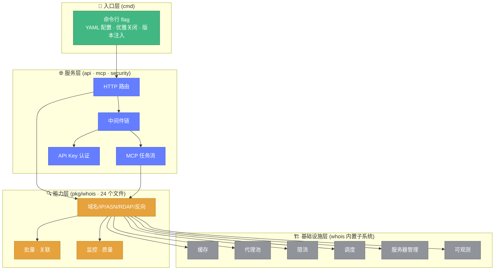
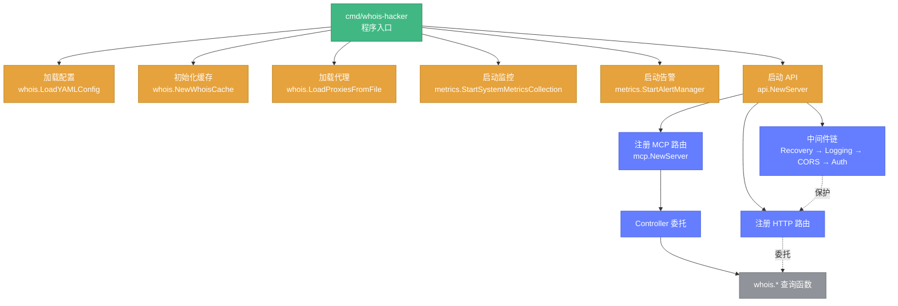

# 🏗️ 架构总览

> 📐 理解 Whois Hacker 的整体设计与模块关系。

---

## 🧭 分层架构

Whois Hacker 采用**分层架构**，从上到下分为：入口层、服务层、能力层、基础设施层。

---

## 🧩 模块职责

| 模块 | 路径 | 职责 | 文档 |
|------|------|------|------|
| 🚀 cmd | `cmd/whois-hacker/` | 程序入口、配置加载、生命周期管理 | [cmd 模块](../modules/cmd.md) |
| 🌐 api | `pkg/api/` | HTTP 路由、中间件、响应封装 | [api 模块](../modules/api.md) |
| 🤖 mcp | `pkg/mcp/` | MCP 任务规划/执行/审批状态机 | [mcp 模块](../modules/mcp.md) |
| 🔍 whois | `pkg/whois/` | **核心能力库**，23 个源文件 | [whois 模块](../modules/whois.md) |
| 📈 metrics | `pkg/metrics/` | 指标采集、告警规则、通知器 | [metrics 模块](../modules/metrics.md) |
| 👁️ monitor | `pkg/monitor/` | WHOIS 查询性能监控 | [monitor 模块](../modules/monitor.md) |
| 🔒 security | `pkg/security/` | API Key 管理、认证中间件 | [security 模块](../modules/security.md) |

---

## 🔍 能力层：WHOIS 核心包内部结构

`pkg/whois` 是核心，包含 23 个源文件，按职责可分为五大类：

### 1️⃣ 查询能力

| 文件 | 能力 | 图标 |
|------|------|------|
| `query.go` | 域名 WHOIS 查询引擎、优先级队列聚合 | 🔎 |
| `ipwhois.go` | IP WHOIS 查询（IANA 引导 → RIR） | 🌐 |
| `asn.go` / `asn_enhanced.go` | ASN 查询（RADB + RDAP） | 🔢 |
| `rdap.go` | RDAP 标准查询（RFC 9083） | 📡 |
| `reverse.go` | 反向 WHOIS（Provider 抽象） | 🔄 |

### 2️⃣ 解析与处理

| 文件 | 能力 | 图标 |
|------|------|------|
| `ipparser.go` | IP WHOIS 响应结构化解析（5 大 RIR） | 🔬 |
| `format.go` | WHOIS 格式检测与原始文本清洗 | 📝 |
| `idn.go` | 国际化域名 Punycode 转换 | 🌍 |
| `diff.go` | 两份 WHOIS 信息字段差异对比 | 📊 |
| `export.go` | 导出 JSON/CSV/Markdown | 📤 |

### 3️⃣ 工程化能力

| 文件 | 能力 | 图标 |
|------|------|------|
| `batch.go` | 流式批量查询、断点续查 | 📋 |
| `cache.go` | 本地/Redis 双缓存、预热 | 💾 |
| `proxy.go` | SOCKS5/HTTP 代理池、故障熔断 | 🔒 |
| `ratelimit.go` | 令牌桶限速（全局+每服务器） | ⏱️ |
| `scheduler.go` | 自适应智能调度 | 🎛️ |
| `servers.go` | WHOIS 服务器管理、健康检查 | 🖥️ |

### 4️⃣ 情报分析

| 文件 | 能力 | 图标 |
|------|------|------|
| `correlation.go` | 多域名关联分析、资产画像 | 🔗 |
| `quality.go` | WHOIS 数据质量三维评分、隐私检测 | ⭐ |
| `availability.go` | 域名可注册性检测 | ✅ |
| `monitor.go` | 域名监控、到期/变更告警 | 👁️ |

### 5️⃣ 配置与可观测

| 文件 | 能力 | 图标 |
|------|------|------|
| `config.go` | 统一配置结构、JSON/YAML 加载 | ⚙️ |
| `errors.go` | 统一错误类型体系、分类器 | ❌ |
| `observability.go` | Metrics 接口、Prometheus/OTel | 📈 |

---

## 🔄 调用关系

---

## 🎯 设计原则

🔌

接口统一

所有查询能力暴露一致的 Go 函数签名与 HTTP 端点，支持 context 超时。

🧱

分层解耦

能力层不依赖服务层，可作为纯库使用；基础设施可独立替换。

🛡️

防御性

代理池故障熔断、令牌桶限速、自适应退避，规避外部限流。

📦

单例复用

缓存、代理池、服务器管理、监控器等均为单例，全局共享状态。

---

## 📚 深入阅读

- 🧩 **[模块全景](./modules-overview.md)** — 各模块速览
- 🔄 **[查询流程](./query-flow.md)** — 一次查询的完整链路
- ⚙️ **[配置系统](./configuration.md)** — 配置项详解
