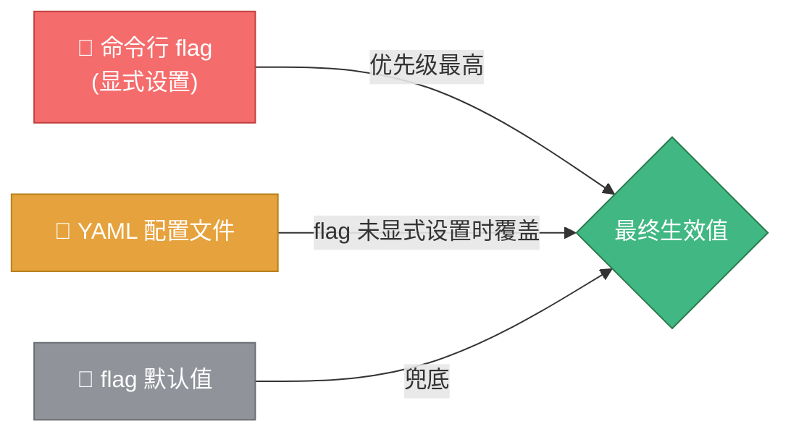
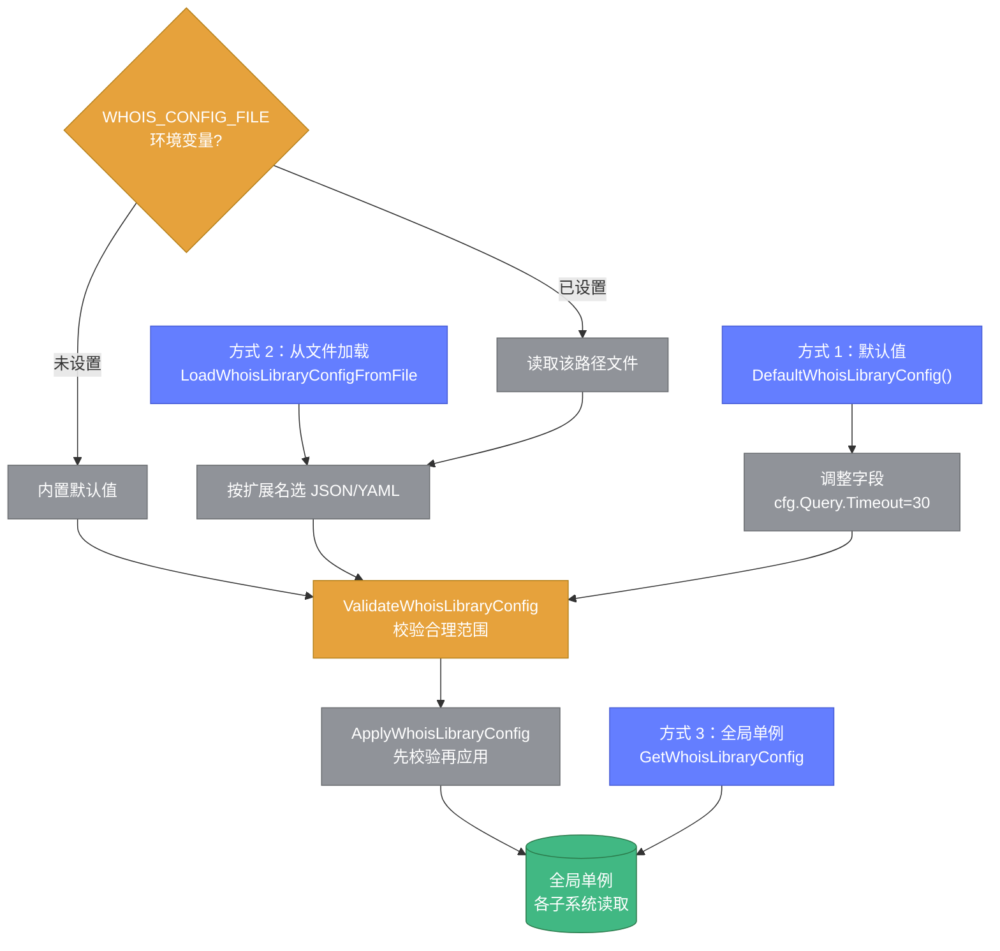

# ⚙️ 配置系统

> 🎛️ Whois Hacker 有两套配置：**应用配置**（`config.yaml`，命令行入口用）与**库配置**（`WhoisLibraryConfig`，库内子系统用）。

---

## 🎯 配置优先级



`main.go` 通过 `flag.Visit`（只遍历已显式设置的 flag）实现优先级判断：命令行未显式设置的字段才会被 YAML 值覆盖。

::: tip 💡 验证
若同时运行 `--port 9090` 且 `config.yaml` 中 `server.port: 8080`，最终监听 `9090`（命令行优先）。
:::

---

## 📄 应用配置 config.yaml

默认配置文件路径 `config/config.yaml`，可通过 `--config` 指定。

```yaml
# WhoisHacker 配置文件
# 命令行参数优先级高于配置文件中的值

# HTTP服务配置
server:
  host: "127.0.0.1"
  port: 8080

# 日志配置
log:
  level: "info"       # debug/info/warn/error
  format: "text"      # text/json

# 缓存配置
cache:
  enabled: true
  type: "local"       # local/redis
  ttl: 3600           # 缓存有效期（秒）
  warmup: false       # 是否启用缓存预热
  warmup_file: "config/warmup.json"

# 代理配置
proxy:
  enabled: false
  file: "config/proxies.json"

# 监控配置
metrics:
  enabled: true
  interval: 60        # 采集间隔（秒）

# 告警配置
alerts:
  enabled: true
  interval: 60        # 检查间隔（秒）
```

---

## 🚀 命令行 flag

| flag | 类型 | 默认值 | 说明 |
|------|------|--------|------|
| `--config` | string | `config/config.yaml` | 配置文件路径 |
| `--host` | string | `127.0.0.1` | HTTP 监听地址 |
| `--port` | int | `8080` | HTTP 监听端口 |
| `--log-level` | string | `info` | 日志级别 |
| `--log-format` | string | `text` | 日志格式 (text/json) |
| `--cache` | bool | `true` | 启用缓存 |
| `--cache-type` | string | `local` | 缓存类型 (local/redis) |
| `--cache-ttl` | int64 | `3600` | 缓存有效期（秒） |
| `--cache-warmup` | bool | `false` | 启用缓存预热 |
| `--warmup-file` | string | `config/warmup.json` | 预热域名列表文件 |
| `--warmup-interval` | int64 | `1000` | 预热间隔（毫秒） |
| `--proxy` | bool | `false` | 启用代理 |
| `--proxy-file` | string | `config/proxies.json` | 代理列表文件 |
| `--metrics` | bool | `true` | 启用监控 |
| `--metrics-interval` | int64 | `60` | 监控采集间隔（秒） |
| `--alerts` | bool | `true` | 启用告警 |
| `--alerts-interval` | int64 | `60` | 告警检查间隔（秒） |

### 使用示例

```bash
# 最小启动
./bin/whois-hacker

# 监听 0.0.0.0:9090，debug 日志，JSON 格式
./bin/whois-hacker --host 0.0.0.0 --port 9090 --log-level debug --log-format json

# 启用缓存预热与代理
./bin/whois-hacker --cache-warmup --warmup-file config/warmup.json \
  --proxy --proxy-file config/proxies.json

# 指定配置文件
./bin/whois-hacker --config /etc/whois/config.yaml
```

---

## 📚 库配置 WhoisLibraryConfig

库内子系统有自己的统一配置结构 `WhoisLibraryConfig`，覆盖九大子系统：

| 子系统 | 配置类型 | 关键字段 |
|--------|---------|---------|
| 🔎 查询 | `WhoisQueryConfig` | Timeout/MaxRetries/RetryInterval/UseProxy/FollowReferral |
| 💾 缓存 | `WhoisCacheConfig` | Enabled/Type/MaxEntries/DefaultTTLMinutes/RedisAddr |
| 🔒 代理 | `WhoisProxyConfig` | Enabled/SOCKS5Addr/HTTPAddr/ProxyFile |
| ⏱️ 限速 | `WhoisRateLimitConfig` | GlobalRate/PerServerRate/BurstSize |
| 📋 批量 | `WhoisBatchConfig` | Concurrency/CheckpointFile/Timeout |
| 👁️ 监控 | `WhoisMonitorConfig` | CheckIntervalMinutes/ExpiryWarningDays |
| 🎛️ 调度 | `WhoisSchedulerConfig` | DefaultIntervalMs/MaxConcurrency/BackoffMultiplier |
| 📈 可观测 | `WhoisObservabilityConfig` | Providers/PrometheusPath/OTLPEndpoint |
| 📝 日志 | `WhoisLogConfig` | Level/Format/OutputFile |

### 加载库配置



```go
// 方式 1：默认值
cfg := whois.DefaultWhoisLibraryConfig()
cfg.Query.Timeout = 30
whois.ApplyWhoisLibraryConfig(&cfg)

// 方式 2：从文件加载（按扩展名自动选 JSON/YAML）
cfg := whois.LoadWhoisLibraryConfigFromFile("config/library.yaml")

// 方式 3：全局单例（优先读 WHOIS_CONFIG_FILE 环境变量）
cfg := whois.GetWhoisLibraryConfig()
```

### 环境变量

| 变量 | 说明 |
|------|------|
| `WHOIS_CONFIG_FILE` | 库配置文件路径，`GetWhoisLibraryConfig` 单例初始化时读取 |

---

## 🔧 配置相关文件

| 文件 | 用途 | 格式 |
|------|------|------|
| `config/config.yaml` | 应用配置 | YAML |
| `config/servers.json` | WHOIS 服务器映射 | JSON（运行时生成） |
| `config/proxies.json` | 代理列表 | JSON |
| `config/warmup.json` | 缓存预热域名列表 | JSON |
| `config/apikeys.json` | API 密钥（权限 0600） | JSON |

::: warning ⚠️ apikeys.json
`config/apikeys.json` 由 `APIKeyManager.SaveConfig()` 写入，权限 `0600`（仅所有者可读写），**不应提交到版本控制**。
:::

---

## ✅ 配置校验

`ValidateWhoisLibraryConfig` 会校验超时、重试、缓存、速率、并发、间隔等合理范围，`ApplyWhoisLibraryConfig` 会先校验再应用。

```go
if err := whois.ValidateWhoisLibraryConfig(&cfg); err != nil {
    log.Fatal("配置无效:", err)
}
whois.ApplyWhoisLibraryConfig(&cfg)
```

---

## 🔗 相关文档

- 📖 [配置 config.go API](../api/whois/config.md)
- 🚀 [cmd 模块](../modules/cmd.md)
- 💾 [缓存 cache.go](../api/whois/cache.md)
- 🔒 [代理 proxy.go](../api/whois/proxy.md)
