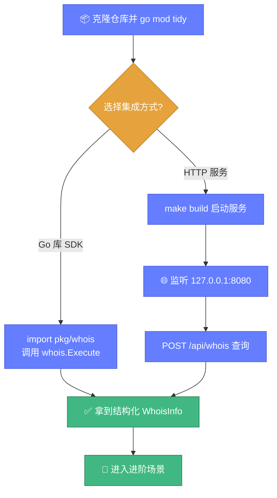

# 🚀 快速开始

> ⏱️ 5 分钟内完成安装并执行第一次 WHOIS 查询。

---

## 📋 前置要求

| 要求 | 版本 | 说明 |
|------|------|------|
| 🐹 Go | ≥ 1.21 | 编译运行所需 |
| 🐙 Git | 任意 | 克隆仓库 |
| 🌐 网络 | 可访问 43 端口 | WHOIS 协议端口 |

::: tip 💡 无 Go 环境？
可以直接使用 [Docker 部署](../deploy/docker.md) 或下载预编译二进制（见 [安装指南](./installation.md)）。
:::

---

## 1️⃣ 安装

```bash
# 克隆仓库
git clone https://github.com/cyberspacesec/whois-skills.git
cd whois-skills

# 下载依赖
go mod tidy
```

---

## 2️⃣ 作为 Go 库使用

最简单的查询方式——直接调用 `whois.Execute`：

```go
package main

import (
	"fmt"

	"github.com/cyberspacesec/whois-skills/pkg/whois"
)

func main() {
	// 旧版简洁 API
	info, err := whois.Execute(&whois.Query{
		Domain: "example.com",
	})
	if err != nil {
		fmt.Println("查询失败:", err)
		return
	}

	// info 是 *whoisparser.WhoisInfo，包含解析后的结构化数据
	fmt.Printf("注册商: %s\n", info.Registrar.Name)
	fmt.Printf("注册人: %s\n", info.Registrant.Name)
	fmt.Printf("创建时间: %s\n", info.Domain.CreatedDate)
	fmt.Printf("到期时间: %s\n", info.Domain.ExpirationDate)
}
```

### 推荐使用：完整结果 API

`ExecuteQueryWithResult` 返回更丰富的信息（原始响应、延迟、重试次数、校验结果）：

```go
result, err := whois.ExecuteQueryWithResult(&whois.QueryOptions{
	Domain:         "example.com",
	Timeout:        10,       // 秒
	MaxRetries:     5,        // 重试次数
	ValidateResult: true,     // 校验结果完整性
	RequiredFields: []string{"registrar", "registrant_email"},
})
if err != nil {
	panic(err)
}

fmt.Printf("查询服务器: %s\n", result.Server)
fmt.Printf("延迟: %d ms\n", result.Latency)
fmt.Printf("重试次数: %d\n", result.RetryCount)
fmt.Printf("校验通过: %v\n", result.ValidationResult.Valid)
```

---

## 3️⃣ 启动 HTTP 服务

```bash
# 编译
make build

# 启动（默认监听 127.0.0.1:8080）
./bin/whois-hacker
```

看到类似输出即表示启动成功：

```
INFO[0000] WHOIS 查询服务已启动
INFO[0000] HTTP 服务监听地址: 127.0.0.1:8080
```

---

## 4️⃣ 调用 HTTP API

```bash
# 查询域名 WHOIS
curl -X POST http://127.0.0.1:8080/api/whois \
  -H "Content-Type: application/json" \
  -d '{"domain":"example.com"}'
```

返回统一格式的 JSON：

```json
{
  "success": true,
  "data": {
    "info": { "...": "解析后的 WHOIS 结构" },
    "raw": "原始 WHOIS 响应文本",
    "server": "whois.verisign-grs.com",
    "latency": 358
  }
}
```

::: tip 📡 更多端点
完整 HTTP API 列表见 [HTTP API 概览](../api/http/overview.md)。
:::

下图展示了从安装到首次查询的快速路径：



---

## 5️⃣ 常用查询场景

### 查询 IP WHOIS

```bash
curl -X POST http://127.0.0.1:8080/api/ip \
  -H "Content-Type: application/json" \
  -d '{"ip":"8.8.8.8"}'
```

### 查询 ASN

```bash
curl -X POST http://127.0.0.1:8080/api/asn \
  -H "Content-Type: application/json" \
  -d '{"asn":13335,"source":"all","include_prefixes":true}'
```

### 检测域名可注册性

```bash
curl -X POST http://127.0.0.1:8080/api/availability \
  -H "Content-Type: application/json" \
  -d '{"domain":"some-likely-unregistered-name-xyz123.com"}'
```

返回 `available` 为 `true` 即可注册。

### 批量查询

```bash
curl -X POST http://127.0.0.1:8080/api/batch \
  -H "Content-Type: application/json" \
  -d '{"domains":["a.com","b.com","c.com"],"concurrency":5}'
```

返回 `session_id`，轮询 `/api/batch/status?id=...` 获取进度。

---

## 🎉 恭喜！

你已经完成了第一次 WHOIS 查询。接下来可以：

- 📖 **[架构总览](./architecture.md)** — 理解整体设计
- ⚙️ **[配置系统](./configuration.md)** — 自定义缓存、代理、监控等
- 🎯 **[域名查询教程](./tutorial-domain.md)** — 深入域名查询
- 📚 **[WHOIS 核心 API](../api/whois/overview.md)** — 完整 API 参考

::: info 🆘 遇到问题？
查阅 [故障排查](../reference/troubleshooting.md) 或 [FAQ](../reference/faq.md)。
:::
