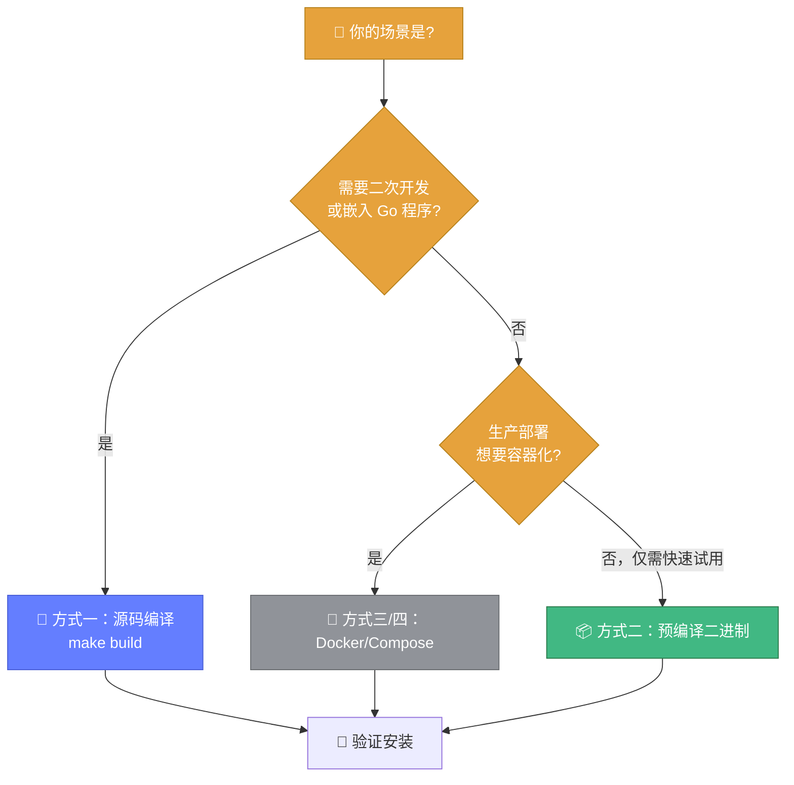

# 📥 安装指南

> 📦 Whois Hacker 支持源码编译、预编译二进制、Docker 三种安装方式。

---

## 🐹 方式一：源码编译（推荐开发者）

### 前置要求

- Go ≥ 1.21
- Git
- （可选）UPX（用于压缩二进制，减小体积）

### 步骤

```bash
# 1. 克隆仓库
git clone https://github.com/cyberspacesec/whois-skills.git
cd whois-skills

# 2. 下载依赖
go mod tidy

# 3. 编译
make build
# 产物：bin/whois-hacker
```

### 注入版本信息

Makefile 默认通过 `-ldflags` 注入版本信息：

```bash
make build VERSION=1.0.0
# 等价于：
go build -ldflags "-X main.Version=1.0.0 -X main.BuildTime=$(date) -X main.GitCommit=$(git rev-parse --short HEAD)" -o bin/whois-hacker ./cmd/whois-hacker
```

### 交叉编译

```bash
# 编译多平台二进制
make build-all
# 产物：
#   bin/whois-hacker-linux-amd64
#   bin/whois-hacker-linux-arm64
#   bin/whois-hacker-windows-amd64.exe
#   bin/whois-hacker-darwin-amd64
#   bin/whois-hacker-darwin-arm64
```

::: details 🔧 指定平台手动编译
```bash
# Windows
GOOS=windows GOARCH=amd64 go build -o bin/whois-hacker.exe ./cmd/whois-hacker

# macOS (Apple Silicon)
GOOS=darwin GOARCH=arm64 go build -o bin/whois-hacker ./cmd/whois-hacker

# Linux ARM64
GOOS=linux GOARCH=arm64 go build -o bin/whois-hacker ./cmd/whois-hacker
```
:::

---

## 📦 方式二：预编译二进制

前往 [GitHub Releases](https://github.com/cyberspacesec/whois-skills/releases) 下载对应平台的二进制：

```bash
# 示例：Linux amd64
wget https://github.com/cyberspacesec/whois-skills/releases/latest/download/whois-hacker-linux-amd64
chmod +x whois-hacker-linux-amd64
./whois-hacker-linux-amd64
```

::: tip 🌍 平台对照
| 文件名 | 平台 |
|--------|------|
| `whois-hacker-linux-amd64` | Linux x86_64 |
| `whois-hacker-linux-arm64` | Linux ARM64 |
| `whois-hacker-windows-amd64.exe` | Windows x86_64 |
| `whois-hacker-darwin-amd64` | macOS Intel |
| `whois-hacker-darwin-arm64` | macOS Apple Silicon |
:::

---

## 🐳 方式三：Docker（推荐生产）

```bash
# 拉取镜像
docker pull cyberspacesec/whois-skills:latest

# 运行
docker run -d \
  --name whois-hacker \
  -p 8080:8080 \
  -v whois_data:/app/data \
  cyberspacesec/whois-skills:latest
```

详细配置见 [Docker 部署](../deploy/docker.md)。

---

## 🎼 方式四：Docker Compose

```bash
docker-compose up -d
```

`docker-compose.yml` 已预配置端口、健康检查与数据卷。详见 [Compose 部署](../deploy/compose.md)。

---

下图根据使用场景给出安装方式的选择决策：



---

## 🔧 验证安装

```bash
# 启动服务
./bin/whois-hacker &

# 健康检查
curl http://127.0.0.1:8080/api/health
# 返回 {"success":true,"data":{"status":"ok","time":"..."}}
```

---

## 📂 作为 Go 库引入

如果你的项目想直接调用 Whois Hacker 的能力：

```bash
go get github.com/cyberspacesec/whois-skills/pkg/whois
```

```go
import "github.com/cyberspacesec/whois-skills/pkg/whois"
```

::: warning ⚠️ 依赖说明
`pkg/whois` 依赖以下库：
- `github.com/likexian/whois` & `whois-parser` — WHOIS 查询与解析
- `golang.org/x/net/idna` — IDN Punycode
- `golang.org/x/net/proxy` — SOCKS5 代理
- `github.com/go-redis/redis/v8` — Redis 缓存（可选）
- `github.com/shirou/gopsutil/v3` — 系统指标（仅 metrics 包）
:::

---

## 🚀 下一步

- 📖 **[快速开始](./getting-started.md)** — 执行第一次查询
- ⚙️ **[配置系统](./configuration.md)** — 自定义行为
- 🐳 **[Docker 部署](../deploy/docker.md)** — 生产环境部署
