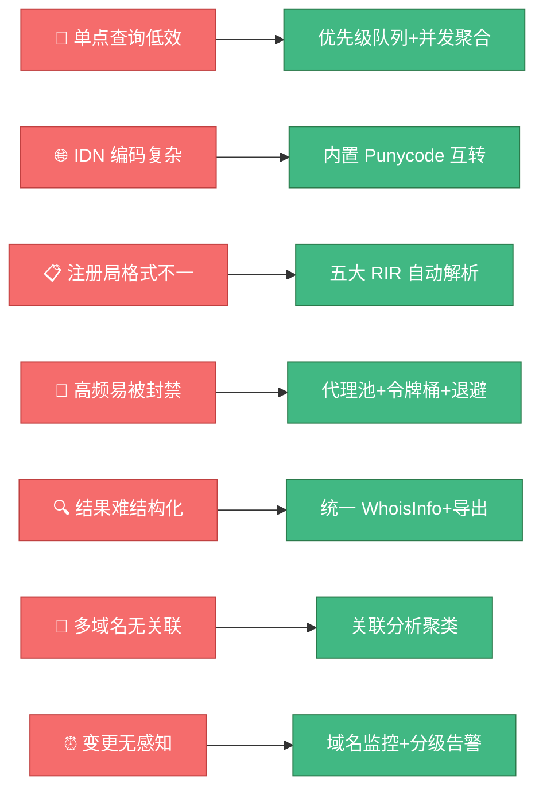
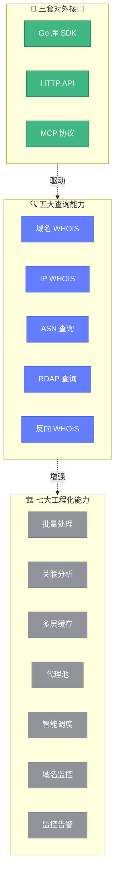

# ✨ 项目介绍

> 📖 **一句话概括**：Whois Hacker 是一个用 Go 编写的一站式 WHOIS 域名情报查询工具，将域名、IP、ASN、RDAP、反向 WHOIS 等能力整合为统一的可编程接口，并叠加缓存、代理、限流、调度、监控、告警、关联分析等工程化能力。

---

## 🎯 这个工具解决了什么问题

传统 WHOIS 查询面临诸多痛点：

| 痛点 | 传统方式 | Whois Hacker 方案 |
|------|---------|-------------------|
| 🔁 单点查询效率低 | 逐个手动查询 | 优先级队列 + 并发聚合 + 批量流式处理 |
| 🌐 国际域名编码复杂 | 手工 Punycode 转换 | 内置 IDN 规范化与 Punycode 互转 |
| 📋 各注册局格式不统一 | 各 RIR 响应格式各异 | 自动识别 ARIN/RIPE/APNIC/LACNIC/AFRINIC 五大格式并统一解析 |
| 🚫 高频查询易被封禁 | 直连易触发限速 | 代理池轮询 + 令牌桶限速 + 自适应调度退避 |
| 🔍 结果难以结构化 | 原始文本难处理 | 统一 `WhoisInfo` 结构 + JSON/CSV/Markdown 导出 |
| 🔗 多域名无关联视角 | 单域名孤立查看 | 关联分析引擎，按邮箱/注册人/组织聚类，构建资产画像 |
| ⏰ 域名变更无感知 | 无法持续跟踪 | 域名监控器，周期检查到期与状态/注册人/NS 变更 |

下图展示了上述痛点与传统方案的对比，以及 Whois Hacker 的应对路径：



---

## 🏗️ 核心能力

Whois Hacker 提供了**五大查询能力**与**七大工程化能力**：

### 五大查询能力

<div class="feature-grid">

<div class="feature-card">
<span class="feature-icon">🔍</span>
<div class="feature-title">域名 WHOIS</div>
<div class="feature-desc">查询域名注册商、注册人、到期时间、NS、DNSSEC 等，支持引导跟随与结果校验。</div>
</div>

<div class="feature-card">
<span class="feature-icon">🌐</span>
<div class="feature-title">IP WHOIS</div>
<div class="feature-desc">查询 IP 所属网段、组织、ASN、RIR，自动通过 IANA 引导定位 RIR 服务器。</div>
</div>

<div class="feature-card">
<span class="feature-icon">🔢</span>
<div class="feature-title">ASN 查询</div>
<div class="feature-desc">查询 ASN 名称、组织、国家、RIR、IPv4/IPv6 前缀、上下游 BGP 关系。</div>
</div>

<div class="feature-card">
<span class="feature-icon">📡</span>
<div class="feature-title">RDAP 查询</div>
<div class="feature-desc">RFC 9083 标准查询，支持域名/IP/ASN/Entity 四类，内置 bootstrap 映射。</div>
</div>

<div class="feature-card">
<span class="feature-icon">🔄</span>
<div class="feature-title">反向 WHOIS</div>
<div class="feature-desc">按注册人邮箱、组织、姓名反向检索关联域名，Provider 接口可扩展。</div>
</div>

</div>

### 七大工程化能力

<div class="feature-grid">

<div class="feature-card">
<span class="feature-icon">📋</span>
<div class="feature-title">批量处理</div>
<div class="feature-desc">流式批量处理器，断点续查、并发限速、进度回调、剩余时间预估。</div>
</div>

<div class="feature-card">
<span class="feature-icon">🔗</span>
<div class="feature-title">关联分析</div>
<div class="feature-desc">按邮箱/注册人/组织/NS/注册商聚类多域名，构建关联图与资产画像。</div>
</div>

<div class="feature-card">
<span class="feature-icon">💾</span>
<div class="feature-title">多层缓存</div>
<div class="feature-desc">本地内存与 Redis 双实现，缓存预热、TTL 过期、命中率统计。</div>
</div>

<div class="feature-card">
<span class="feature-icon">🔒</span>
<div class="feature-title">代理池</div>
<div class="feature-desc">SOCKS5/HTTP 代理池，轮询调度、健康检查、故障熔断。</div>
</div>

<div class="feature-card">
<span class="feature-icon">⏱️</span>
<div class="feature-title">智能调度</div>
<div class="feature-desc">按响应时间与限速反馈自适应调整间隔、退避与并发。</div>
</div>

<div class="feature-card">
<span class="feature-icon">👁️</span>
<div class="feature-title">域名监控</div>
<div class="feature-desc">周期检查到期与变更，分级告警（info/warning/critical）。</div>
</div>

<div class="feature-card">
<span class="feature-icon">🚨</span>
<div class="feature-title">监控告警</div>
<div class="feature-desc">CPU/内存/错误率/失败率四类规则，Email/Slack/Webhook 通知。</div>
</div>

</div>

下图汇总了五大查询能力与七大工程化能力的分层关系：



---

## 🧩 三套对外接口

Whois Hacker 提供**三种集成方式**，适配不同场景：

<div class="feature-grid">

<div class="feature-card">
<span class="feature-icon">📦</span>
<div class="feature-title">Go 库</div>
<div class="feature-desc">直接 import <code>pkg/whois</code> 等包，作为 SDK 嵌入你的 Go 程序。</div>
</div>

<div class="feature-card">
<span class="feature-icon">🌐</span>
<div class="feature-title">HTTP API</div>
<div class="feature-desc">启动 HTTP 服务，通过 REST 端点查询，适配任何语言与 Web 场景。</div>
</div>

<div class="feature-card">
<span class="feature-icon">🤖</span>
<div class="feature-title">MCP 协议</div>
<div class="feature-desc">Mission Control Protocol 任务流，适配 AI Agent 协作场景。</div>
</div>

</div>

---

## 📂 项目结构

```
whois-skills/
├── cmd/whois-hacker/       # 🚀 命令行入口与 HTTP 服务
├── pkg/
│   ├── whois/              # 🔍 WHOIS 核心库（23 个源文件）
│   ├── api/                # 🌐 HTTP API 服务
│   ├── mcp/                # 🤖 MCP 协议服务
│   ├── metrics/            # 📈 指标采集与告警
│   ├── monitor/            # 👁️ 性能监控
│   └── security/           # 🔒 安全认证
├── config/                 # ⚙️ 配置文件
├── website/                # 📚 文档站（本站点）
├── Dockerfile              # 🐳 Docker 构建
├── docker-compose.yml      # 🎼 编排
└── Makefile                # 🔧 构建/测试/发布
```

---

## 🚀 接下来

- 📖 **[快速开始](./getting-started.md)** — 5 分钟跑起来
- 📥 **[安装指南](./installation.md)** — 各种安装方式
- 🏗️ **[架构总览](./architecture.md)** — 理解整体设计
- 🎯 **[域名查询教程](./tutorial-domain.md)** — 从域名查询入门
