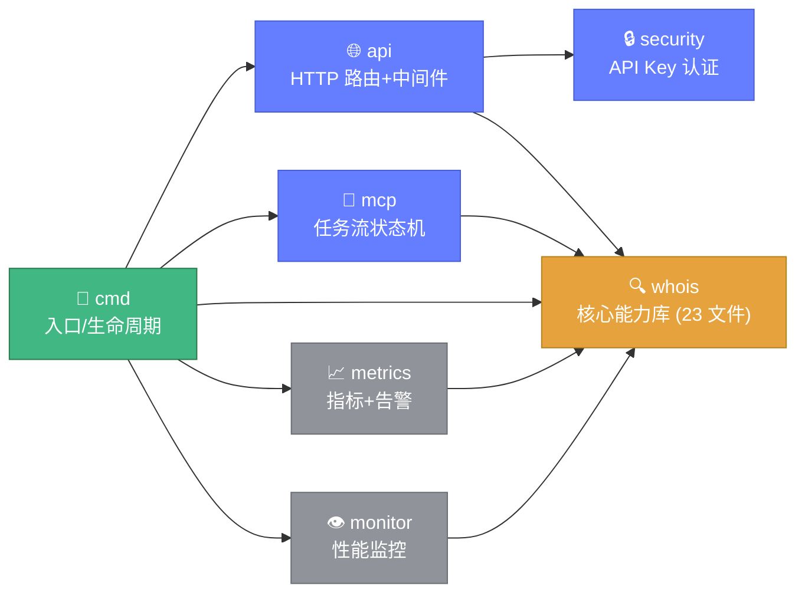
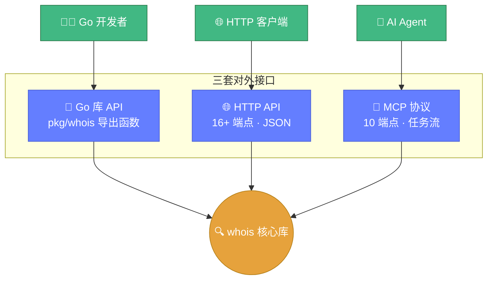

# 🧩 模块全景

> 🚀 各模块速览，一图掌握 Whois Hacker 的组成。

---

## 📊 模块速查表

| 模块 | 路径 | 源文件数 | 核心职责 | 状态 |
|------|------|---------|---------|------|
| 🚀 cmd | `cmd/whois-hacker/` | 2 | 入口、配置、生命周期 | <span class="status-tag stable">稳定</span> |
| 🌐 api | `pkg/api/` | 3 | HTTP 路由、中间件、响应 | <span class="status-tag stable">稳定</span> |
| 🤖 mcp | `pkg/mcp/` | 3 | MCP 任务流 | <span class="status-tag beta">Beta</span> |
| 🔍 whois | `pkg/whois/` | 23 | **核心能力库** | <span class="status-tag stable">稳定</span> |
| 📈 metrics | `pkg/metrics/` | 4 | 指标与告警 | <span class="status-tag stable">稳定</span> |
| 👁️ monitor | `pkg/monitor/` | 1 | 性能监控 | <span class="status-tag beta">Beta</span> |
| 🔒 security | `pkg/security/` | 3 + config | API Key 认证 | <span class="status-tag beta">Beta</span> |

## 🗺️ 模块依赖关系图

箭头表示"依赖 / 调用"方向。`whois` 核心库位于中心，不依赖服务层，可独立作为库使用。



---

## 🔍 whois 核心库 23 文件速览

### 查询能力

| 文件 | 一句话 | 入口函数 |
|------|--------|---------|
| 🔎 `query.go` | 域名 WHOIS 查询引擎 | `ExecuteQueryWithResult` |
| 🌐 `ipwhois.go` | IP WHOIS 查询 | `QueryIP` |
| 🔢 `asn.go` | ASN 基础查询 (RADB) | `GetIPRangesByASN` |
| 🚀 `asn_enhanced.go` | ASN 增强 (RADB+RDAP) | `QueryASN` |
| 📡 `rdap.go` | RDAP 标准查询 | `QueryRDAP` |
| 🔄 `reverse.go` | 反向 WHOIS | `NewReverseWhoisClient` |

### 解析处理

| 文件 | 一句话 | 入口函数 |
|------|--------|---------|
| 🔬 `ipparser.go` | IP 响应结构化解析 | `ParseIPWhois` |
| 📝 `format.go` | 格式检测与清洗 | `DetectWhoisFormat` |
| 🌍 `idn.go` | IDN Punycode | `NormalizeDomain` |
| 📊 `diff.go` | WHOIS 差异对比 | `CompareWhois` |
| 📤 `export.go` | 多格式导出 | `ExportToJSON` |

### 工程化

| 文件 | 一句话 | 入口函数 |
|------|--------|---------|
| 📋 `batch.go` | 流式批量查询 | `NewStreamBatchProcessor` |
| 💾 `cache.go` | 多层缓存 | `NewWhoisCache` |
| 🔒 `proxy.go` | 代理池 | `LoadProxiesFromFile` |
| ⏱️ `ratelimit.go` | 令牌桶限速 | `NewRateLimiter` |
| 🎛️ `scheduler.go` | 自适应调度 | `NewSmartScheduler` |
| 🖥️ `servers.go` | 服务器管理 | `GetServerManager` |

### 情报分析

| 文件 | 一句话 | 入口函数 |
|------|--------|---------|
| 🔗 `correlation.go` | 关联分析 | `NewCorrelationEngine` |
| ⭐ `quality.go` | 质量评分 | `AssessQuality` |
| ✅ `availability.go` | 可注册性检测 | `CheckDomainAvailability` |
| 👁️ `monitor.go` | 域名监控 | `NewDomainMonitor` |

### 配置可观测

| 文件 | 一句话 | 入口函数 |
|------|--------|---------|
| ⚙️ `config.go` | 统一配置 | `GetWhoisLibraryConfig` |
| ❌ `errors.go` | 错误体系 | `CheckError` |
| 📈 `observability.go` | 指标体系 | `GetGlobalMetrics` |

---

## 🌐 对外暴露的三套接口



### Go 库 API

直接调用 `pkg/whois` 的导出函数：

```go
info, _ := whois.ExecuteQueryWithResult(&whois.QueryOptions{Domain: "example.com"})
```

📖 详见 [WHOIS 核心 API](../api/whois/overview.md)。

### HTTP API

通过 `cmd/whois-hacker` 启动服务后调用：

```bash
curl -X POST http://127.0.0.1:8080/api/whois -d '{"domain":"example.com"}'
```

📖 详见 [HTTP API](../api/http/overview.md)，共 16+ 个端点。

### MCP 协议

任务规划/执行/审批流程：

```bash
curl -X POST http://127.0.0.1:8080/api/mcp/request_planning -d '{...}'
```

📖 详见 [MCP 协议](../api/mcp/overview.md)，共 10 个端点。

---

## 📚 下一步

选择你感兴趣的模块深入：

- 🔍 **[whois 模块详解](../modules/whois.md)**
- 🌐 **[api 模块详解](../modules/api.md)**
- 🤖 **[mcp 模块详解](../modules/mcp.md)**
- 📈 **[metrics 模块详解](../modules/metrics.md)**
- 👁️ **[monitor 模块详解](../modules/monitor.md)**
- 🔒 **[security 模块详解](../modules/security.md)**
- ⚙️ **[cmd 模块详解](../modules/cmd.md)**
