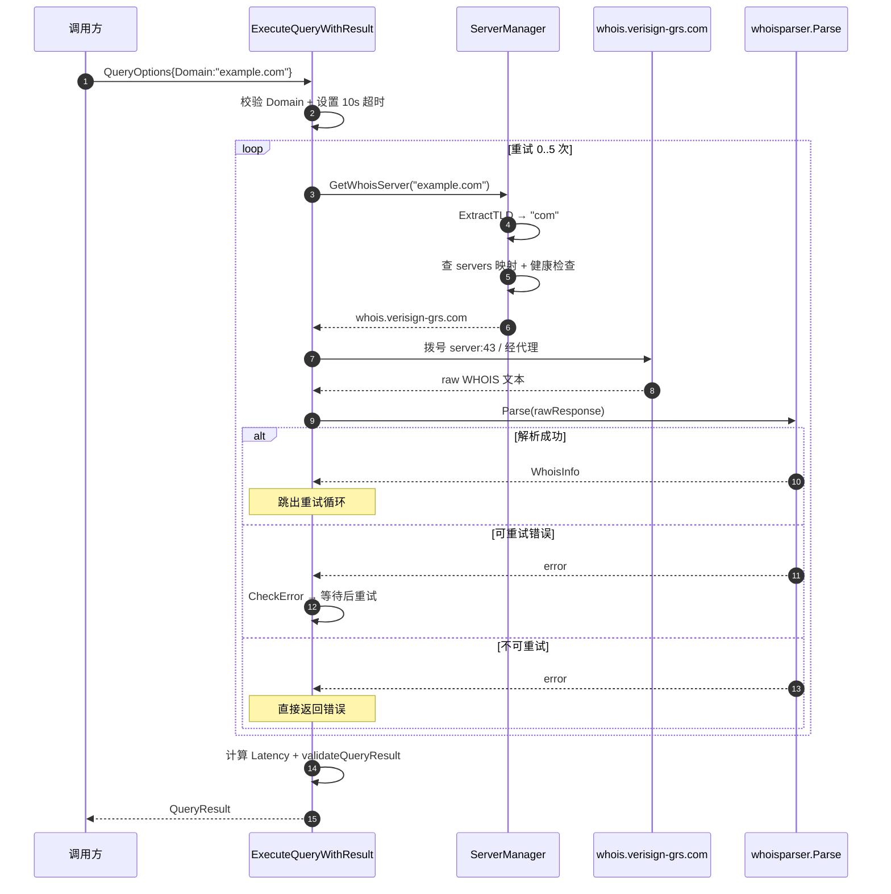
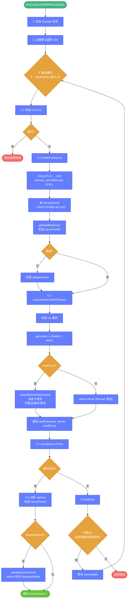
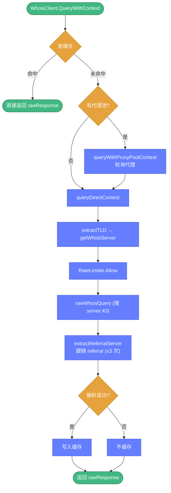

# 🔄 查询流程

> 🔬 跟随一次域名 WHOIS 查询，理解完整链路。

---

## 🎯 场景：查询 `example.com`

调用 `whois.ExecuteQueryWithResult(&QueryOptions{Domain: "example.com"})` 时发生了什么？

下方的时序图展示了调用方、查询引擎、服务器管理器、WHOIS 服务器与解析器之间的交互：



---

## 📐 完整链路



---

## 🛡️ 基础设施介入点

查询过程中，以下子系统会介入：

<div class="feature-grid">

<div class="feature-card">
<span class="feature-icon">🖥️</span>
<div class="feature-title">服务器管理</div>
<div class="feature-desc"><code>servers.go</code> 维护 TLD→服务器映射，5 分钟后台健康检查，不健康自动回退。</div>
</div>

<div class="feature-card">
<span class="feature-icon">💾</span>
<div class="feature-title">缓存</div>
<div class="feature-desc"><code>proxy.go</code> 的 <code>WhoisClient.QueryWithContext</code> 会先查缓存，命中则直接返回。</div>
</div>

<div class="feature-card">
<span class="feature-icon">🔒</span>
<div class="feature-title">代理池</div>
<div class="feature-desc"><code>UseProxy</code> 时通过代理池轮询，失败标记故障熔断，连续失败 ≥3 标记不可用。</div>
</div>

<div class="feature-card">
<span class="feature-icon">⏱️</span>
<div class="feature-title">限速</div>
<div class="feature-desc"><code>RateLimiter.Allow(server)</code> 全局+每服务器双维度令牌桶，限速时阻塞等待。</div>
</div>

<div class="feature-card">
<span class="feature-icon">❌</span>
<div class="feature-title">错误分类</div>
<div class="feature-desc"><code>errors.go</code> 的 <code>CheckError</code> 按消息字符串分类，<code>IsRetryable</code> 决定是否重试。</div>
</div>

<div class="feature-card">
<span class="feature-icon">🔄</span>
<div class="feature-title">引导跟随</div>
<div class="feature-desc">注册局返回 referral 时，<code>extractReferralServer</code> 提取注册商服务器继续查询（默认 3 次）。</div>
</div>

</div>

---

## 🌐 两条查询路径

Whois Hacker 有两条查询路径：

### 路径 A：likexian 库直连（默认）

`UseProxy=false` 时，走 `github.com/likexian/whois.Whois`，简单可靠。

### 路径 B：自定义客户端（启用代理或需要完整控制）

`UseProxy=true` 时，走 `DirectWhoisWithContext` → `WhoisClient`：



::: tip 💡 何时用路径 B
- 需要规避 IP 封禁 → 启用代理池
- 需要缓存 → 路径 B 自动写入缓存
- 需要限速 → 路径 B 受 RateLimiter 约束
:::

---

## 📊 结果结构

`QueryResult` 包含完整信息：

```go
type QueryResult struct {
    Info             *whoisparser.WhoisInfo  // 解析后的结构化数据
    RawResponse      string                  // 原始 WHOIS 文本
    QueryTime        time.Time               // 查询时刻
    Latency          int64                   // 延迟（毫秒）
    Server           string                  // 实际查询的服务器
    UsedProxy        bool                    // 是否用了代理
    RetryCount       int                     // 重试次数
    ValidationResult *ValidationResult       // 结果校验
}
```

---

## 🔗 相关文档

- 🔎 **[查询引擎 query.go](../api/whois/query.md)** — 完整 API
- 🖥️ **[服务器管理 servers.go](../api/whois/servers.md)** — TLD 映射
- ❌ **[错误体系 errors.go](../api/whois/errors.md)** — 错误分类
- 🎯 **[域名查询教程](./tutorial-domain.md)** — 动手实践
